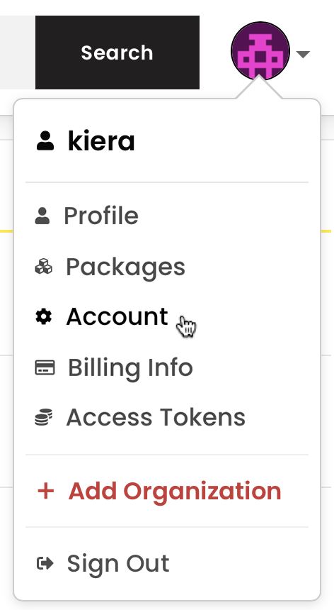
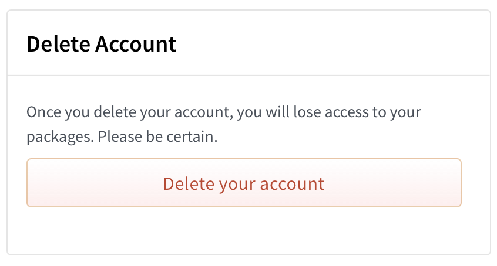
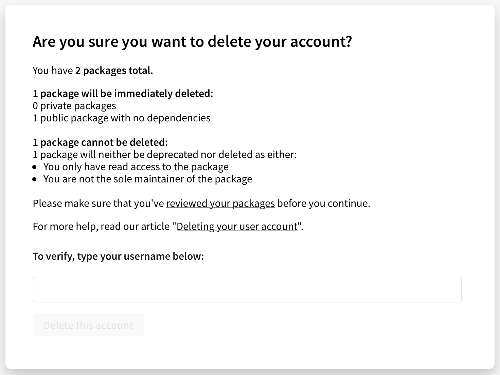

+++
title = "删除 npm 用户账户"
date = 2023-09-22T20:52:07+08:00
weight = 20
type = "docs"
description = ""
isCJKLanguage = true
draft = false

+++

> 原文: [https://docs.npmjs.com/deleting-your-npm-user-account](https://docs.npmjs.com/deleting-your-npm-user-account)

# Deleting your npm user account - 删除 npm 用户账户

From the web, you can delete your npm user account.

​	您可以通过网页删除您的 npm 用户账户。

1. On the npm "Sign In" page, enter your account details and click Sign In.

2. 在 npm "登录" 页面上，输入您的账户详细信息，然后点击 "登录"。

   

3. In the upper right corner of the page, click your profile picture, then click Account.

4. 在页面右上角，点击您的个人头像，然后点击 "账户"。

   

5. On this page, you will find a button to delete your account. Click that.

6. 在该页面上，您将找到一个删除账户的按钮。点击它。

   

7. You will now be presented with an overview of how many npm packages will be deleted and deprecated as part of your account deletion. If you agree with this, then enter your username and click "Delete this account".

8. 现在，您将看到一个概览，其中显示将作为删除账户的一部分删除和弃用的 npm 包的数量。如果您同意，请输入您的用户名，然后点击 "删除此账户"。

   

9. You will be immediately logged out, and will not be able to log back in.

10. 您将立即注销，并且将无法再次登录。

In some cases, you will be presented with an error if we were unable to automatically delete your account. For example. if you are the sole owner of an organization you will need to add an additional owner before your account can be deleted. You will be presented clear instructions of what you will need to do in order to delete your account.

​	在某些情况下，如果我们无法自动删除您的账户，您将看到一个错误提示。例如，如果您是组织的唯一所有者，则需要在删除您的账户之前添加其他所有者。您将收到明确的指示，以便了解如何删除您的账户。

If you are in doubt about deleting your account, [contact npm Support](https://www.npmjs.com/support).

​	如果您对删除账户有疑虑，请[联系 npm 支持](https://www.npmjs.com/support)。
