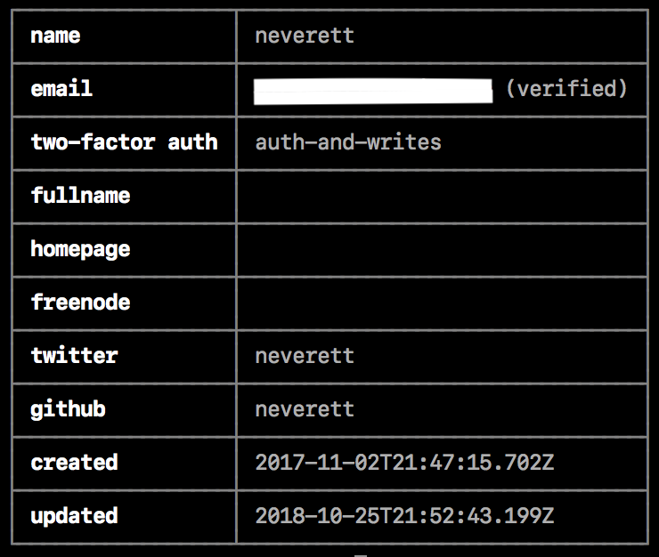

+++
title = "管理个人资料设置"
date = 2023-09-22T20:51:49+08:00
weight = 1
type = "docs"
description = ""
isCJKLanguage = true
draft = false

+++

> 原文: [https://docs.npmjs.com/managing-your-profile-settings](https://docs.npmjs.com/managing-your-profile-settings)

# Managing your profile settings - 管理个人资料设置

You can manage settings for your user account profile from the web or command line.

​	您可以通过网页或命令行管理您的用户账户资料设置。

## 通过网页管理用户账户资料设置 Managing user account profile settings from the web

From the web, you can change the following user profile settings:

​	通过网页，您可以更改以下用户资料设置：

- Avatar
- 头像
- Password
- 密码
- Full name
- 全名
- Link GitHub Account
- 链接 GitHub 账户
- Link Twitter Account
- 链接 Twitter 账户
- Email address added to package metadata
- 添加到软件包元数据的电子邮件地址
- Two-factor authentication status
- 双因素身份验证状态

1. On the npm "Sign In" page, enter your account details and click Sign In.

2. 在 npm 的“登录”页面上，输入您的账户详细信息，然后点击“登录”。

   

3. In the upper right corner of the page, click your profile picture, then click Account.

4. 在页面的右上角，点击您的个人头像，然后点击“账户”。

   

### 链接您的 npm 和 GitHub 账户 Linking your npm and GitHub accounts

1. On the account settings page, you will find a button to link your GitHub account. Click that.

2. 在账户设置页面上，您将找到一个链接 GitHub 账户的按钮。点击该按钮。

   

3. If you are not currently logged in to GitHub you will be prompted to go through the authentication flow.

4. 如果您当前未登录 GitHub，则会提示您进行身份验证流程。

   

5. After successfully logging in, or if you already had an active browser sessions, you will be prompted to "authorize npm account link", click the button.

6. 成功登录后，或者如果您已经有一个活动的浏览器会话，则会提示您“授权 npm 账户链接”，点击按钮。

   

7. You will be redirected to npm and the link will show as successful in your settings.

8. 您将被重定向到 npm，并且链接将显示为成功在您的设置中。

   

### 链接您的 npm 和 Twitter 账户 Linking your npm and Twitter accounts

1. On the account settings page, you will find a button to link your Twitter account. Click that.

2. 在账户设置页面上，您将找到一个链接 Twitter 账户的按钮。点击该按钮。

   

3. If you are not currently logged in to Twitter you will be prompted to go through the authentication flow. Click "Log in"

4. 如果您当前未登录 Twitter，则会提示您进行身份验证流程。点击“登录”

   

5. After successfully logging in, or if you already had an active browser sessions, you will be prompted to "Authorize app", click the button.

6. 成功登录后，或者如果您已经有一个活动的浏览器会话，则会提示您“授权应用”，点击按钮。

   

7. You will be redirected to npm and the link will show as successful in your settings.

8. 您将被重定向到 npm，并且链接将显示为成功在您的设置中。

   

### 从 npm 中移除您的 GitHub 账户 Removing your GitHub account from npm

1. On the account settings page, you will find a button to remove your GitHub account. Click that.

1. 在账户设置页面上，您将找到一个移除 GitHub 账户的按钮。点击该按钮。

   

   *Note: Clicking remove will only remove the link from your npm account. You need to `revoke` permissions from your [GitHub app authorization settings](https://github.com/settings/apps/authorizations) to permanently remove the integration from your GitHub account*
   
   *注意：点击移除按钮只会从您的 npm 账户中移除链接。您需要从您的 [GitHub 应用授权设置](https://github.com/settings/apps/authorizations) 中“撤销”权限，以永久移除与您的 GitHub 账户的集成*

### 从 npm 中移除您的 Twitter 账户 Removing your Twitter account from npm

1. On the account settings page, you will find a button to remove your GitHub account. Click that.

1. 在账户设置页面上，您将找到一个移除 Twitter 账户的按钮。点击该按钮。

   

   *Note: Clicking remove will only remove the link from your npm account. You need to `revoke` permissions from your [Twitter connect apps management page](https://twitter.com/settings/connected_apps) to permanently remove the integration from your Twitter account*
   
   *注意：点击移除按钮只会从您的 npm 账户中移除链接。您需要从您的 [Twitter 连接应用管理页面](https://twitter.com/settings/connected_apps) 中“撤销”权限，以永久移除与您的 Twitter 账户的集成*

## 通过命令行管理用户账户资料设置 Managing user account profile settings from the command line

**Note:** Your npm client must be version 5.5.1 or higher to change your account settings from the CLI. To update to the latest version of npm, on the command line, run `npm install npm@latest -g`

**注意：**您的 npm 客户端必须是 5.5.1 或更高版本才能从命令行更改您的账户设置。要更新到最新版本的 npm，请在命令行中运行  `npm install npm@latest -g` 

### 从命令行查看用户账户资料设置 Viewing user account profile settings from the command line

To view your user profile settings from the CLI, on the command line, run the following command:

​	要从命令行查看您的用户资料设置，请在命令行中运行以下命令：

```
npm profile get
```



### 从命令行更新用户账户资料设置 Updating user account profile settings from the command line

From the CLI, you can change the following properties for your user account:

​	从命令行，您可以更改用户账户的以下属性：

- `email`
- `two-factor auth`
- `fullname`
- `homepage`
- `freenode`
- `password`

1. On the command line, type the following command, replacing `property` with the name of the property, and `value` with the new value:

2. 在命令行中输入以下命令，将  `property`  替换为属性名称，将  `value`  替换为新值：

   ```
   npm profile set <prop> <value>
   ```

3. When prompted, provide your current password.

4. 在提示时，提供您的当前密码。

5. If you have enabled two-factor authentication on your account, when prompted, enter a one-time password.

6. 如果您已在您的账户上启用了双因素身份验证，在提示时，输入一次性密码。

For more details, see the `profile` [command line documentation](https://docs.npmjs.com/cli/profile).

​	有关更多详细信息，请参阅  `profile`  的[命令行文档](https://docs.npmjs.com/cli/profile)。

#### 从命令行设置密码 Setting a password from the command line

1. On the command line, type the following command:

2. 在命令行中输入以下命令：

   ```
   npm profile set password
   ```

3. When prompted, provide your current password.

4. 在提示时，提供您的当前密码。

5. When prompted, type a new password.

6. 在提示时，输入新密码。

To protect your account, when you reset your password from the command line, it must:

​	为了保护您的账户，在命令行中重置密码时，密码必须满足以下要求：

- be longer than 10 characters
- 长度超过 10 个字符
- not contain part of your username
- 不包含用户名的部分
- not be in the "[Have I Been Pwned](https://haveibeenpwned.com/)" breach database
- 不在“[Have I Been Pwned](https://haveibeenpwned.com/)”的泄露数据库中

#### 从命令行配置双因素身份验证 Configuring two-factor authentication from the command line

Enabling two-factor authentication on your account helps protect against unauthorized access to your account and packages.

​	在您的账户上启用双因素身份验证有助于防止未经授权访问您的账户和软件包。

To enable, configure, and disable two-factor authentication from the command line, see "[Configuring two-factor authentication](https://docs.npmjs.com/configuring-two-factor-authentication#configuring-2fa-from-the-command-line)".

​	要从命令行启用、配置和禁用双因素身份验证，请参阅“[配置双因素身份验证](https://docs.npmjs.com/configuring-two-factor-authentication#configuring-2fa-from-the-command-line)”
