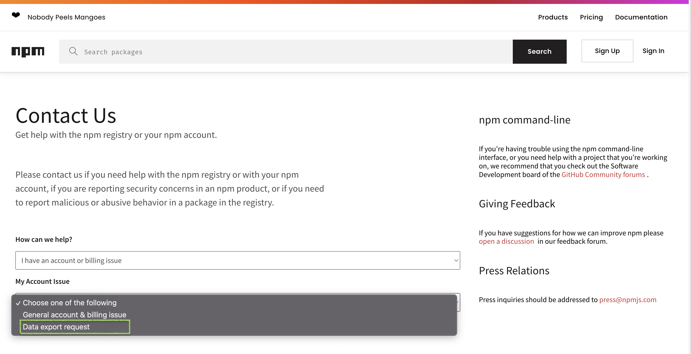

+++
title = "请求导出个人数据"
date = 2023-09-22T20:52:19+08:00
weight = 30
type = "docs"
description = ""
isCJKLanguage = true
draft = false

+++

> 原文: [https://docs.npmjs.com/requesting-your-data](https://docs.npmjs.com/requesting-your-data)

# Requesting an export of your personal data - 请求导出个人数据

You can export and review the metadata that npm stores about your personal account. The export is an archive containing the following information.

​	您可以导出并查看npm存储的有关您个人账户的元数据。导出的是一个包含以下信息的存档。

1. Your personal details such as username, email address, full name, linked Twitter / GitHub accounts, masked Personal Access Tokens (PAT) and the organisations that you are a member of.
2. 您的个人详细信息，如用户名、电子邮件地址、全名、关联的Twitter / GitHub账户、掩码的个人访问令牌（PAT）以及您所属的组织。
3. Metadata of all the packages that you have access to.
4. 您可以访问的所有软件包的元数据。
5. Each individual version of packages that you have published to npm.
6. 您发布到npm的每个单独版本的软件包。

## 如何请求导出 How to request an export

1. Navigate to [npm support form](https://www.npmjs.com/support)
2. 导航至[npm支持表单](https://www.npmjs.com/support)
3. Select "Account and Billing issues" category
4. 选择“账户和计费问题”类别
5. Select "Data export request" sub-category
6. 选择“数据导出请求”子类别

7. Fill in the details and submit the form
8. 填写详细信息并提交表单

## 检索导出的数据 Retrieving the exported data

After a request is placed our support team will review it and initiate an export on your behalf. Once the export process is complete you will receive an email with a link to an archive of your personal data. You must be authenticated to npmjs.com to download this archive.

​	在提交请求后，我们的支持团队将对其进行审核并代表您启动导出过程。导出过程完成后，您将收到一封电子邮件，其中包含您个人数据存档的链接。您必须在npmjs.com上进行身份验证才能下载此存档。

The download link will be available for 7 days, after which the exported data and the link is purged.

​	下载链接将可用7天，之后导出的数据和链接将被清除。
