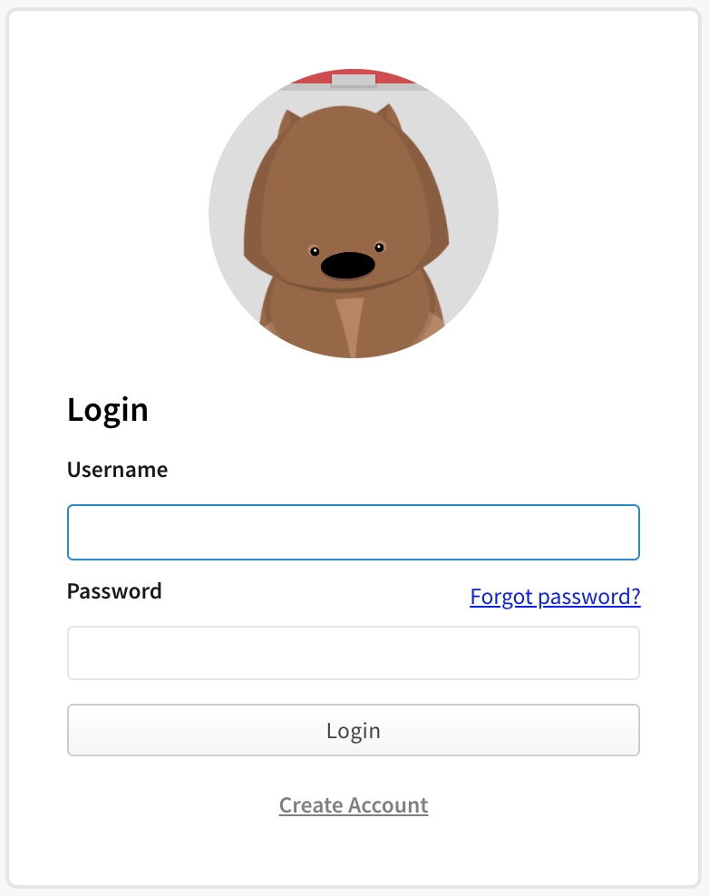
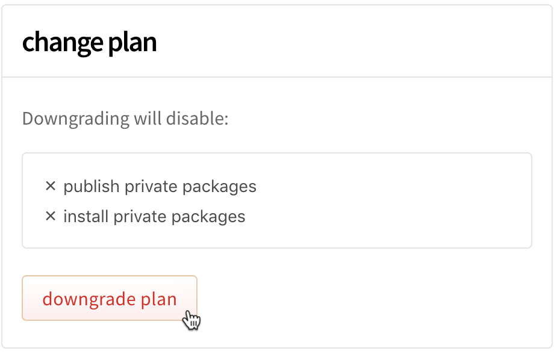

+++
title = "降级到免费用户账户计划"
date = 2023-09-22T20:52:59+08:00
weight = 30
type = "docs"
description = ""
isCJKLanguage = true
draft = false

+++

> 原文: [https://docs.npmjs.com/downgrading-to-a-free-user-account-plan](https://docs.npmjs.com/downgrading-to-a-free-user-account-plan)

# Downgrading to a free user account plan - 降级到免费用户账户计划

**Note:** This article only applies to users of the public npm registry.

**注意：**本文仅适用于公共npm注册表的用户。

If you have a paid user account, but no longer need private packages, you can downgrade your paid organization to a free organization. When you downgrade from a paid to a free organization, you will lose the ability to install and publish private packages at the end of your last paid billing cycle. Your private packages will *not* be made publicly visible when you downgrade to a free plan.

​	如果您有一个付费用户账户，但不再需要私有软件包，您可以将付费组织降级为免费组织。当您从付费组织降级为免费组织时，在您最后一个付费计费周期结束时，您将失去安装和发布私有软件包的能力。当您降级为免费计划时，您的私有软件包将**不会**公开可见。

1. On the npm "Sign In" page, enter your account details and click Sign In.

2. 在npm的“登录”页面上，输入您的账户详细信息，然后点击“登录”。

   

3. In the upper right corner of the page, click your profile picture, then select Billing Info.

4. 在页面右上角，点击您的个人头像，然后选择“账单信息”。

   

5. Under "change plan", click Downgrade Plan.

6. 在“更改计划”下，点击“降级计划”。

   

7. Under "Are you sure?", click Downgrade to a free account.

8. 在“您确定吗？”下，点击“降级为免费账户”。

   
