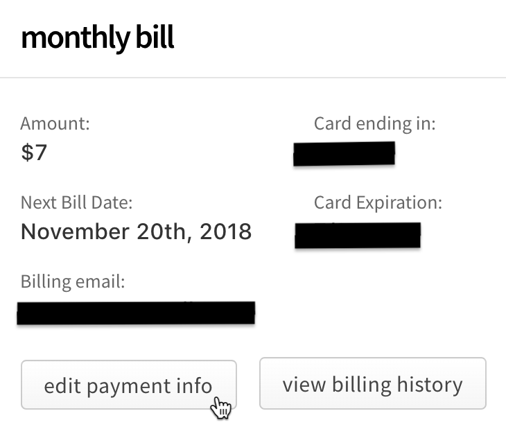
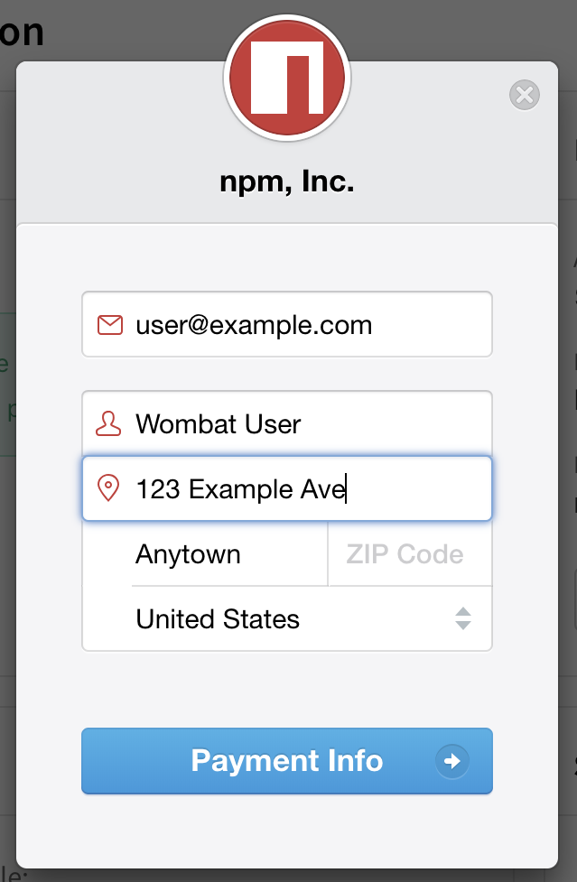
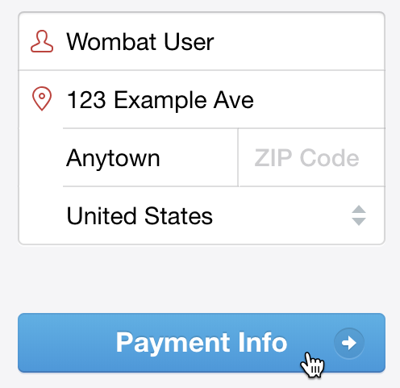
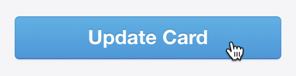
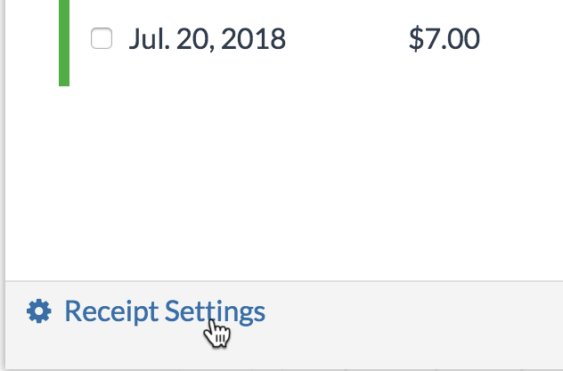

+++
title = "更新用户账户的计费设置"
date = 2023-09-22T20:52:49+08:00
weight = 20
type = "docs"
description = ""
isCJKLanguage = true
draft = false

+++

> 原文: [https://docs.npmjs.com/updating-user-account-billing-settings](https://docs.npmjs.com/updating-user-account-billing-settings)

# Updating user account billing settings - 更新用户账户的计费设置

**Note:** This article only applies to users of the public npm registry.

**注意：**本文仅适用于公共 npm 注册表的用户。

You can update the credit card used to pay for your paid user account plan. Updating your credit card will not change your billing cycle date, and the new credit card will be charged on the next billing cycle.

​	您可以更新用于支付付费用户账户计划的信用卡。更新信用卡不会更改您的计费周期日期，新的信用卡将在下一个计费周期上收费。

**Note:** If the credit card used to pay for your paid user account plan expires, or we are otherwise are unable to charge your card, you have a grace period of nine days to update the card.

**注意：**如果用于支付付费用户账户计划的信用卡过期，或者我们无法收取您的款项，您有九天的宽限期来更新信用卡。

## 更新信用卡信息 Updating credit card information

1. On the npm "Sign In" page, enter your account details and click Sign In.

2. 在 npm "登录" 页面上，输入您的账户详细信息，然后点击 "登录"。

   

3. In the upper right corner of the page, click your profile picture, then select Billing Info.

4. 在页面右上角，点击您的个人头像，然后选择 "计费信息"。

   

5. Under "monthly bill", click Edit Payment Info.

6. 在 "月度账单" 下，点击 "编辑付款信息"。

   

7. In the billing information dialog box, enter your billing information:

8. 在计费信息对话框中，输入您的计费信息：

   - Email: the email address used for the billing contact
   - 邮箱：用于计费联系的电子邮件地址
   - Name: the name on the credit card used to pay
   - 姓名：用于付款的信用卡上的姓名
   - Street, City, ZIP Code, Country: the billing address associated with the credit card
   - 街道、城市、邮政编码、国家/地区：与信用卡关联的计费地址

   

9. Click Payment Info.

10. 点击 "付款信息"。

   

11. In the credit card information dialog box, enter your credit card information:

12. 在信用卡信息对话框中，输入您的信用卡信息：

    - Card number
    - 卡号
    - MM / YY: the month and year of the card expiration date
    - 月 / 年：信用卡到期日期的月份和年份
    - CVC: the three-digit code on the credit card
    - CVC：信用卡上的三位数安全码

    

13. To save your credit card information for other payments on npm, select "Remember me".

14. 要将您的信用卡信息保存用于 npm 上的其他付款，请选择 "记住我"。

    

15. Click Update Card.

16. 点击 "更新卡片"。

    

## 更新计费收据电子邮件和额外收据信息 Updating billing receipt email and extra receipt information

You can update the email address used for receipts, and add extra information to the receipt for your paid user account plan, such as your business name, VAT identification number, or address of record. Updated billing information will appear on all receipts immediately.

​	您可以更新用于收据的电子邮件地址，并为付费用户账户计划的收据添加额外信息，例如您的企业名称、增值税号码或记录地址。更新的计费信息将立即显示在所有收据上。

**Note:** The billing email is used for receipts only and is not required to match the email address of the person whose card is used to pay for the paid user account plan.

**注意：**计费电子邮件仅用于收据，不需要与用于支付付费用户账户计划的信用卡持有人的电子邮件地址匹配。

1. On the npm "Sign In" page, enter your account details and click Sign In.

2. 在 npm "登录" 页面上，输入您的账户详细信息，然后点击 "登录"。

   

3. In the upper right corner of the page, click your profile picture, then select Billing Info.

4. 在页面右上角，点击您的个人头像，然后选择 "计费信息"。

   

5. On the Billing Information page, under "monthly bill", select View Billing History.

6. 在 "月度账单" 下，选择 "查看计费历史"。

   

7. At the bottom of the Billing History dialog box, click "Receipt Settings".

8. 在计费历史对话框的底部，点击 "收据设置"。

   

9. To add a business name, VAT number, address of record, or other information to your receipts, in the "Extra Billing Information" text box, type the information.

10. 要在收据上添加企业名称、增值税号码、记录地址或其他信息，请在 "额外计费信息" 文本框中输入信息。

   

11. To update the email address used for receipts, beside "Send my receipts", select the checkbox and type the email address that should receive billing receipts.

12. 要更新用于收据的电子邮件地址，请在 "发送我的收据" 旁边选中复选框，并输入应接收计费收据的电子邮件地址。

    

13. Click Save.

14. 点击“保存”。

    
