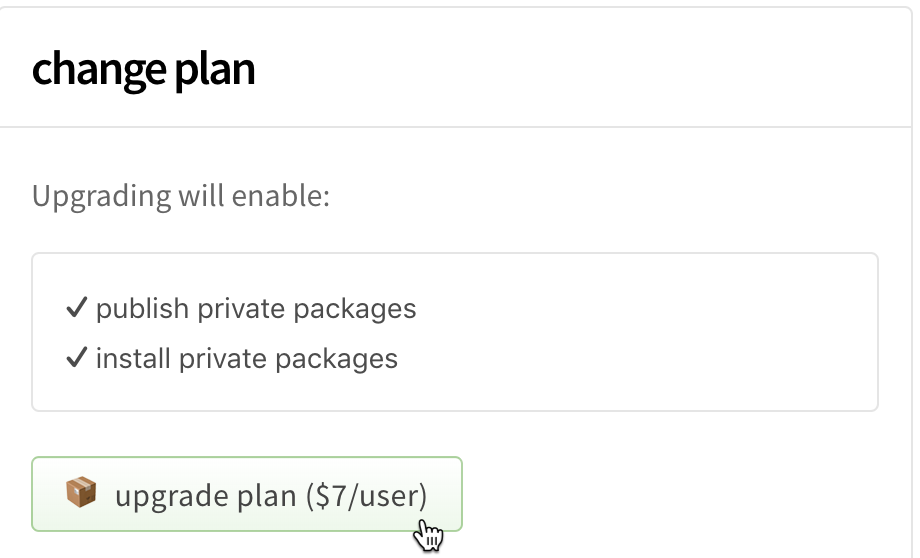
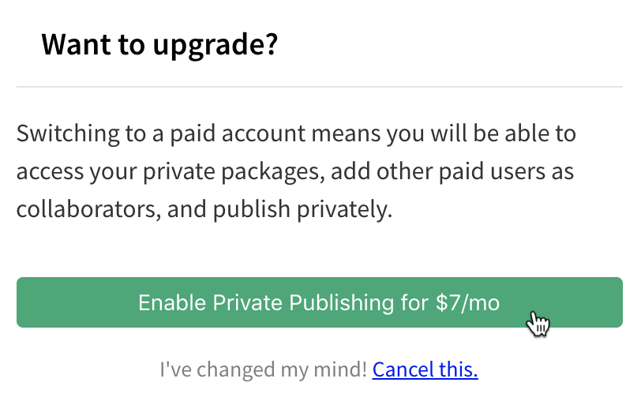
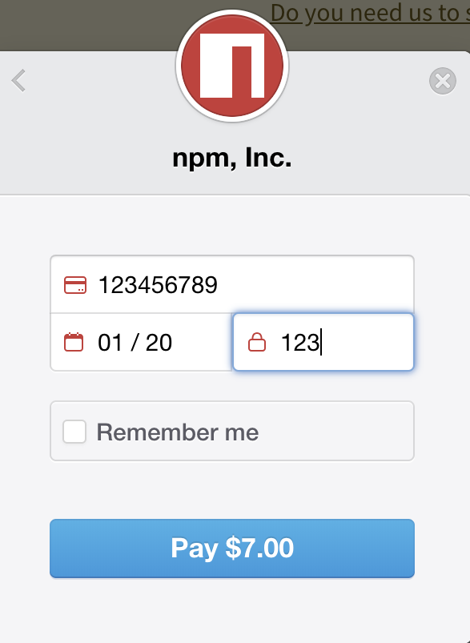
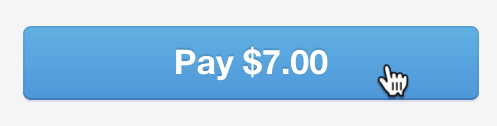

+++
title = "升级到付费用户账户计划"
date = 2023-09-22T20:52:29+08:00
weight = 1
type = "docs"
description = ""
isCJKLanguage = true
draft = false

+++

> 原文: [https://docs.npmjs.com/upgrading-to-a-paid-user-account-plan](https://docs.npmjs.com/upgrading-to-a-paid-user-account-plan)

# Upgrading to a paid user account plan - 升级到付费用户账户计划

**Note:** This article only applies to users of the public npm registry.

**注意：**本文仅适用于公共 npm 注册表的用户。

If you need to install and publish private packages, you can upgrade to a paid user account plan. Our paid user account plan costs $7 per month. For more information, see the "npm account" column on our [pricing page](https://www.npmjs.com/pricing).

​	如果您需要安装和发布私有软件包，您可以升级到付费用户账户计划。我们的付费用户账户计划每月收费 7 美元。有关更多信息，请参阅我们的[定价页面](https://www.npmjs.com/pricing)上的“npm 账户”列。

Your paid plan and billing cycle will start when you submit your credit card information, and you will be charged for the first month immediately.

​	您的付费计划和计费周期将在您提交信用卡信息后开始，您将立即支付首月费用。

1. On the npm "Sign In" page, enter your account details and click Sign In.

2. 在 npm 的“登录”页面上，输入您的账户详细信息，然后点击“登录”。

   

3. In the upper right corner of the page, click your profile picture, then select Billing Info.

4. 在页面的右上角，点击您的个人头像，然后选择“账单信息”。

   

5. Under "change plan", click **Upgrade Plan ($7/User)**.

6. 在“更改计划”下，点击 **升级计划（7 美元/用户）**。

   

7. Under "Want to upgrade?", click **Enable Private Publishing for $7/mo**.

8. 在“想要升级吗？”下，点击 **启用私有发布（每月 7 美元）**。

   

9. In the billing information dialog box, enter your billing information:

10. 在账单信息对话框中，输入您的账单信息：

   - Email: the email address used for the billing contact
   - 电子邮件：用于账单联系的电子邮件地址
   - Name: the name on the credit card used to pay
   - 姓名：用于支付的信用卡上的姓名
   - Street, City, ZIP Code, Country: the billing address associated with the credit card
   - 街道、城市、邮政编码、国家：与信用卡关联的账单地址

   

11. Click Payment Info.

12. 点击“付款信息”。

    

13. In the credit card information dialog box, enter your credit card information:

14. 在信用卡信息对话框中，输入您的信用卡信息：

    - Card number
    - 卡号
    - MM / YY: the month and year of the card expiration date
    - MM / YY：卡片到期日的月份和年份
    - CVC: the three-digit code on the credit card
    - CVC：信用卡上的三位数安全码

    

15. To save your credit card information for other payments on npm, select "Remember me".

16. 要在 npm 上保存您的信用卡信息以进行其他支付，请选择“记住我”。

    

17. Click **Pay $7.00**.

18. 点击 **支付 7.00 美元**。

    
