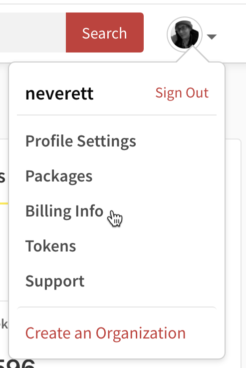
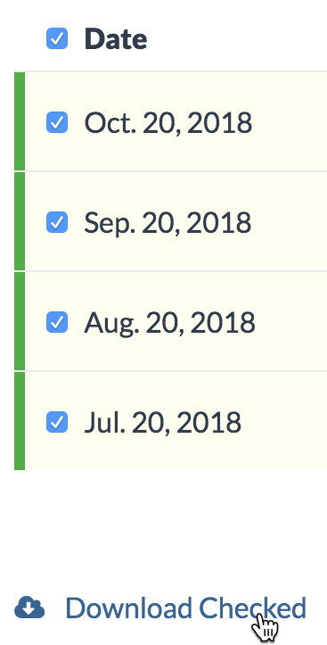

+++
title = "查看、下载和通过电子邮件获取您的npm用户账户的收据"
date = 2023-09-22T20:52:40+08:00
weight = 10
type = "docs"
description = ""
isCJKLanguage = true
draft = false

+++

> 原文: [https://docs.npmjs.com/viewing-downloading-and-emailing-receipts-for-your-user-account](https://docs.npmjs.com/viewing-downloading-and-emailing-receipts-for-your-user-account)

# Viewing, downloading, and emailing receipts for your npm user account - 查看、下载和通过电子邮件获取您的npm用户账户的收据

**Note:** This article only applies to users of the public npm registry.

**注意：**本文仅适用于公共npm注册用户。

You can view, download, and email receipts for the complete billing history of your npm user account.

​	您可以查看、下载和通过电子邮件获取完整的npm用户账户的账单历史收据。

## 查看收据 Viewing receipts

1. On the npm "Sign In" page, enter your account details and click Sign In.

2. 在npm的“登录”页面上，输入您的账户详细信息，然后点击“登录”。

   

3. In the upper right corner of the page, click your profile picture, then select Billing Info.

4. 在页面右上角，点击您的个人头像，然后选择“账单信息”。

   

5. On the Billing Information page, under "monthly bill", select View Billing History.

6. 在“账单信息”页面上，在“月度账单”下选择“查看账单历史”。

   

7. To view a single receipt, find the row of the receipt you want to view, then, on the right side of the row, click the view icon.

8. 要查看单个收据，请找到您想要查看的收据所在的行，在行的右侧点击查看图标。

   

## 下载收据 Downloading receipts

1. On the npm "Sign In" page, enter your account details and click Sign In.

2. 在npm的“登录”页面上，输入您的账户详细信息，然后点击“登录”。

   

3. In the upper right corner of the page, click your profile picture, then select Billing Info.

4. 在页面右上角，点击您的个人头像，然后选择“账单信息”。

   

5. On the Billing Information page, under "monthly bill", select View Billing History.

6. 在“账单信息”页面上，在“月度账单”下选择“查看账单历史”。

   

7. To download a single receipt, find the row of the receipt you want to download, then click the PDF icon on the right side of the row.

8. 要下载单个收据，请找到您想要下载的收据所在的行，然后点击行右侧的PDF图标。

   

9. To download multiple receipts, first select the receipts that you wish to download by selecting the box next to the date. To select all receipts, select the checkbox next to the "Date" header. Then click Download Checked.

10. 要下载多个收据，首先通过选择日期旁边的复选框选择要下载的收据。要选择所有收据，请选择“日期”标题旁边的复选框。然后点击“下载已选”。

   

## 通过电子邮件发送收据 Emailing receipts

1. On the npm "Sign In" page, enter your account details and click Sign In.

2. 在npm的“登录”页面上，输入您的账户详细信息，然后点击“登录”。

   

3. In the upper right corner of the page, click your profile picture, then select Billing Info.

4. 在页面右上角，点击您的个人头像，然后选择“账单信息”。

   

5. On the Billing Information page, under "monthly bill", select View Billing History.

6. 在“账单信息”页面上，在“月度账单”下选择“查看账单历史”。

   

7. To email a single receipt, find the row of the receipt you want to download, then, on the right side of the row, click the email icon.

8. 要通过电子邮件发送单个收据，请找到您想要下载的收据所在的行，在行的右侧点击电子邮件图标。

   

9. To email multiple receipts, first select the receipts that you wish to download by selecting the box next to the date. To select all receipts, select the checkbox next to the "Date" header. Then click Email Checked.

10. 要通过电子邮件发送多个收据，首先通过选择日期旁边的复选框选择要下载的收据。要选择所有收据，请选择“日期”标题旁边的复选框。然后点击“发送已选”。

   

11. In the Email Receipt dialog box, fill in the "From", "To", and "Message" fields.

12. 在“发送电子邮件收据”对话框中，填写“发件人”、“收件人”和“消息”字段。

    

13. Click **Send**.

14. 点击**发送**。
