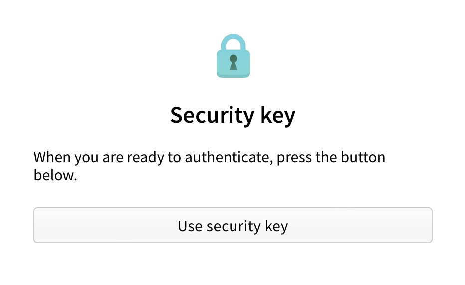
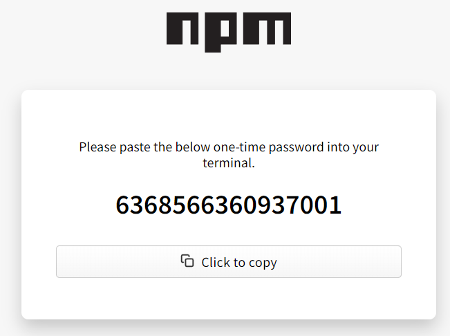

+++
title = "使用双因素身份验证访问 npm"
date = 2023-09-22T20:51:31+08:00
weight = 50
type = "docs"
description = ""
isCJKLanguage = true
draft = false

+++

> 原文: [https://docs.npmjs.com/accessing-npm-using-2fa](https://docs.npmjs.com/accessing-npm-using-2fa)

# Accessing npm using two-factor authentication - 使用双因素身份验证访问 npm

## 使用安全密钥流程从命令行登录 Sign in from the command line using security-key flow

1. On the command line, type the [`npm login`](https://docs.npmjs.com/cli/adduser) command.

2. 在命令行中，输入[ `npm login` ](https://docs.npmjs.com/cli/adduser)命令。

3. When prompted, provide your username, password, and email address.

4. 当提示时，提供您的用户名、密码和电子邮件地址。

   ```
   user@host:~$ npm login
   npm notice Log in on https://registry.npmjs.org/
   Username: mona
   Password:
   Email: (this IS public) mona@github.com
   npm notice Open https://www.npmjs.com/login/913c3ab1-89a0-44bd-be8d-d946e2e906f0 to use your security key for authentication or enter OTP from your authenticator app
   ```

5. If you have configured a security-key, open the provided URL shown in the command line. Alternatively, if you have configured a mobile authenticator skip to step 6.

6. 如果您已配置安全密钥，请打开命令行中显示的提供的 URL。或者，如果您已配置移动验证器，请跳至步骤 6。

7. Click on *Use security key* and follow the browser specific steps to authenticate.

8. 点击“使用安全密钥”并按照浏览器特定的步骤进行身份验证。

   

9. Copy the generated token

10. 复制生成的令牌。

   

11. Enter the one-time password into the CLI prompt.

12. 在命令行提示中输入一次性密码。

    ```
    Enter one-time password:
    ```

## 使用  `--auth-type=web`  从命令行登录 Sign in from the command line using `--auth-type=web`

npm 8.14.0 and higher support login flow through the browsers. This will become the default behavior for the npm public registry in npm 9.

​	npm 8.14.0 及更高版本支持通过浏览器进行登录流程。这将成为 npm 9 中 npm 公共注册表的默认行为。

### 使用现有的浏览器会话 With an existing browser session

1. On the command line, type the [`npm login --auth-type=web`](https://docs.npmjs.com/cli/adduser) command.

2. 在命令行中，输入[ `npm login --auth-type=web` ](https://docs.npmjs.com/cli/adduser)命令。

3. When prompted hit "ENTER" to open your browser to start the login flow or click the provided URL show in the command line.

4. 当提示时，按下 "ENTER" 键打开浏览器开始登录流程，或者点击命令行中显示的提供的 URL。

   ```
   user@host:~$ npm login
   npm notice Log in on https://registry.npmjs.org/
   Authenticate your account at:
   https://www.npmjs.com/login?next=/login/cli/b1a2f96a-ce09-4463-954c-c99f6773b922
   Press ENTER to open in the browser...
   ```

5. Click on *Use security key* and follow the browser specific steps to authenticate.

6. 点击“使用安全密钥”并按照浏览器特定的步骤进行身份验证。

   

   *Note: If you have configured to use TOTP, you will see an TOTP prompt instead*

   *注意：如果您已配置使用 TOTP，则会看到 TOTP 提示*

### 没有现有的浏览器会话 Without an existing browser session

1. On the command line, type the [`npm login --auth-type=web`](https://docs.npmjs.com/cli/adduser) command.

2. 在命令行中，输入[ `npm login --auth-type=web` ](https://docs.npmjs.com/cli/adduser)命令。

3. When prompted hit "ENTER" to open your browser to start the login flow or click the provided URL show in the command line.

4. 当提示时，按下 "ENTER" 键打开浏览器开始登录流程，或者点击命令行中显示的提供的 URL。

   ```
   user@host:~$ npm login
   npm notice Log in on https://registry.npmjs.org/
   Authenticate your account at:
   https://www.npmjs.com/login?next=/login/cli/b1a2f96a-ce09-4463-954c-c99f6773b922
   Press ENTER to open in the browser...
   ```

5. On the npm "Sign In" page, enter your account details and click  Sign In.

6. 在 npm "登录" 页面上，输入您的账户详细信息，然后点击 "登录"。

   

7. Click on *Use security key* and follow the browser specific steps to authenticate.

8. 点击“使用安全密钥”并按照浏览器特定的步骤进行身份验证。

   

   *Note: If you have configured to use TOTP, you will see an TOTP prompt instead*

   *注意：如果您已配置使用 TOTP，则会看到 TOTP 提示*
