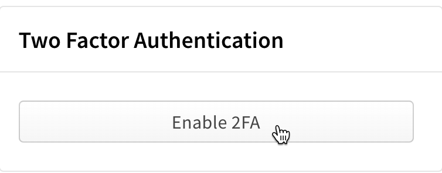
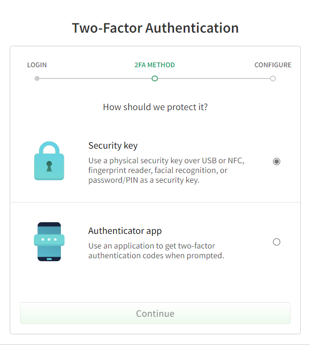
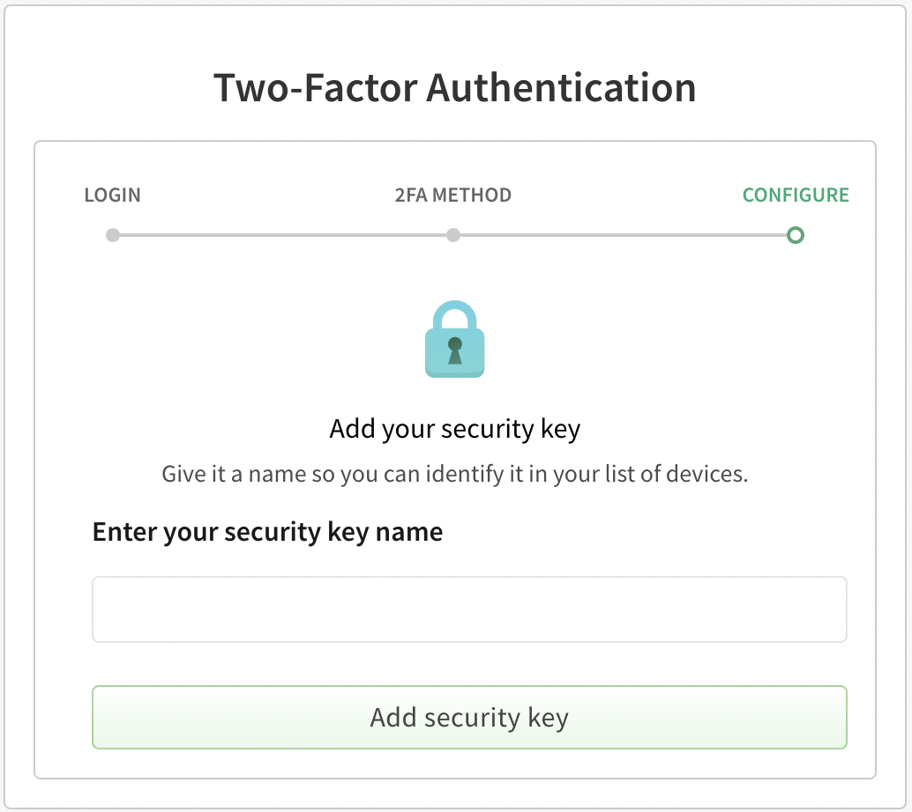
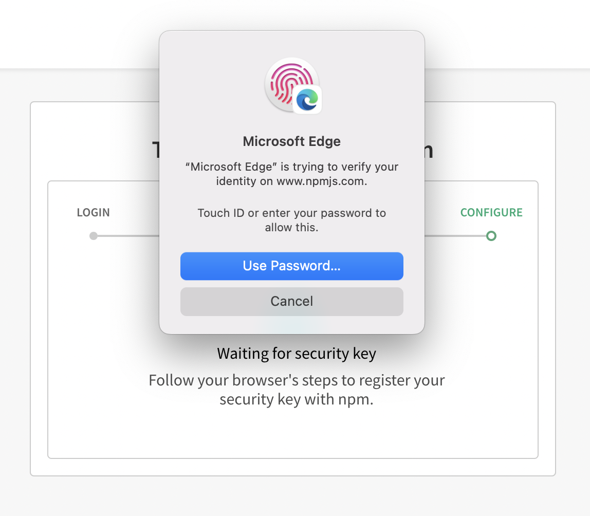
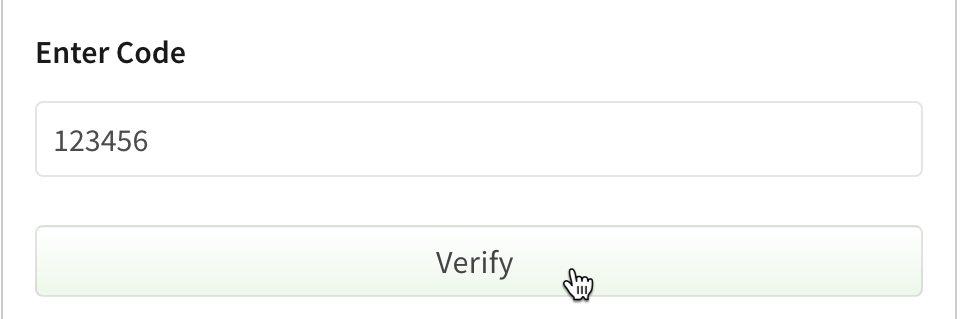
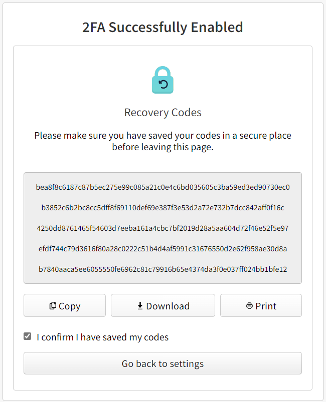
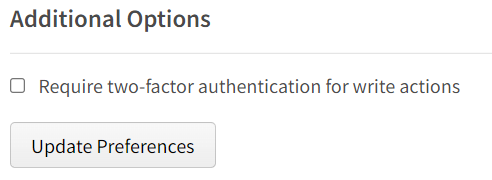
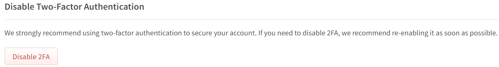
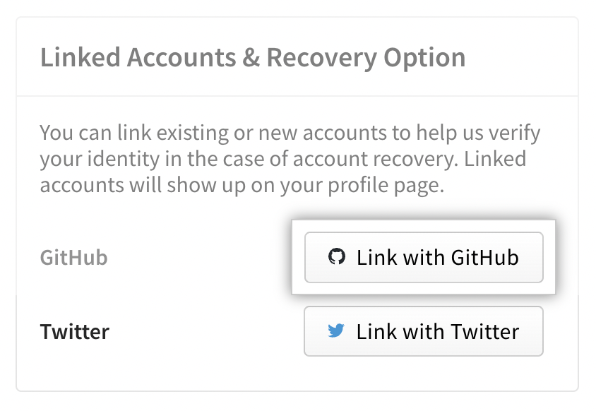
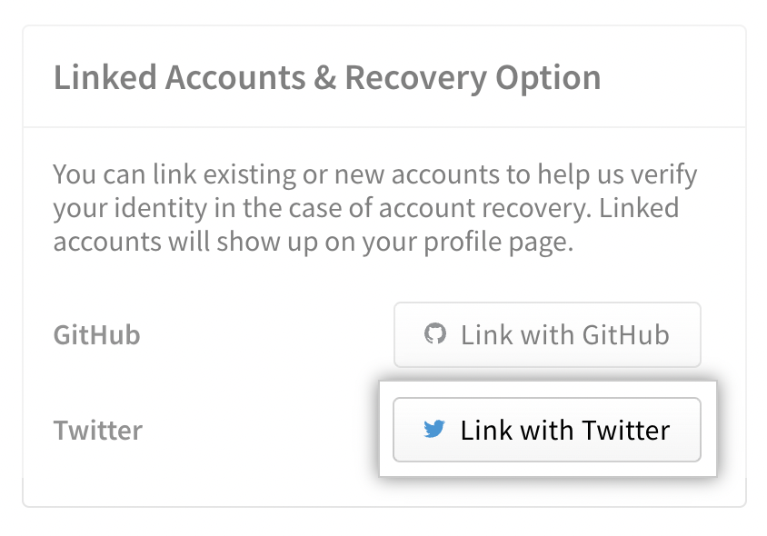

+++
title = "配置双因素身份验证"
date = 2023-09-22T20:51:12+08:00
weight = 40
type = "docs"
description = ""
isCJKLanguage = true
draft = false

+++

> 原文: [https://docs.npmjs.com/configuring-two-factor-authentication](https://docs.npmjs.com/configuring-two-factor-authentication)

# Configuring two-factor authentication - 配置双因素身份验证

You can enable two-factor authentication (2FA) on your npm user account to protect against unauthorized access to your account and packages, either by using a [security-key](https://webauthn.guide/) or [time-based one-time password (TOTP)](https://en.wikipedia.org/wiki/Time-based_one-time_password) from a mobile app.

​	您可以在 npm 用户账户上启用双因素身份验证（2FA），以保护您的账户和软件包免受未经授权的访问。您可以使用[安全密钥](https://webauthn.guide/)或[基于时间的一次性密码（TOTP）](https://en.wikipedia.org/wiki/Time-based_one-time_password)通过移动应用程序来启用双因素身份验证。

## 先决条件 Prerequisites

Before you enable 2FA on your npm user account, you must:

​	在启用 npm 用户账户上的双因素身份验证之前，您必须：

- Update your npm client to version 5.5.1 or higher.
- 将您的 npm 客户端更新到 5.5.1 或更高版本。
- To configure a security-key requires a modern browser that support [WebAuthn](https://caniuse.com/#search=webauthn). This will allow you to configure a biometric devices such as Apple [Touch ID](https://support.apple.com/en-gb/HT204587), [Face ID](https://support.apple.com/en-us/HT208108), or [Windows Hello](https://support.microsoft.com/en-us/windows/learn-about-windows-hello-and-set-it-up-dae28983-8242-bb2a-d3d1-87c9d265a5f0) as well as physical keys such as [Yubikey](https://www.yubico.com/), [Thetis](https://thetis.io/), or [Feitian](https://www.ftsafe.com/).
- 要配置安全密钥，需要支持[WebAuthn](https://caniuse.com/#search=webauthn)的现代浏览器。这将允许您配置生物识别设备，如 Apple 的[Touch ID](https://support.apple.com/zh-cn/HT204587)、[Face ID](https://support.apple.com/zh-cn/HT208108)或[Windows Hello](https://support.microsoft.com/zh-cn/windows/learn-about-windows-hello-and-set-it-up-dae28983-8242-bb2a-d3d1-87c9d265a5f0)，以及物理密钥，如[YubiKey](https://www.yubico.com/)、[Thetis](https://thetis.io/)或[Feitian](https://www.ftsafe.com/)。
- To configure TOTP you will need to install an authenticator application that can generate OTPs such as [Authy](https://authy.com/download/), [Google Authenticator](https://support.google.com/accounts/answer/1066447), or [Microsoft Authenticator](https://www.microsoft.com/security/mobile-authenticator-app) on your mobile device.
- 要配置 TOTP，您需要在手机上安装一个可以生成 OTP 的身份验证应用程序，例如[Authy](https://authy.com/download/)、[Google Authenticator](https://support.google.com/accounts/answer/1066447)或[Microsoft Authenticator](https://www.microsoft.com/security/mobile-authenticator-app)。

For more information on supported 2FA methods, see "[About two-factor authentication](https://docs.npmjs.com/about-two-factor-authentication)".

​	有关支持的双因素身份验证方法的更多信息，请参阅“[关于双因素身份验证](https://docs.npmjs.com/about-two-factor-authentication)”。

**Note:** npm does not accept SMS (text-to-phone) as a 2FA method.

**注意：**npm 不接受短信（短信到手机）作为双因素身份验证的方法。

## 从网站配置双因素身份验证 Configuring 2FA from the website

### 启用双因素身份验证 Enabling 2FA

1. On the npm "Sign In" page, enter your account details and click Sign In.

2. 在 npm 的“登录”页面上，输入您的账户详细信息，然后点击“登录”。

   

3. In the upper right corner of the page, click your profile picture, then click Account.

4. 在页面的右上角，点击您的个人头像，然后点击“账户”。****

   

5. On the account settings page, under "Two-Factor Authentication", click **Enable 2FA**.

6. 在账户设置页面上，在“双因素身份验证”下，点击 **启用 2FA**。

   

7. When prompted provide your current account password and then click **Confirm password to continue**.

8. 在提示时，提供您当前账户密码，然后点击 **确认密码以继续**。

9. On the 2FA method page, select the method you would like to enable and click **Continue**. For more information on supported 2FA methods, see "[About two-factor authentication](https://docs.npmjs.com/about-two-factor-authentication)".

10. 在 2FA 方法页面上，选择要启用的方法，然后点击 **继续**。有关支持的双因素身份验证方法的更多信息，请参阅“[关于双因素身份验证](https://docs.npmjs.com/about-two-factor-authentication)”。

   

11. Configure the 2FA method of your choice:

12. 配置您选择的 2FA 方法：

- When using a **security-key**, provide a name for it and click **Add security key**. Follow the browser specific steps to add your security-key.

- 使用 **安全密钥** 时，请为其提供一个名称，然后点击 **添加安全密钥**。按照特定于浏览器的步骤添加您的安全密钥。

  

  Below is an example of configuration from Microsoft Edge running on a MacOS

  以下是在运行 MacOS 上的 Microsoft Edge 上配置的示例

  

- When using an **authenticator application** on your phone, open it and scan the QR code on the two-step verification page. Enter the code generated by the app, then click **Verify**.

- 在手机上使用 **身份验证应用程序** 时，请打开应用程序并扫描两步验证页面上的 QR 码。输入应用程序生成的代码，然后点击 **验证**。

  

1. On the recovery code page, copy the recovery codes to your computer or other safe location that is not your second factor device. We recommend using a password manager.

1. 在恢复代码页面上，将恢复代码复制到计算机或其他安全位置，而不是您的第二因素设备。我们建议使用密码管理器。

   

*Recovery codes are the only way to ensure you can recover your account if you lose access to your second factor device. Each code can be used only once. You can [view and regenerate your recovery code](https://docs.npmjs.com/recovering-your-2fa-enabled-account#viewing-and-regenerating-recovery-code) from your 2FA settings page. For secondary account recovery options, see "[Configuring account recovery options](https://docs.npmjs.com/configuring-two-factor-authentication#configuring-account-recovery-options)."*

*恢复代码是确保在无法访问第二因素设备的情况下恢复您的账户的唯一方法。每个代码只能使用一次。您可以从 2FA 设置页面[查看和重新生成恢复代码](https://docs.npmjs.com/recovering-your-2fa-enabled-account#viewing-and-regenerating-recovery-code)。有关辅助账户恢复选项，请参阅“[配置账户恢复选项](https://docs.npmjs.com/configuring-two-factor-authentication#configuring-account-recovery-options)”*

1. Click **Go back to settings** after confirming that you have saved your codes.
1. 确认已保存代码后，点击 **返回设置**。

### 禁用写操作的双因素身份验证 Disabling 2FA for writes

Check the [Authorization and writes](https://docs.npmjs.com/about-two-factor-authentication#authorization-and-writes) section for more information on different operations that requires 2FA when this mode is enabled.

​	有关在启用此模式时需要双因素身份验证的不同操作的更多信息，请查看[授权和写操作](https://docs.npmjs.com/about-two-factor-authentication#authorization-and-writes)部分。

**Note**: As a recommended setting, 2FA for write operations are *automatically enabled* when setting up 2FA. The following steps explain how to disable it.

**注意：**作为推荐设置，在设置双因素身份验证时，写操作的双因素身份验证会被*自动启用*。以下步骤解释了如何禁用它。

1. On the npm "Sign In" page, enter your account details and click Sign In.

2. 在 npm 的“登录”页面上，输入您的账户详细信息，然后点击“登录”。

   

3. In the upper right corner of the page, click your profile picture, then click Account.

4. 在页面的右上角，点击您的个人头像，然后点击“账户”。

   

5. On the account settings page, under "Two-Factor Authentication", click **Modify 2FA**.

6. 在账户设置页面上，在“双因素身份验证”下，点击 **修改 2FA**。

   

7. From the "Manage Two-Factor Authentication" navigate to "Additional Options" section

8. 从“管理双因素身份验证”导航到“附加选项”部分

9. Clear the checkbox for "Require two-factor authentication for write actions" and click "Update Preferences"

10. 清除“要求在写操作中进行双因素身份验证”的复选框，然后点击“更新首选项”

   

### 禁用双因素身份验证 Disabling 2FA

If you have 2FA enabled, you can remove it from your account settings page.

​	如果您已启用双因素身份验证，您可以在账户设置页面上将其移除。

**Note:** You cannot remove 2FA if you are a member of an organization that enforces 2FA. You can view the list of organizations memberships from your profile page under the "Organizations" tab.

**注意：**如果您是一个强制要求双因素身份验证的组织的成员，您无法移除双因素身份验证。您可以在个人资料页面的“组织”选项卡下查看组织成员资格列表。

1. On the npm "Sign In" page, enter your account details and click Sign In.

2. 在 npm 的“登录”页面上，输入您的账户详细信息，然后点击“登录”。

   

3. In the upper right corner of the page, click your profile picture, then click Account.

4. 在页面的右上角，点击您的个人头像，然后点击“账户”。

   

5. On the account settings page, under "Two-Factor Authentication", click **Modify 2FA**.

6. 在账户设置页面上，在“双因素身份验证”下，点击 **修改 2FA**。

   

7. Scroll to the bottom of the "Manage Two-Factor Authentication" page and click Disable 2FA.

8. 滚动到“管理双因素身份验证”页面的底部，然后点击禁用 2FA。

   

9. Agree to the prompt from the browser.

10. 同意浏览器的提示。

## 从命令行配置双因素身份验证 Configuring 2FA from the command line

### 启用2FA Enabling 2FA from the command line

Although security-key with WebAuthn can be used for authentication from both the web and the command line, it can only be configured from the web. When enabling 2FA from the command line, currently the only available option is to use an TOTP mobile app.

​	尽管WebAuthn的安全密钥可以用于Web和命令行的身份验证，但目前只能从Web进行配置。当您从命令行启用2FA时，目前唯一可用的选项是使用TOTP移动应用程序。

**Note:** Settings you configure on the command line will also apply to your profile settings on the npm website.

**注意：**您在命令行上配置的设置也将应用于您在npm网站上的个人资料设置。

1. If you are logged out on the command line, log in using `npm login` command.

2. 如果您在命令行上已注销，请使用 `npm login` 命令登录。

3. On the command line, type the [`npm profile`](https://docs.npmjs.com/cli/profile) command along with the option for the 2FA mode you want to enable:

4. 在命令行上，输入[ `npm profile` ](https://docs.npmjs.com/cli/profile)命令以及您要启用的2FA模式的选项：

   - To enable 2FA for authorization and writes, type:

   - 要为授权和写入启用2FA，请输入：

     ```
     npm profile enable-2fa auth-and-writes
     ```
     
   - To enable 2FA for authorization only, type:

   - 要仅为授权启用2FA，请输入：

     ```
     npm profile enable-2fa auth-only
     ```

5. To add npm to your authenticator application, using the device with the app, you can either:

6. 要将npm添加到您的认证器应用程序中，请使用带有应用程序的设备，可以选择：

   - Scan the QR code displayed on the command line.
   - 扫描在命令行上显示的QR码。
   - Type the number displayed below the QR code.
   - 输入在QR码下方显示的数字。

7. When prompted to add an OTP code from your authenticator, on the command line, enter a one-time password generated by your authenticator app.

8. 在命令行上，当要求您添加认证器的OTP代码时，请输入认证器应用程序生成的一次性密码。

### 从命令行发送一次性密码 Sending a one-time password from the command line

If you have enabled 2FA auth-and-writes, you will need to send the TOTP from the command line for certain commands to work. To do this, append `--otp=123456` (where *123456* is the code generated by your authenticator) at the end of the command. Here are a few examples:

​	如果您已启用2FA授权和写入，则需要从命令行发送TOTP才能使某些命令正常工作。为此，在命令的末尾附加 `--otp=123456` （其中*123456*是您的认证器生成的代码）即可。以下是一些示例：

```
npm publish [<tarball>|<folder>][--tag <tag>] --otp=123456
npm owner add <user > --otp=123456
npm owner rm <user> --otp=123456
npm dist-tags add <pkg>@<version> [<tag>] --otp=123456
npm access edit [<package>) --otp=123456
npm unpublish [<@scope>/]<pkg>[@<version>] --otp=123456
```

### 从命令行中删除2FA Removing 2FA from the command line

1. If you are logged out on the command line, log in using `npm login` command.

2. 如果您在命令行上已注销，请使用 `npm login` 命令登录。

3. On the command line, type the following command:

4. 在命令行上，输入以下命令：

   ```
   npm profile disable-2fa
   ```

5. When prompted, enter your npm password:

6. 当提示时，输入您的npm密码：

   ```
   npm password:
   ```

7. When prompted for a one-time password, enter a password from your authenticator app:

8. 当提示输入一次性密码时，请输入认证器应用程序生成的密码：

   ```
   Enter one-time password from your authenticator: 123456
   ```

## 配置账户恢复选项 Configuring account recovery options

When you enable 2FA on your npm user account, we strongly recommend you link your GitHub and/or Twitter accounts to your npm user account. In the event you lose access to your 2FA device and recovery codes, these linked accounts can be used to verify your identity and expedite the recovery of your npm account.

​	当您在npm用户账户上启用2FA时，我们强烈建议您将GitHub和/或Twitter账户与npm用户账户关联起来。如果您无法访问您的2FA设备和恢复码，这些关联的账户可以用于验证您的身份并加快恢复npm账户的过程。

1. On the npm "Sign In" page, enter your account details and click Sign In.

2. 在npm的“登录”页面上，输入您的账户详细信息，然后点击“登录”。

   

3. In the upper right corner of the page, click your profile picture, then click Account.

4. 在页面右上角，点击您的个人头像，然后点击“账户”。

   

5. To [link your GitHub](managing-your-profile-settings#linking-your-npm-and-github-accounts) account, on the account settings page, under "Linked Accounts & Recovery Option", click **Link with GitHub**.

6. 要[链接您的GitHub](managing-your-profile-settings#linking-your-npm-and-github-accounts)账户，请在账户设置页面上，在“Linked Accounts & Recovery Option”下，点击**Link with GitHub**。

   

7. On the authorization page, verify all information looks correct. Then click **Authorize npm account link**.

8. 在授权页面上，验证所有信息是否正确。然后点击**Authorize npm account link**。

9. To [link your Twitter](https://docs.npmjs.com/managing-your-profile-settings#linking-your-npm-and-twitter-accounts) account, on the account settings page, under "Linked Accounts & Recovery Option", click **Link with Twitter**.

10. 要[链接您的Twitter](https://docs.npmjs.com/managing-your-profile-settings#linking-your-npm-and-twitter-accounts)账户，请在账户设置页面上，在“Linked Accounts & Recovery Option”下，点击**Link with Twitter**。

   

11. On the authorization page, verify all information looks correct. Then click **Authorize app**.

12. 在授权页面上，验证所有信息是否正确。然后点击**Authorize app**。

The Twitter or GitHub account is now linked to your npm account. To remove the link to either account, you can click the **Remove** button next to the account you want to remove from your npm account.

​	Twitter或GitHub账户现已链接到您的npm账户。要删除与任一账户的链接，您可以点击该账户旁边的**Remove**按钮，从您的npm账户中删除该链接。

## 解决TOTP错误 Resolving TOTP errors

If you are entering what seems to be a valid [TOTP](https://en.wikipedia.org/wiki/Time-based_one-time_password) but you see an error, be sure that you are using the correct authenticator account. If you have multiple authenticator accounts, using an TOTP from the wrong account will cause an error.

​	如果您输入的TOTP似乎是有效的，但出现错误，请确保您使用的是正确的认证器账户。如果您有多个认证器账户，并且使用了来自错误账户的TOTP，将会导致错误。

Also, when you reset two-factor authentication after it has been disabled, the authenticator might create a second account with the same name. Please see the authenticator documentation to delete the old account.

​	此外，当您在禁用2FA后重新设置双因素认证时，认证器可能会创建一个同名的第二个账户。请参阅认证器文档以删除旧账户。
