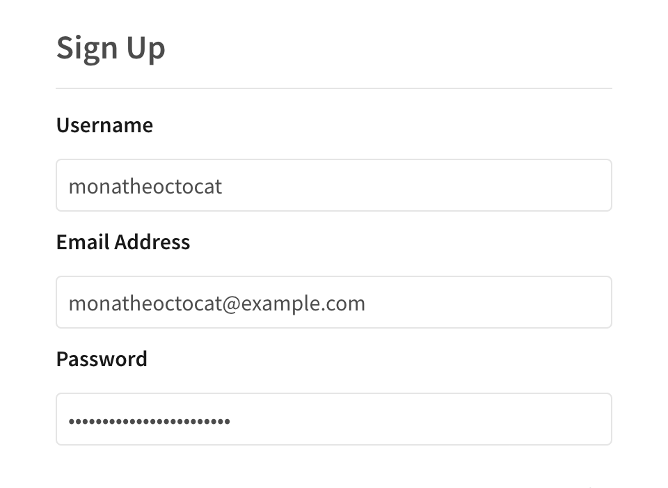
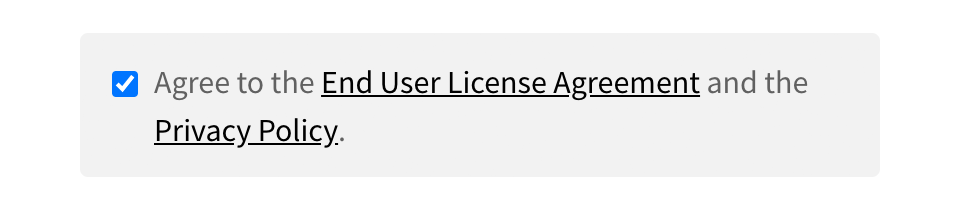
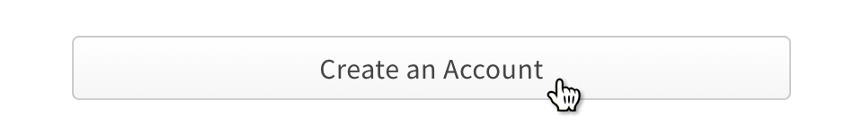

+++
title = "在公共注册表上创建新的用户账户"
date = 2023-09-22T20:50:33+08:00
weight = 1
type = "docs"
description = ""
isCJKLanguage = true
draft = false

+++

> 原文: [https://docs.npmjs.com/creating-a-new-npm-user-account](https://docs.npmjs.com/creating-a-new-npm-user-account)

# Creating a new user account on the public registry - 在公共注册表上创建新的用户账户

If you do not already have an npm user account, you can create an account in order to share and download Javascript packages on the public registry.

​	如果您还没有npm用户账户，您可以创建一个账户，以便在公共注册表上分享和下载JavaScript软件包。

## 在网站上创建账户 Creating an account on the website

1. Go to the [npm signup page](https://www.npmjs.com/signup)

2. 前往[npm注册页面](https://www.npmjs.com/signup)

3. In the user signup form, type in the fields:

4. 在用户注册表单中，填写以下字段：

   - **Username:** The username that will be displayed when you publish packages or interact with other npm users on npmjs.com. Your username must be lower case, and can contain hyphens and numerals.
   - **用户名：** 在您发布软件包或与其他npm用户在npmjs.com上进行交互时显示的用户名。您的用户名必须为小写字母，并且可以包含连字符和数字。
   - **Email address:** Your public email address will be added to the metadata of your packages and will be visible to anyone who downloads your packages. We will also send email to this account when you update packages, as well as occasional product updates and information.
   - **电子邮件地址：** 您的公共电子邮件地址将添加到您的软件包的元数据中，并对下载您的软件包的任何人可见。我们还将向此账户发送电子邮件，以通知您更新软件包以及偶尔的产品更新和信息。
   - **Password**: Your password must meet [our password guidelines](creating-a-strong-password).
   - **密码：** 您的密码必须符合[我们的密码准则](creating-a-strong-password)。

   

5. Read the [End User License Agreement](https://www.npmjs.com/policies/terms) and [Privacy Policy](https://www.npmjs.com/policies/privacy), and indicate that you agree to them.

6. 阅读[最终用户许可协议](https://www.npmjs.com/policies/terms)和[隐私政策](https://www.npmjs.com/policies/privacy)，并表示您同意它们。

   

7. Click **Create An Account**.

8. 点击**创建账户**。

   

**Note:** After signing up for an npm account, you will receive an account verification email. You must verify your email address in order to publish packages to the registry.

**注意：**注册npm账户后，您将收到一封账户验证电子邮件。您必须验证您的电子邮件地址才能将软件包发布到注册表中。

## 使用npm login测试您的新账户 Testing your new account with npm login

Use the [`npm login`](https://docs.npmjs.com/cli/adduser) command to test logging in to your new account.

​	使用[ `npm login` ](https://docs.npmjs.com/cli/adduser)命令测试登录到您的新账户。

**Note:** If you misspell your existing account username when you log in with the `npm login` command, you will create a new account with the misspelled name. For help with accidentally-created accounts, [contact npm Support](https://www.npmjs.com/support).

**注意：**如果您在使用 `npm login` 命令登录时拼写错误现有的账户用户名，将会创建一个带有拼写错误名称的新账户。如果出现意外创建的账户问题，请[联系npm支持](https://www.npmjs.com/support)寻求帮助。

1. On the command line, type the following command:

2. 在命令行中，输入以下命令：

   ```
   npm login
   ```

3. When prompted, enter your username, password, and email address.

4. 当提示时，输入您的用户名、密码和电子邮件地址。

5. If you have [two-factor authentication](about-two-factor-authentication) enabled, when prompted, enter a one-time password.

6. 如果您已启用[双因素身份验证](about-two-factor-authentication)，在提示时输入一次性密码。

7. To test that you have successfully logged in, type:

8. 为了测试您是否成功登录，输入：

   ```
   npm whoami
   ```

   Your npm username should be displayed.

   您的npm用户名应该会显示出来。
