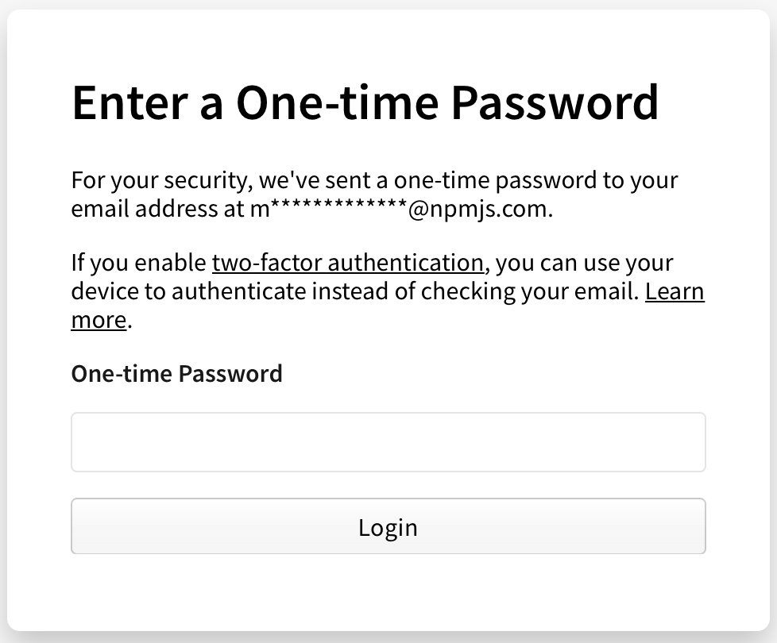
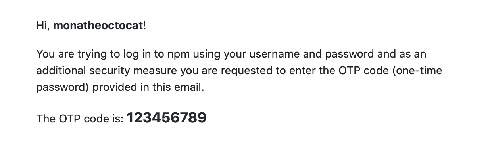
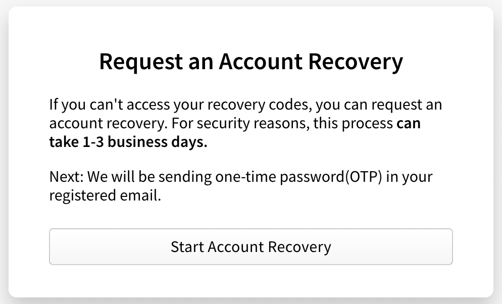

+++
title = "接收一次性密码的电子邮件"
date = 2023-09-22T20:50:49+08:00
weight = 20
type = "docs"
description = ""
isCJKLanguage = true
draft = false

+++

> 原文: [https://docs.npmjs.com/receiving-a-one-time-password-over-email](https://docs.npmjs.com/receiving-a-one-time-password-over-email)

# Receiving a one-time password over email - 接收一次性密码的电子邮件

For your security, npm may require additional verification to allow you to log in to your account. If you do not have [two-factor authentication](configuring-two-factor-authentication) enabled, you may be asked to verify yourself with a one-time password sent to the email address configured for your account.

​	为了您的安全，npm 可能需要额外的验证来允许您登录到您的账户。如果您没有启用[双因素身份验证](configuring-two-factor-authentication)，您可能会被要求通过发送到您账户配置的电子邮件地址的一次性密码来验证自己。

## 使用一次性密码登录 Logging in with a one-time password

1. On the npm "Sign In" page, enter your account details and click Sign In.

2. 在 npm "登录" 页面上，输入您的账户详细信息，然后点击 "登录"。

   

3. You'll be prompted for a one-time password that was sent to your email.

4. 您将被提示输入发送到您电子邮件的一次性密码。

   

5. Check your email account for an email from npm containing your one-time password (the subject will begin "OTP for logging in to your account").

6. 检查您的电子邮件账户，查看来自 npm 的电子邮件，其中包含您的一次性密码（主题将以 "OTP for logging in to your account" 开头）。

   

7. Enter the digits from your email in your one-time password field.

8. 在一次性密码字段中输入电子邮件中的数字。

## 启用双因素身份验证 Enabling two-factor authentication

To avoid this additional login step, with a one-time password sent to you via e-mail, you can configure [two-factor authentication with a device](https://docs.npmjs.com/configuring-two-factor-authentication) (2FA) instead.

​	为了避免这个额外的登录步骤，通过电子邮件向您发送一次性密码，您可以配置[使用设备的双因素身份验证](https://docs.npmjs.com/configuring-two-factor-authentication)（2FA）。

## 无法访问电子邮件 Unable to access email

If you are unable to access the email linked to your npm account, you can submit a support ticket to reset this email address.

​	如果您无法访问与您的 npm 账户关联的电子邮件，您可以提交一个支持工单来重置这个电子邮件地址。

1. On the npm "Sign In" page, enter your account details and click Sign In.

2. 在 npm "登录" 页面上，输入您的账户详细信息，然后点击 "登录"。

   

3. Under the "Login Verification" form, click **Try recovering your account**.

4. 在 "登录验证" 表单下，点击 **尝试恢复您的账户**。

5. On the "Request an Account Recovery" page, click Start Account Recovery.

6. 在 "请求账户恢复" 页面上，点击 "开始账户恢复"。

   

7. In the "Open a Support Ticket" form, enter the following information:

8. 在 "打开支持工单" 表单中，输入以下信息：

   - In the **Email** field, enter an email address where our support team can contact you.

   - 在 **邮箱** 字段中，输入我们的支持团队可以联系您的电子邮件地址。

   - In the **How can we help?** section, select **Reset my email**.

   - 在 **我们如何帮助您？** 部分，选择 **重置我的电子邮件**。

   - If you need help with anything else, in the How can we help? section, select Other and enter more information in the Additional Details field.
   - 如果您需要帮助其他事项，在 "我们如何帮助您？" 部分，选择其他并在 "其他详细信息" 字段中输入更多信息。
     - If you have previously linked a GitHub account to your npm account, select **Connect to GitHub**. This will help our support team verify your account.
     - 如果您之前将 GitHub 账户链接到了您的 npm 账户，请选择 **连接到 GitHub**。这将帮助我们的支持团队验证您的账户。
   - If you have previously linked a Twitter account to your npm account, select **Connect to Twitter**. This will help our support team verify your account.
   - 如果您之前将 Twitter 账户链接到了您的 npm 账户，请选择 **连接到 Twitter**。这将帮助我们的支持团队验证您的账户。

9. At the bottom of the form, click **Submit Support Ticket**.

10. 在表单底部，点击 **提交支持工单**。
