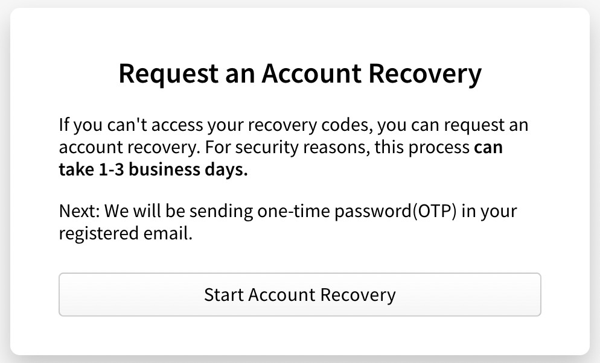

+++
title = "恢复启用了双因素身份验证的账户"
date = 2023-09-22T20:51:40+08:00
weight = 60
type = "docs"
description = ""
isCJKLanguage = true
draft = false

+++

> 原文: [https://docs.npmjs.com/recovering-your-2fa-enabled-account](https://docs.npmjs.com/recovering-your-2fa-enabled-account)

# Recovering your 2FA-enabled account - 恢复启用了双因素身份验证的账户

When you have two-factor access enabled on your account, and you lose access to your 2FA device, you may be able to recover your account using the following methods.

​	当您的账户启用了双因素身份验证并且无法访问您的双因素设备时，您可以使用以下方法恢复您的账户。

## 丢失第二因素设备 Misplaced second factor device

If you have misplaced the device that provided second-factor authentication, you can use the recovery codes generated when you [enabled 2FA](https://docs.npmjs.com/configuring-two-factor-authentication#enabling-2fa-on-the-web) to access your account.

​	如果您丢失了提供第二因素身份验证的设备，您可以使用在[启用 2FA](https://docs.npmjs.com/configuring-two-factor-authentication#enabling-2fa-on-the-web)时生成的恢复代码来访问您的账户。

### 在网页上使用恢复代码 Using recovery code on the web

1. Locate the recovery codes generated that you have saved.

2. 找到您保存的恢复代码。

3. On the npm "Sign In" page, enter your account details and click Sign In.

4. 在 npm 的“登录”页面上，输入您的账户详细信息，然后点击“登录”。

   

5. On the "Two-Factor Authentication" page, click Use a recovery code or request a reset.

6. 在“双因素身份验证”页面上，点击 **使用恢复代码或请求重置**。

   

   *Note: If you have configured to use TOTP, you will see an TOTP prompt instead*

   *注意：如果您配置了使用 TOTP，您将看到 TOTP 提示*

7. Enter an unused recovery code in the "Use a Recovery Code" prompt.

8. 在“使用恢复代码”提示中，输入一个未使用的恢复代码。

   

9. You are now logged into npm.

10. 您现在已登录到 npm。

11. (Optional) To disable 2FA, see "[Disabling 2FA](https://docs.npmjs.com/configuring-two-factor-authentication#disabling-2fa)".

12. （可选）要禁用 2FA，请参阅“[禁用 2FA](https://docs.npmjs.com/configuring-two-factor-authentication#disabling-2fa)”。

### 在命令行中使用恢复代码 Using recovery code from the command line

1. Locate the recovery codes generated when you enabled 2FA on your account.

2. 找到在您的账户上启用 2FA 时生成的恢复代码。

3. If you are logged out on the command line, log in using `npm login` command with your username and npm password.

4. 如果您在命令行上已注销，请使用  `npm login`  命令以您的用户名和 npm 密码登录。

5. Enter an unused recovery code when you see this prompt:

6. 当您看到此提示时，输入一个未使用的恢复代码：

   ```
   Enter one-time password:
   ```

7. Once you are logged in, use the below and enter your npm password if prompted.

8. 登录后，如果提示，请使用以下命令并在提示时输入您的 npm 密码：

   ```
   npm profile disable-2fa
   ```

9. Enter another unused recovery code when you see this prompt:

10. 当您看到此提示时，输入另一个未使用的恢复代码：

   ```
   Enter one-time password:
   ```

11. npm will confirm that two-factor authentication has been disabled.

12. npm 将确认已禁用双因素身份验证。

13. Follow the steps outlined in "[Configuring two-factor authentication](https://docs.npmjs.com/configuring-two-factor-authentication)" to re-enable 2FA and generate new recovery codes.

14. 按照“[配置双因素身份验证](https://docs.npmjs.com/configuring-two-factor-authentication)”中的步骤重新启用 2FA 并生成新的恢复代码。

**Note:** Using the recovery codes to re-enable 2FA may create a new authenticator account with the same npm account name.

**注意：**使用恢复代码重新启用 2FA 可能会在同一个 npm 账户名称下创建一个新的身份验证器账户。

If you are using a [time-based one-time password (TOTP)](https://en.wikipedia.org/wiki/Time-based_one-time_password) mobile app and want to delete the old authenticator account, follow the steps for the authenticator.

​	如果您使用的是[基于时间的一次性密码（TOTP）](https://en.wikipedia.org/wiki/Time-based_one-time_password)移动应用程序并且要删除旧的身份验证器账户，请按照身份验证器的步骤进行操作。

## 查看和重新生成恢复代码 Viewing and regenerating recovery code

**Note:** Once you regenerate a set of code, all previous recovery codes become invalid. Each code can be used only once.

**注意：**一旦重新生成一组代码，所有先前的恢复代码将失效。每个代码只能使用一次。

1. On the npm "Sign In" page, enter your account details and click Sign In.

2. 在 npm 的“登录”页面上，输入您的账户详细信息，然后点击“登录”。

   

3. In the upper right corner of the page, click your profile picture, then click Account.

4. 在页面的右上角，点击您的个人头像，然后点击“账户”。

   

5. On the account settings page, under "Two-Factor Authentication", click **Modify 2FA**.

6. 在账户设置页面上，在“双因素身份验证”下，点击 **修改 2FA**。

   

7. Click "Manage Recovery Codes" to view your recovery codes.

8. 点击“管理恢复代码”以查看您的恢复代码。

   

9. Click "Regenerate Code" to generate a new set of codes.

10. 点击“重新生成代码”以生成一组新的代码。

## 丢失恢复代码 Misplaced recovery codes

If you have misplaced both your 2FA device and your recovery codes, you can contact our support team to attempt to recover your account. Provide as much information as possible to help us expedite the request faster.

​	如果您丢失了双因素设备和恢复代码，您可以联系我们的支持团队尝试恢复您的账户。请提供尽可能多的信息，以帮助我们更快地处理请求。

1. On the npm "Sign In" page, enter your account details and click Sign In.

2. 在 npm 的“登录”页面上，输入您的账户详细信息，然后点击“登录”。

   

3. On the "Two-Factor Authentication" page, click Use a recovery code or request a reset.

4. 在“双因素身份验证”页面上，点击 **使用恢复代码或请求重置**。

   

5. Under the "Use a Recovery Code" form, click **Try recovering your account**.

6. 在“使用恢复代码”表单下，点击 **尝试恢复您的账户**。

7. On the "Request an Account Recovery" page, click Start Account Recovery.

8. 在“请求账户恢复”页面上，点击 **开始账户恢复**。

   

9. If you have access to your registered email, enter the one-time password sent to your email in the **One-Time Password** field, then click **Verify Email Address**. *If you do not have access to your registered email, select **Skip email verification** at the bottom of the form.*

10. 如果您可以访问您注册的电子邮件，请在“一次性密码”字段中输入您的电子邮件中收到的一次性密码，然后点击 **验证电子邮件地址**。 *如果您无法访问您注册的电子邮件，请在表单底部选择 **跳过电子邮件验证***。

11. In the "Open a Support Ticket" form, enter the following information:

12. 在“打开支持工单”表单中，输入以下信息：

    - In the **Email** field, enter an email address where our support team can contact you.

    - 在“电子邮件”字段中，输入我们的支持团队可以联系您的电子邮件地址。

    - In the **How can we help?** section, select **Reset my two-factor authentication (2FA)**.

    - 在“我们如何帮助您？”部分，选择 **重置我的双因素身份验证（2FA）**。

    - If you need help with anything else, in the How can we help? section, select Other and enter more information in the Additional Details field.
    - 如果您需要帮助解决其他问题，请在“我们如何帮助您？”部分选择其他，并在“附加详细信息”字段中输入更多信息。
      - If you have previously linked a GitHub account to your npm account, select **Connect to GitHub**. This will help our support team verify your account.
      - 如果您以前将 GitHub 账户链接到您的 npm 账户，请选择 **连接到 GitHub**。这将帮助我们的支持团队验证您的账户。
    - If you have previously linked a Twitter account to your npm account, select **Connect to Twitter**. This will help our support team verify your account.
    - 如果您以前将 Twitter 账户链接到您的 npm 账户，请选择 **连接到 Twitter**。这将帮助我们的支持团队验证您的账户。

    

13. At the bottom of the form, click **Submit Support Ticket**.

14. 在表单底部，点击 **提交支持工单**。
