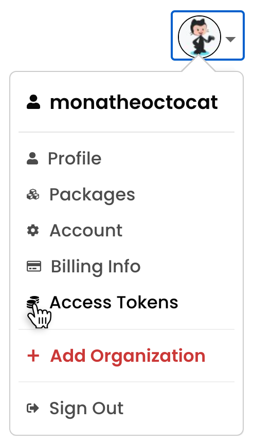
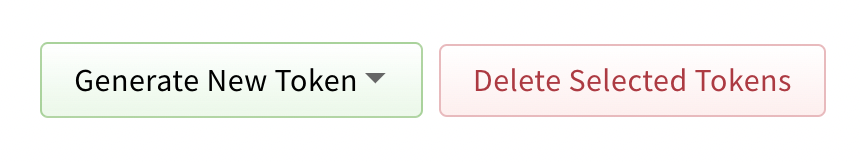
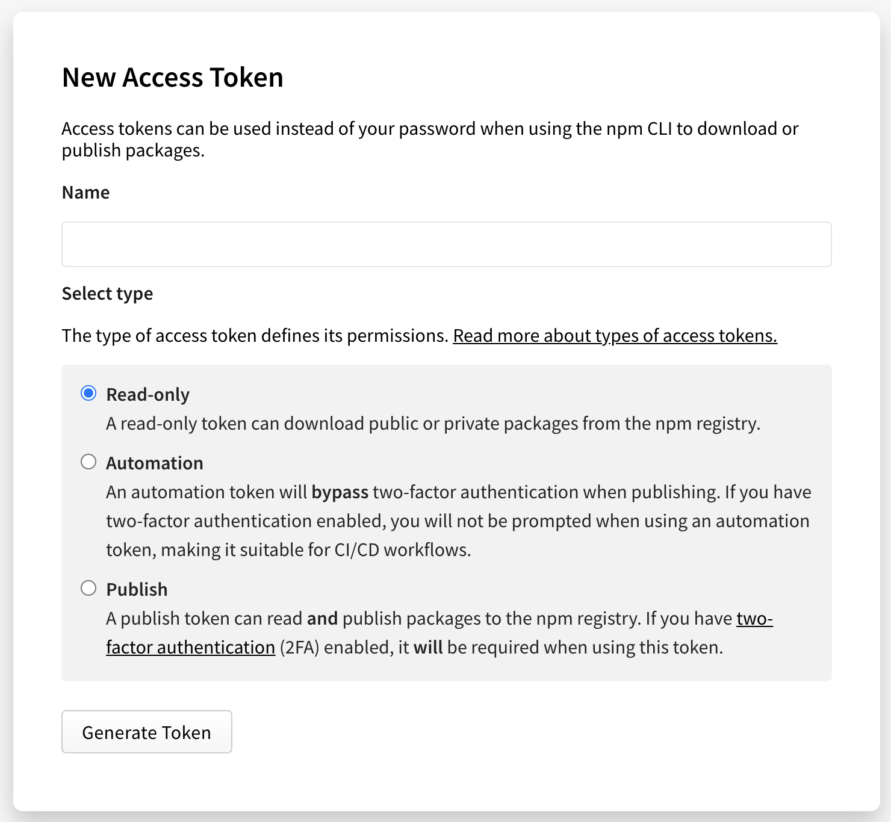
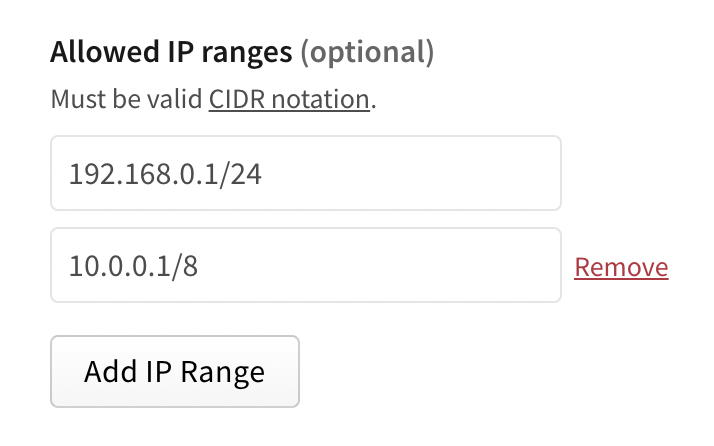
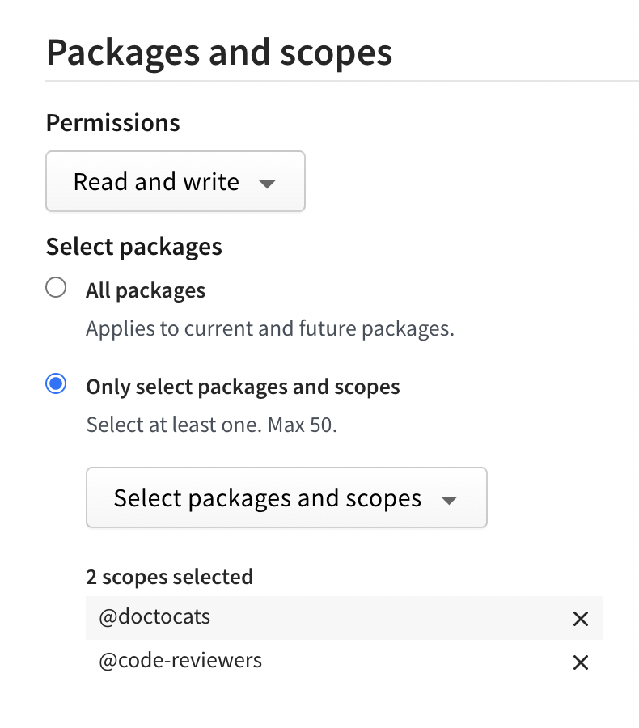
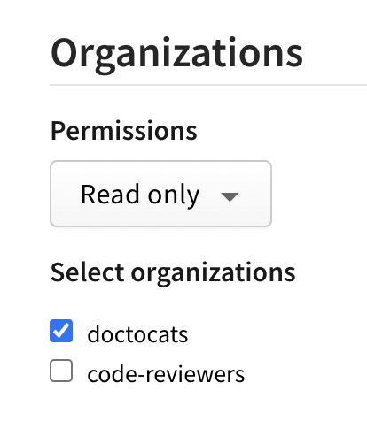
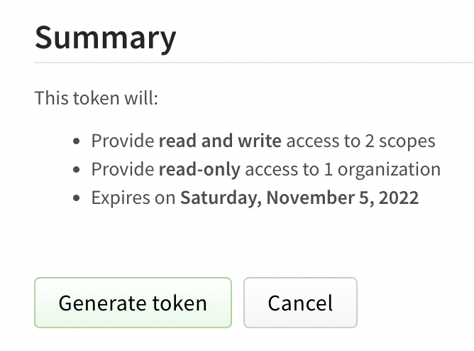

+++
title = "创建和查看访问令牌"
date = 2023-09-22T21:00:50+08:00
weight = 10
type = "docs"
description = ""
isCJKLanguage = true
draft = false

+++

> 原文: [https://docs.npmjs.com/creating-and-viewing-access-tokens](https://docs.npmjs.com/creating-and-viewing-access-tokens)

# Creating and viewing access tokens - 创建和查看访问令牌

You can [create](#creating-access-tokens) and [view](#viewing-access-tokens) access tokens from the website and command line interface (CLI).

​	您可以通过网站和命令行界面（CLI）[创建](#创建访问令牌)和[查看](#查看访问令牌)访问令牌。

## 创建访问令牌 Creating access tokens

### 在网站上创建传统令牌 Creating legacy tokens on the website

**Note:** For greater security, we recommend using [granular access tokens](#creating-granular-access-tokens-on-the-website) instead of legacy read-only tokens or legacy automation tokens.

**注意：**为了提高安全性，我们建议使用[细粒度访问令牌](#在网站上创建细粒度访问令牌)代替传统的只读令牌或传统的自动化令牌。

1. In the upper right corner of the page, click your profile picture, then click **Access Tokens**.

2. 在页面右上角，点击您的个人头像，然后选择 **访问令牌**。

   

3. Click **Generate New Token**, then select **legacy token** from the dropdown menu.

4. 点击 **生成新令牌**，然后从下拉菜单中选择 **传统令牌**。

   

5. (Optional) Name your token.

6. （可选）为令牌命名。

7. Select the type of access token:

8. 选择访问令牌的类型：

   - **Read-only**: A read-only token can only be used to download packages from the registry. It will have permission to read any private package that you have access to. This is recommended for automation and workflows where you are installing packages, but not publishing new ones.
   - **只读**：只读令牌只能用于从注册表下载包。它将有权限读取您可以访问的任何私有包。这推荐用于自动化和工作流，您可以在其中安装包，但不发布新包。
   - **Automation**: An automation token can download packages and publish new ones, but if you have two-factor authentication (2FA) configured on your account, it will **not** be enforced. You can use an automation token in continuous integration workflows and other automation systems to publish a package even when you cannot enter a one-time passcode.
   - **自动化**：自动化令牌可以下载包并发布新包，但如果您的账户配置了双因素身份验证（2FA），则**不会**强制执行。您可以在持续集成工作流和其他自动化系统中使用自动化令牌，即使您无法输入一次性验证码，也可以发布包。
   - **Publish**: A publish token can perform any action on your behalf, including downloading packages, publishing packages, and changing user settings or package settings. If you have two-factor authentication configured on your account, you will be required to enter a one-time passcode when using a publish token. This is recommended for interactive workflows such as a CLI.
   - **发布**：发布令牌可以代表您执行任何操作，包括下载包、发布包和更改用户设置或包设置。如果您的账户配置了双因素身份验证，使用发布令牌时将需要输入一次性验证码。这推荐用于交互式工作流，例如 CLI。

   

9. Click **Generate Token**.

10. 点击 **生成令牌**。

11. Copy the token from the top of page.

12. 从页面顶部复制令牌。

### 在网站上创建细粒度访问令牌 Creating granular access tokens on the website

1. In the upper right corner of the page, click your profile picture, then click **Access Tokens**.

2. 在页面右上角，点击您的个人头像，然后选择 **访问令牌**。

   

3. Click **Generate New Token**, then click **Granular Access Token**.

4. 点击 **生成新令牌**，然后点击 **细粒度访问令牌**。

   

5. In the **Token name** field, enter a name for your token.

6. 在 **令牌名称** 字段中，输入令牌的名称。

7. (Optional) In the **Description** field, enter a description for your token.

8. （可选）在 **描述** 字段中，输入令牌的描述。

9. In the **Expiration** field, enter a token expiration period. The date must be at least 1 day in the future.

10. 在 **过期时间** 字段中，输入令牌的过期时间。日期必须至少为未来的1天。

11. (Optional) In the **Allowed IP Ranges** field, enter IP address ranges to restrict your access token to. You must use [CIDR](https://en.wikipedia.org/wiki/Classless_Inter-Domain_Routing) notation to enter IP address ranges. To add more than one allowed IP range, click **Add IP Range** and enter an IP range in the new text field.

12. （可选）在 **允许的 IP 范围** 字段中，输入要限制访问令牌的 IP 地址范围。您必须使用 [CIDR](https://en.wikipedia.org/wiki/Classless_Inter-Domain_Routing) 表示法输入 IP 地址范围。要添加多个允许的 IP 范围，请点击 **添加 IP 范围** 并在新的文本字段中输入一个 IP 范围。

    

13. (Optional) In the **Packages and scopes** section, configure your token's access to packages and scopes.

14. （可选）在 **包和作用域** 部分，配置令牌对包和作用域的访问权限。

    - In the **Permissions** dropdown menu, select **No access**, **Read-only**, or **Read and write**.

    - 在 **权限** 下拉菜单中，选择 **无访问权限**、**只读权限** 或 **读写权限**。

    - Under Select Packages, select either:

    - 在选择包下，选择以下之一：
      - **All Packages** to grant the token access to all packages the user account has access to.
      - **所有包**：授予令牌访问用户账户具有访问权限的所有包。
      - **Only select packages and scopes** to choose up to 50 specific packages or scopes to give the token access to. Then select specific packages or scopes from the dropdown menu.
      - **仅选择包和作用域**：选择最多 50 个特定的包或作用域，以授予令牌访问权限。然后从下拉菜单中选择特定的包或作用域。

    

15. (Optional) In the **Organizations** section, configure your token's access to organizations.

16. （可选）在 **组织** 部分，配置令牌对组织的访问权限。

    - In the **Permissions** dropdown menu, select **No access**, **Read-only**, or **Read and write**.
    - 在 **权限** 下拉菜单中，选择 **无访问权限**、**只读权限** 或 **读写权限**。
    - Under **Select organizations**, select the organizations you want to grant your token access to.
    - 在 **选择组织** 下，选择您要授予令牌访问权限的组织。

    

    ***Note**: When you give a token access to an organization, the token can only be used for managing organization settings and teams or users associated with the organization. It does not give the token the right to publish packages managed by the organization.*

    ***注意**：当您为令牌授予组织访问权限时，令牌只能用于管理组织设置、团队或与组织关联的用户。它不会授予令牌发布由组织管理的包的权限。*

17. Review the token summary, then click **Generate Token**.

18. 查看令牌摘要，然后点击 **生成令牌**。

    

19. Copy the token from the top of page.

20. 从页面顶部复制令牌。

### 使用CLI创建令牌 Creating tokens with the CLI

You can create tokens with **read-only** permissions or **read and publish** permissions with the CLI.

​	您可以使用CLI创建具有**只读**权限或**读写**权限的令牌。

**Note:** You cannot create legacy automation tokens or granular access tokens from the CLI. You must use the website to generate these types of tokens. For more information, see "[Creating legacy tokens on the website](#creating-legacy-tokens-on-the-website)" and "[Creating granular access tokens on the website](#creating-granular-access-tokens-on-the-website)."

**注意：**您无法使用CLI创建传统的自动化令牌或细粒度访问令牌。您必须使用网站生成这些类型的令牌。有关更多信息，请参阅“[在网站上创建传统令牌](#在网站上创建传统令牌)”和“[在网站上创建细粒度访问令牌](#在网站上创建细粒度访问令牌)”。

- **Read-only:** Tokens that allow installation and distribution only, but no publishing or other rights associated with your account.
- **只读：**允许仅安装和分发，但没有与您的帐户关联的发布或其他权限的令牌。
- **Publish:** The default setting for new tokens, and most permissive token type. Publish tokens allow installation, distribution, modification, publishing, and all rights that you have on your account.
- **发布：**新令牌的默认设置，也是最宽松的令牌类型。发布令牌允许安装、分发、修改、发布以及您在帐户上拥有的所有权限。

In addition, you can specify that the token is only valid for a specific IPv4 address range, using [CIDR](https://en.wikipedia.org/wiki/Classless_Inter-Domain_Routing) notation. The token will only be valid when used from the specified IP addresses.

​	此外，您可以使用[CIDR](https://en.wikipedia.org/wiki/Classless_Inter-Domain_Routing)表示法指定令牌仅对特定的IPv4地址范围有效。仅当从指定的IP地址使用时，令牌才有效。

1. To create a new token, on the command line, run:
2. 要创建新令牌，请在命令行上运行：
   - `npm token create` for a read and publish token
   - `npm token create`  创建读写令牌
   - `npm token create --read-only` for a read-only token
   - `npm token create --read-only`  创建只读令牌
   - `npm token create --cidr=[list]` for a CIDR-restricted read and publish token. For example, `npm token create --cidr=192.0.2.0/24`
   - `npm token create --cidr=[list]`  创建CIDR限制的读写令牌。例如， `npm token create --cidr=192.0.2.0/24` 
   - `npm token create --read-only --cidr=[list]` for a CIDR-restricted read-only token
   - `npm token create --read-only --cidr=[list]`  创建CIDR限制的只读令牌
3. When prompted, enter your password.
4. 提示输入密码。
5. If you have enabled [two-factor authentication](about-two-factor-authentication), when prompted, enter a one-time password.
6. 如果您已启用[双重身份验证](about-two-factor-authentication)，在提示时输入一次性密码。
7. Copy the token from the **token** field in the command output.
8. 从命令输出的**token**字段中复制令牌。

#### CIDR限制令牌错误 CIDR-restricted token errors

If the CIDR string you enter is invalid or in an inappropriate format, you will get an error similar to the one below:

​	如果您输入的CIDR字符串无效或格式不正确，您将收到类似下面的错误：

```
npm ERR! CIDR whitelist contains invalid CIDR entry: X.X.X.X./YY,Z.Z.. . .
```

Make sure you are using a valid IPv4 range and try creating the token again.

​	确保您使用的是有效的IPv4范围，并尝试重新创建令牌。

## 查看访问令牌 Viewing access tokens

**Note:** Full tokens are never displayed, only the first and last four characters will be shown. You can only view a full token immediately after creation.

**注意：**完整的令牌永远不会显示，只会显示第一个和最后四个字符。您只能在创建后立即查看完整的令牌。

### 在网站上查看令牌 Viewing tokens on the website

To view all tokens associated with your account, in the upper right corner of the page, click your profile picture, then click **Access Tokens**.

​	要查看与您的帐户关联的所有令牌，请在页面的右上角，单击您的个人资料图片，然后单击**Access Tokens**。


### 在CLI上查看令牌 Viewing tokens on the CLI

To view all tokens associated with your account, on the command line, run the following command:

​	要查看与您的帐户关联的所有令牌，请在命令行上运行以下命令：

```
npm token list
```

#### 令牌属性 Token attributes

- **id:** Use the token ID to refer to the token in commands.
- **id：**使用令牌ID在命令中引用该令牌。
- **token:** The first digits of the actual token.
- **token：**实际令牌的前几个数字。
- **create:** Date the token was created.
- **create：**令牌创建的日期。
- **readonly:** If yes, indicates a read-only token. If no, indicates a token with both read and publish permissions.
- **readonly：**如果是yes，则表示只读令牌。如果是no，则表示具有读写权限的令牌。
- **CIDR whitelist:** Restricts token use by IP address.
- **CIDR白名单：**通过IP地址限制令牌的使用。
