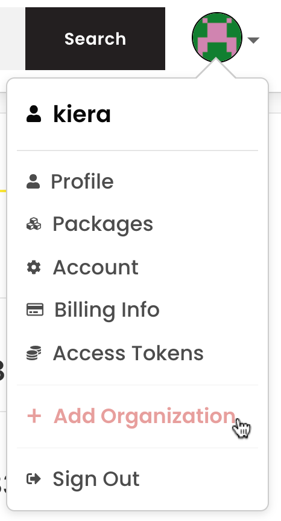
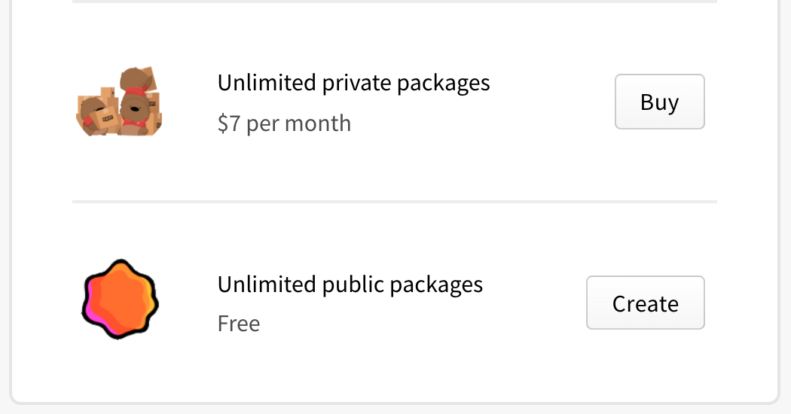

+++
title = "将用户账户转换为组织账户"
date = 2023-09-22T21:01:46+08:00
weight = 10
type = "docs"
description = ""
isCJKLanguage = true
draft = false

+++

> 原文: [https://docs.npmjs.com/converting-your-user-account-to-an-organization](https://docs.npmjs.com/converting-your-user-account-to-an-organization)

# Converting your user account to an organization - 将用户账户转换为组织账户

If you have an npm user account, you can convert your user account to an organization. When you convert your user account to an organization, we will:

​	如果您拥有一个npm用户账户，您可以将其转换为组织账户。当您将用户账户转换为组织账户时，我们将会：

- Create a new organization with the name of your user account.
- 创建一个以您的用户账户名称命名的新组织。
- Prompt you to create a new npm user account. We recommend choosing a variation of your old user name so collaborators will recognize you. For example, if your old username was "wombat", your new username might be "wombat-new".
- 提示您创建一个新的npm用户账户。我们建议您选择一个与旧用户名相似的变体，以便合作者能够认出您。例如，如果您的旧用户名是"wombat"，您的新用户名可能是"wombat-new"。
- Make your new npm user account an owner of your new organization.
- 将您的新npm用户账户设置为新组织的所有者。
- Add your new npm user account to a team called "Developers" in your new organization.
- 在新组织中将您的新npm用户账户添加到一个名为"Developers"的团队中。
- Transfer packages owned by your user account to your new organization.
- 将您的用户账户拥有的软件包转移到新组织中。
- Transfer your existing organization and team memberships and contributor access settings to your new user account.
- 将您现有的组织、团队成员资格和贡献者访问设置转移到您的新用户账户。

**Note:** Once your old user account has been converted to an organization, you will no longer be able to sign in to npm with your old user account.

**注意：** 一旦您的旧用户账户被转换为组织账户，您将无法再使用旧用户账户登录npm。

1. On the npm "Sign In" page, enter your account details and click Sign In.

2. 在npm的"登录"页面上，输入您的账户详细信息，然后点击"登录"。

   

3. In the upper right corner of the page, click your profile picture, then click Add an Organization.

4. 在页面右上角，点击您的个人头像，然后点击"添加组织"。

   

5. Below the account creation form, click **Convert**.

6. 在账户创建表单下方，点击**转换**。

   

7. Review the account conversion steps and click **Continue**.

8. 查看账户转换步骤，然后点击**继续**。

   

9. On the new user account creation page, in the "Username" field, type the name of your new user account, then click **Submit**.

10. 在新用户账户创建页面上，在"用户名"字段中输入您的新用户账户名称，然后点击**提交**。

   

11. On the plan selection page, select either the "Unlimited private packages" paid plan or the "Unlimited public packages" free plan, then click **Buy** or **Create**.

12. 在计划选择页面上，选择"无限私有软件包"付费计划或"无限公共软件包"免费计划，然后点击**购买**或**创建**。

    

13. If you selected to use the unlimited private packages plan, in the payment dialog, provide the email, name, address, and credit card information for the card that will be used to pay for the organization.

14. 如果您选择使用无限私有软件包计划，在付款对话框中，提供用于支付组织费用的信用卡的电子邮件、姓名、地址和信用卡信息。
