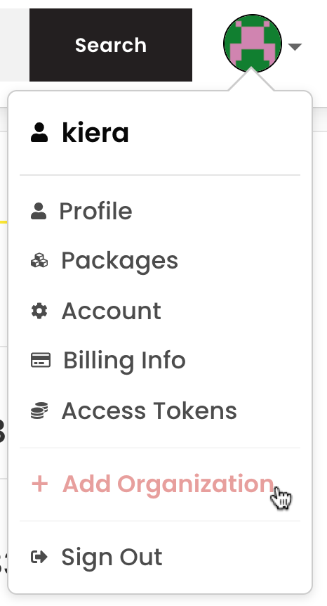
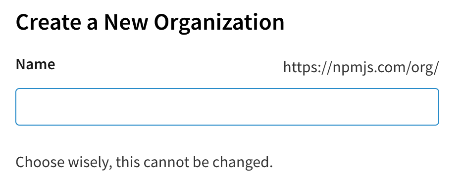
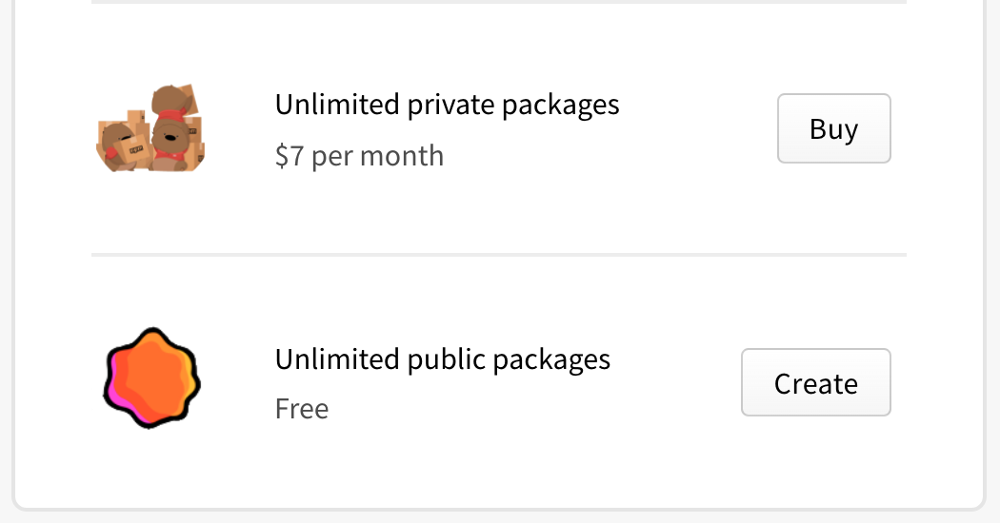
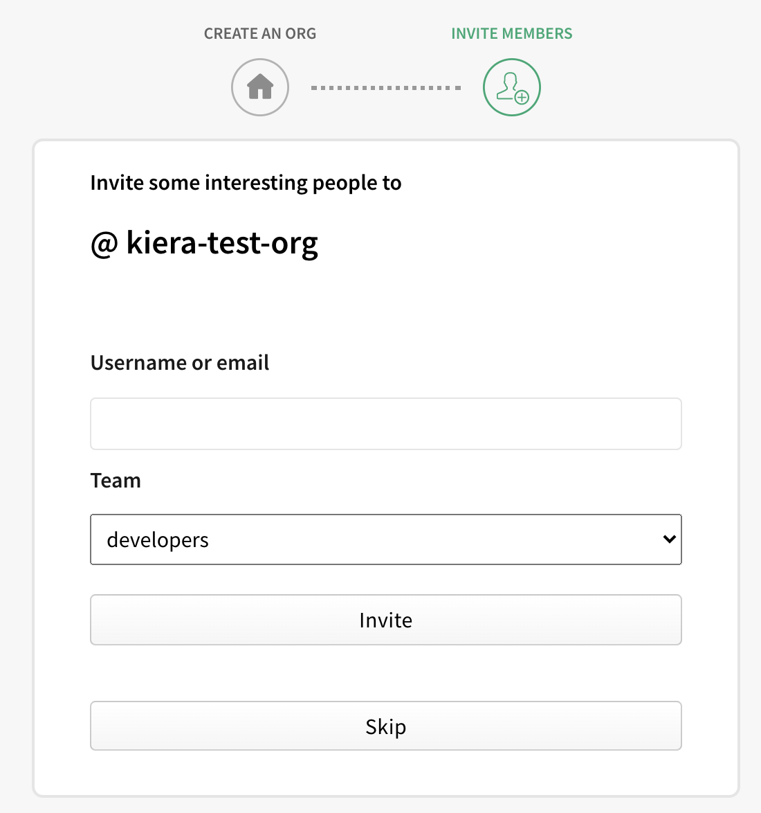
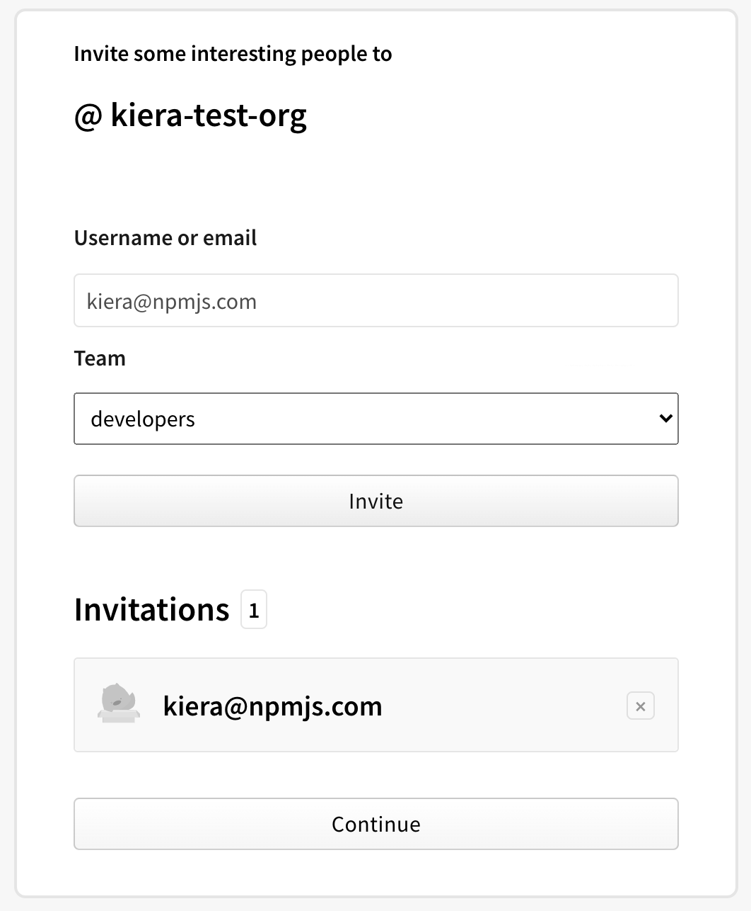

+++
title = "创建组织"
date = 2023-09-22T21:01:36+08:00
weight = 1
type = "docs"
description = ""
isCJKLanguage = true
draft = false

+++

> 原文: [https://docs.npmjs.com/creating-an-organization](https://docs.npmjs.com/creating-an-organization)

# Creating an organization - 创建组织

Any npm user can create an organization to manage contributor access to packages governed by the organization.

​	任何npm用户都可以创建一个组织，以管理由该组织管理的软件包的贡献者访问权限。

**Note:** You need an npm user account to create an organization. To create a user account, visit the [account signup page](https://www.npmjs.com/signup)".

**注意：**您需要一个npm用户账号才能创建一个组织。要创建一个用户账号，请访问[账号注册页面](https://www.npmjs.com/signup)。

1. On the npm "Sign In" page, enter your account details and click Sign In.

2. 在npm的“登录”页面上，输入您的账号详细信息，然后点击“登录”。

   

3. In the upper right corner of the page, click your profile picture, then click Add an Organization.

4. 在页面的右上角，点击您的个人头像，然后点击“添加组织”。

   

5. On the organization creation page, in the **Name** field, type a name for your organization. Your organization name will also be your organization scope.

6. 在组织创建页面上，在**名称**字段中，输入您的组织名称。您的组织名称也将是您的组织作用域。

   

7. Under the **Name** field, choose either the "Unlimited private packages" paid plan or the "Unlimited public packages" free plan and click **Buy** or **Create**.

8. 在**名称**字段下方，选择“无限制的私有软件包”付费计划或“无限制的公共软件包”免费计划，然后点击**购买**或**创建**。

   

9. (Optional) On the organization invitation page, type the npm username or email address of a person you would like to add to your organization as a member and select a team to invite them to, then click **Invite**.

10. （可选）在组织邀请页面上，输入您想要添加到组织的成员的npm用户名或电子邮件地址，并选择要邀请他们加入的团队，然后点击**邀请**。

   

11. Click **Continue**.

12. 点击**继续**。

    
