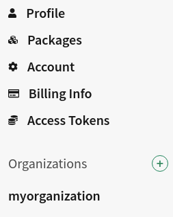
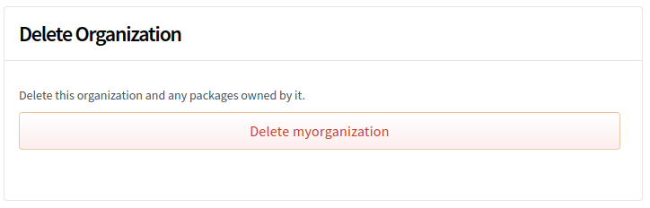
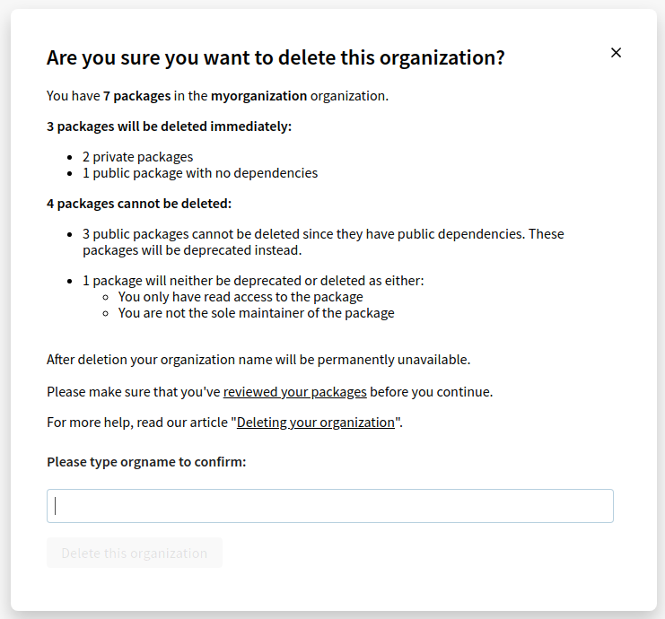

+++
title = "删除组织"
date = 2023-09-22T21:02:47+08:00
weight = 40
type = "docs"
description = ""
isCJKLanguage = true
draft = false

+++

> 原文: [https://docs.npmjs.com/deleting-an-organization](https://docs.npmjs.com/deleting-an-organization)

# Deleting an organization - 删除组织

An organization administrator can delete the organization; packages in the organization will also [be deleted](https://docs.npmjs.com/unpublishing-packages-from-the-registry) if they fulfill the [requirements to unpublish packages](https://docs.npmjs.com/policies/unpublish). Packages that cannot be deleted can be [deprecated](https://docs.npmjs.com/deprecating-and-undeprecating-packages-or-package-versions) instead.

​	组织管理员可以删除组织；如果组织中的软件包满足[撤销软件包的要求](https://docs.npmjs.com/policies/unpublish)，软件包也将被删除。无法删除的软件包可以选择[废弃](https://docs.npmjs.com/deprecating-and-undeprecating-packages-or-package-versions)。

1. On the npm "Sign In" page, enter your account details and click Sign In.

2. 在npm的“登录”页面，输入您的账户详细信息，然后点击“登录”。

   

3. In the upper right corner of the page, click your profile picture, then click Account.

4. 在页面的右上角，点击您的个人头像，然后点击“账户”。

   

5. In the left sidebar, click the name of the organization that you want to delete.

6. 在左侧边栏中，点击您要删除的组织的名称。

   

7. On the organization settings page, click Billing.

8. 在组织设置页面，点击“计费”。

   

9. Under "delete organization", click **Delete**.

10. 在“删除组织”下，点击**删除**。

   

11. You will be given an overview of the packages in your organization and what will happen to them when your organization is deleted. Packages that [can be unpublished](https://docs.npmjs.com/unpublishing-packages-from-the-registry) will be deleted.

12. 您将看到您组织中的软件包的概览以及在删除组织时将发生的情况。可以[撤销的软件包](https://docs.npmjs.com/unpublishing-packages-from-the-registry)将被删除。

    If you are sure that you want to continue, enter your organization name and click **Delete this organization**.

    如果您确定要继续，请输入您的组织名称，然后点击**删除此组织**。

    
