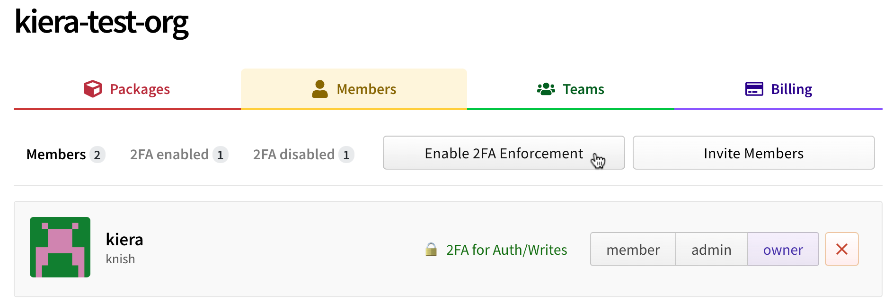
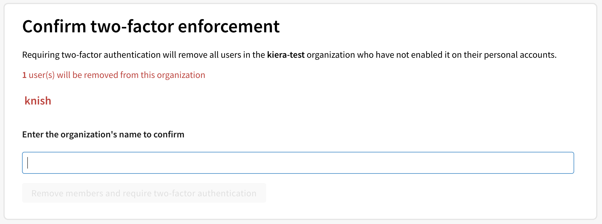

+++
title = "在组织中要求双因素身份验证"
date = 2023-09-22T21:01:57+08:00
weight = 20
type = "docs"
description = ""
isCJKLanguage = true
draft = false

+++

> 原文: [https://docs.npmjs.com/requiring-two-factor-authentication-in-your-organization](https://docs.npmjs.com/requiring-two-factor-authentication-in-your-organization)

# Requiring two-factor authentication in your organization - 在组织中要求双因素身份验证

Organization owners can require organization members to enable two-factor authentication for their personal accounts, making it harder for malicious actors to access an organization's packages and settings

​	组织所有者可以要求组织成员为其个人帐户启用双因素身份验证，以增加恶意行为者访问组织的软件包和设置的难度。

## 关于组织的双因素身份验证 About two-factor authentication for organizations

Two-factor authentication (2FA) is an extra layer of security used when logging into websites or apps. You can require all members in your organization to enable two-factor authentication on npm. For more information about two-factor authentication, see ["Configuring two-factor authentication."](configuring-two-factor-authentication).

​	双因素身份验证（2FA）是一种在登录网站或应用程序时使用的额外安全层。您可以要求您组织中的所有成员在npm上启用双因素身份验证。有关双因素身份验证的更多信息，请参见["配置双因素身份验证"](configuring-two-factor-authentication)。

**Note:**

**注意：**

- When you require use of two-factor authentication for your organization, members who do not use 2FA will be removed from the organization and lose access to its packages. You can add them back to the organization if they enable two-factor authentication.
- 当您要求组织使用双因素身份验证时，不使用2FA的成员将被从组织中移除，并且失去对其软件包的访问权限。如果他们启用了双因素身份验证，您可以将他们重新添加到组织中。
- An organization owner cannot opt-in to requiring 2FA for an organization if they do not have 2FA enabled on their account.
- 如果组织所有者未启用其帐户上的2FA，则无法选择要求组织使用2FA。
- If you are the member of an organization that requires 2FA you will not be able to disable 2FA until you leave that organization.
- 如果您是要求使用2FA的组织的成员，您将无法禁用2FA，直到您离开该组织。

## 先决条件 Prerequisites

Before you can require organization members to use two-factor authentication, you must enable two-factor authentication for your account on npm. For more information, see ["Configuring two-factor authentication."](configuring-two-factor-authentication).

​	在要求组织成员使用双因素身份验证之前，您必须在npm上启用双因素身份验证。有关更多信息，请参见["配置双因素身份验证"](configuring-two-factor-authentication)。

Before you require use of two-factor authentication, we recommend notifying organization members and asking them to set up 2FA for their accounts. You can see if members already use 2Fa in the organizations members page.

​	在要求使用双因素身份验证之前，我们建议通知组织成员并要求他们为其帐户设置2FA。您可以在组织成员页面中查看成员是否已使用2FA。

## 在组织中要求双因素身份验证 Requiring two-factor authentication in your organization

1. On the npm "Sign In" page, enter your account details and click Sign In.

2. 在npm的“登录”页面上，输入您的帐户详细信息，然后点击“登录”。

   

3. In the upper right corner of the page, click your profile picture, then click Account.

4. 在页面的右上角，点击您的个人资料图片，然后点击“账户”。

   

5. In the left sidebar, click the name of your organization.

6. 在左侧的侧边栏中，点击您组织的名称。

   

7. On the organization settings page, click Members.

8. 在组织设置页面上，点击“成员”。

   

9. Click the **Enable 2FA Enforcement** button.

10. 点击**启用2FA强制执行**按钮。

   

11. If prompted, read the information about members who will be removed from the organization. Type your organization's name to confirm the change, then click Remove members & require two-factor authentication.

12. 如果收到提示，请阅读有关将从组织中删除的成员的信息。输入您的组织名称以确认更改，然后点击“删除成员并要求双因素身份验证”。

    

13. If any members are removed from the organization, we recommend sending them an invitation that can reinstate their former privileges and access to your organization. They must enable two-factor authentication before they can accept your invitation.

14. 如果有任何成员从组织中删除，我们建议向他们发送一封邀请，以恢复他们以前的特权和对您组织的访问权限。在接受您的邀请之前，他们必须启用双因素身份验证。

## 帮助被移除的成员和外部协作者重新加入您的组织 Helping removed members and outside collaborators rejoin your organization

If any members are removed from the organization when you enable required use of two-factor authentication, they'll receive an email notifying them that they've been removed. They should then enable 2FA for their personal account, and contact an organization owner to request access to your organization.

​	如果在启用必须使用双因素身份验证后，有成员被从组织中删除，他们将收到一封通知他们已被移除的电子邮件。然后，他们应该为其个人帐户启用2FA，并联系组织所有者请求访问您的组织。
