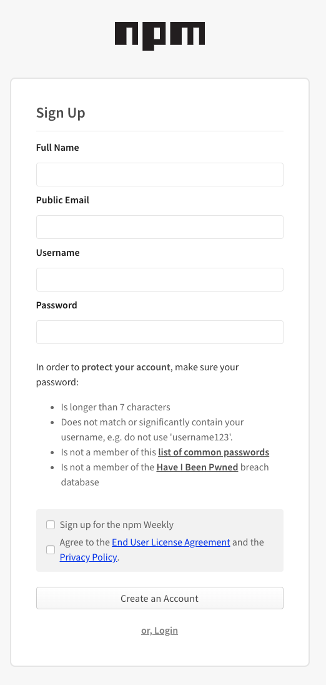

+++
title = "接受或拒绝组织邀请"
date = 2023-09-22T21:03:45+08:00
weight = 10
type = "docs"
description = ""
isCJKLanguage = true
draft = false

+++

> 原文: [https://docs.npmjs.com/accepting-or-rejecting-an-organization-invitation](https://docs.npmjs.com/accepting-or-rejecting-an-organization-invitation)

# Accepting or rejecting an organization invitation - 接受或拒绝组织邀请

## 接受组织邀请 Accepting an organization invitation

If you receive an invitation to an organization, you have to accept the invitation over email to be added to the organization.

​	如果您收到了一个组织的邀请，您需要通过电子邮件接受邀请才能加入该组织。

You have the option to use a different email address than the one that received the invitation to join the organization.

​	您可以选择使用与收到邀请的电子邮件地址不同的电子邮件地址加入该组织。

1. Click the verification link in the organization invitation email.

2. 在组织邀请的电子邮件中点击验证链接。

3. You will be prompted to log into your npm user account. If you don't have an npm user account, you can sign up for one.

4. 您将被提示登录您的npm用户账户。如果您没有npm用户账户，您可以注册一个。

   

## 拒绝组织邀请 Rejecting an organization invitation

If you are invited to an organization that you do not want to join, you can let the invitation expire. Organization invitations expire after one week.

​	如果您被邀请加入一个您不想加入的组织，您可以让邀请过期。组织邀请在一周后过期。
