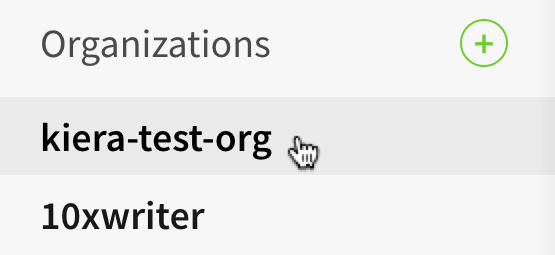

+++
title = "将成员添加到您的组织"
date = 2023-09-22T21:03:36+08:00
weight = 1
type = "docs"
description = ""
isCJKLanguage = true
draft = false

+++

> 原文: [https://docs.npmjs.com/adding-members-to-your-organization](https://docs.npmjs.com/adding-members-to-your-organization)

# Adding members to your organization - 将成员添加到您的组织

As an organization owner, you can add other npm users to your organization to give them read or read and write access to public and private packages within your organization's scope, as well as public unscoped packages governed by your organization.

​	作为组织所有者，您可以将其他npm用户添加到您的组织，为他们提供对您组织范围内的公共和私有软件包的读取或读取和写入访问权限，以及由您的组织管理的公共无作用域软件包。

When you add a member to your organization, they are sent an email inviting them to the organization.

​	当您将成员添加到您的组织时，他们将收到一封邀请他们加入组织的电子邮件。

Once the new member [accepts the invitation](accepting-or-rejecting-an-org-invitation), they are:

​	一旦新成员[接受邀请](accepting-or-rejecting-an-org-invitation)，他们将会：

- assigned the role of "[member](org-roles-and-permissions)"
- 被分配为"[成员](org-roles-and-permissions)"角色
- added to the ["developers" team](about-developers-team)
- 添加到"[开发者团队](about-developers-team)"

If you have a [paid organization](upgrading-to-a-paid-org-plan), as part of an npm Teams plan, you will be billed $7 per month for each new member.

​	如果您有一个[付费组织](upgrading-to-a-paid-org-plan)，作为npm Teams计划的一部分，每个新成员将按月收费7美元。

## 邀请成员加入您的组织 Inviting members to your organization

1. On the npm "Sign In" page, enter your account details and click Sign In.

2. 在npm的"登录"页面上，输入您的账户详细信息，然后点击"登录"。

   

3. In the upper right corner of the page, click your profile picture, then click Account.

4. 在页面右上角，点击您的个人头像，然后点击"账户"。

   

5. In the left sidebar, click the name of your organization.

6. 在左侧边栏中，点击您的组织名称。

   

7. On the organization settings page, click Members.

8. 在组织设置页面上，点击"成员"。

   

9. Click the **Invite Members** button.

10. 点击**邀请成员**按钮。

   

11. In the "Username or email" field, type the username or email address of the person you wish to invite. Optionally you can select a specific team to invite the member to.

12. 在"用户名或电子邮件"字段中，输入您希望邀请的人的用户名或电子邮件地址。您还可以选择将成员邀请到特定的团队。

    

13. Click **Invite**.

14. 点击**邀请**。

    

## 撤销组织邀请 Revoking an organization invitation

As an organization owner, if you've made a mistake in inviting someone to your organization, you can revoke the organization invitation.

​	作为组织所有者，如果您在邀请某人加入您的组织时犯了一个错误，您可以撤销组织邀请。

1. On the npm "Sign In" page, enter your account details and click Sign In.

2. 在npm的"登录"页面上，输入您的账户详细信息，然后点击"登录"。

   

3. In the upper right corner of the page, click your profile picture, then click Account.

4. 在页面右上角，点击您的个人头像，然后点击"账户"。

   

5. In the left sidebar, click the name of your organization.

6. 在左侧边栏中，点击您的组织名称。

   

7. On the organization settings page, click Members.

8. 在组织设置页面上，点击"成员"。

   

9. Click the **Invite Members** button.

10. 点击**邀请成员**按钮。

   

11. Under the "Invitations" field, click the **X** next to the name of the user invitation you would like to revoke.

12. 在"邀请"字段下，点击您想要撤销的用户邀请旁边的**X**。

    
