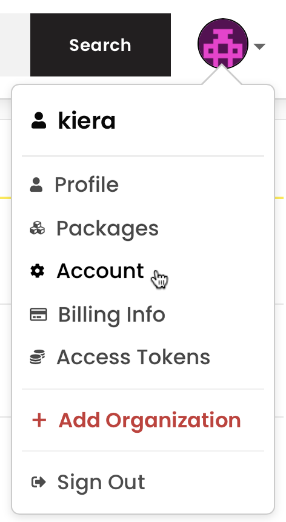

+++
title = "管理组织权限"
date = 2023-09-22T21:04:05+08:00
weight = 30
type = "docs"
description = ""
isCJKLanguage = true
draft = false

+++

> 原文: [https://docs.npmjs.com/managing-organization-permissions](https://docs.npmjs.com/managing-organization-permissions)

# Managing organization permissions - 管理组织权限

As an organization owner, you can change the role of any member of your organization to add or remove permissions on the organization for that member.

​	作为组织所有者，您可以更改组织成员的角色，为该成员添加或删除组织的权限。

1. On the npm "Sign In" page, enter your account details and click Sign In.

2. 在npm的“登录”页面上，输入您的账号详细信息，然后点击“登录”。

   

3. In the upper right corner of the page, click your profile picture, then click Account.

4. 在页面的右上角，点击您的个人头像，然后点击“账户”。

   

5. In the left sidebar, click the name of your organization.

6. 在左侧边栏中，点击您组织的名称。

   

7. On the organization settings page, click Members.

8. 在组织设置页面上，点击“成员”。

   

9. In the list of organization members, find the member whose role you want to change.

10. 在组织成员列表中，找到您想要更改角色的成员。

11. In the member row, to select the new role of the organization member, click **member**, **admin**, or **owner**.

12. 在成员行中，点击**成员**、**管理员**或**所有者**来选择组织成员的新角色。

    
