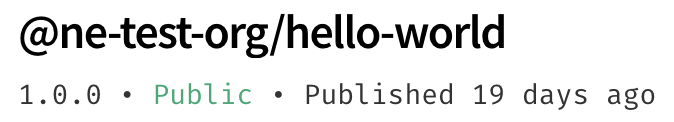

+++
title = "创建和发布组织作用域的软件包"
date = 2023-09-22T21:05:41+08:00
weight = 20
type = "docs"
description = ""
isCJKLanguage = true
draft = false

+++

> 原文: [https://docs.npmjs.com/creating-and-publishing-an-organization-scoped-package](https://docs.npmjs.com/creating-and-publishing-an-organization-scoped-package)

# Creating and publishing an organization scoped package - 创建和发布组织作用域的软件包

As an organization member, you can create and publish public and private packages within the organization's scope.

​	作为组织成员，您可以在组织的作用域内创建和发布公共和私有软件包。

## 创建组织作用域的软件包 Creating an organization scoped package

1. On the command line, make a directory with the name of the package you would like to create.

2. 在命令行中，创建一个与您要创建的软件包同名的目录。

   ```
   mkdir /path/to/package/directory
   ```

3. Navigate to the newly-created package directory.

4. 切换到新创建的软件包目录。

5. To create an organization scoped package, on the command line, run:

6. 要创建一个组织作用域的软件包，请在命令行中运行：

   ```
   npm init --scope=<your_org_name>
   ```

7. To verify the package is using your organization scope, in a text editor, open the package's `package.json` file and check that the name is `@your_org_name/<pkg_name>`, replacing `your_org_name` with the name of your organization.

8. 要验证软件包是否使用了您的组织作用域，请在文本编辑器中打开软件包的 `package.json` 文件，并检查名称是否为 `@your_org_name/<pkg_name>` ，将 `your_org_name` 替换为您的组织名称。

## 发布私有的组织作用域的软件包 Publishing a private organization scoped package

By default, `npm publish` will publish a scoped package as private.

​	默认情况下， `npm publish` 将会将作用域软件包发布为私有的。

By default, any scoped package is published as private. However, if you have an organization that does not have the Private Packages feature, `npm publish` will fail unless you pass the `access` flag.

​	默认情况下，任何作用域软件包都会被发布为私有的。但是，如果您的组织没有私有软件包功能，那么除非您传递 `access` 标志，否则 `npm publish` 将会失败。

1. On the command line, navigate to the package directory.
2. 在命令行中，切换到软件包目录。
3. Run `npm publish`.
4. 运行 `npm publish` 。

Private packages will say `private` below the package name on the npm website.

​	私有软件包在npm网站上的软件包名称下方会显示为 `private` 。


## 发布公共的组织作用域的软件包 Publishing a public organization scoped package

To publish an organization scoped package as public, use `npm publish --access public`.

​	要将组织作用域的软件包发布为公共软件包，请使用 `npm publish --access public` 。

1. On the command line, navigate to the package directory.
2. 在命令行中，切换到软件包目录。
3. Run `npm publish --access public`.
4. 运行 `npm publish --access public` 。

Public packages will say `public` below the package name on the npm website.

​	公共软件包在npm网站上的软件包名称下方会显示为 `public` 。


