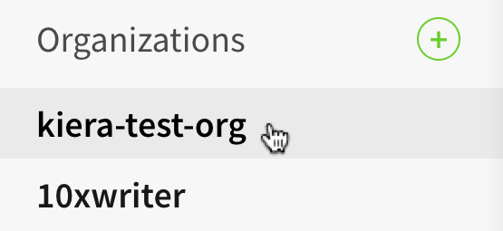
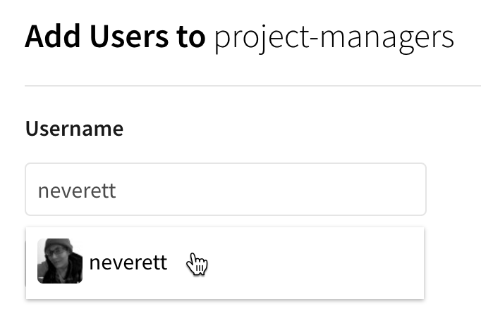
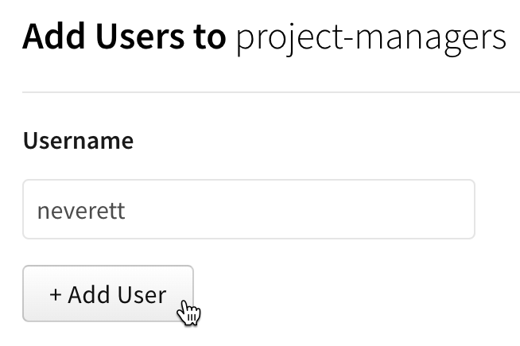

+++
title = "将组织成员添加到团队"
date = 2023-09-22T21:04:45+08:00
weight = 20
type = "docs"
description = ""
isCJKLanguage = true
draft = false
+++

> 原文: [https://docs.npmjs.com/adding-organization-members-to-teams](https://docs.npmjs.com/adding-organization-members-to-teams)

# Adding organization members to teams - 将组织成员添加到团队

As an organization owner or team admin, you can add organization members to teams to give them access to a specific set of packages governed by the organization.

​	作为组织所有者或团队管理员，您可以将组织成员添加到团队，以便让他们访问组织管理的特定一组软件包。

**Note:** An npm user must be a member of your organization before you can add them to a team. To add a member to your organization, see "[Adding members to your organization](adding-members-to-your-organization)".

**注意：** 在将成员添加到团队之前，npm用户必须是您的组织成员。要将成员添加到组织中，请参阅"[将成员添加到您的组织]()"。

1. On the npm "Sign In" page, enter your account details and click Sign In.

2. 在npm的"登录"页面上，输入您的账户详细信息，然后点击"登录"。

   

3. In the upper right corner of the page, click your profile picture, then click Account.

4. 在页面右上角，点击您的个人头像，然后点击"账户"。

   

5. In the left sidebar, click the name of your organization.

6. 在左侧边栏中，点击您的组织名称。

   

7. On the organization settings page, click Teams.

8. 在组织设置页面上，点击"团队"。

   

9. Beside the team you want to add members to, click **Members**.

10. 在您要向其添加成员的团队旁边，点击**成员**。

   

11. In the "Username" field, type the npm username of the organization member you would like to add to your team.

12. 在"用户名"字段中，输入您要添加到团队的组织成员的npm用户名。

    

13. Click **+ Add User**.

14. 点击**+ 添加用户**。

    

**Note:** organization members are not notified when they are added to a team. We recommend telling the organization member you have added them to a team.

**注意：** 当将组织成员添加到团队时，他们不会收到通知。我们建议您告知组织成员您已将他们添加到团队中。

## 使用命令行界面（CLI）管理团队 Managing teams from the CLI

If you would like to manage the membership of your team from the command line interface (CLI), you can use:

​	如果您希望从命令行界面（CLI）管理团队的成员资格，您可以使用以下命令：

```
npm team
```

For more information, see the [CLI documentation on teams](https://docs.npmjs.com/cli/team).

​	有关更多信息，请参阅[CLI文档中的团队部分](https://docs.npmjs.com/cli/team)。
