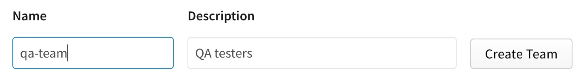
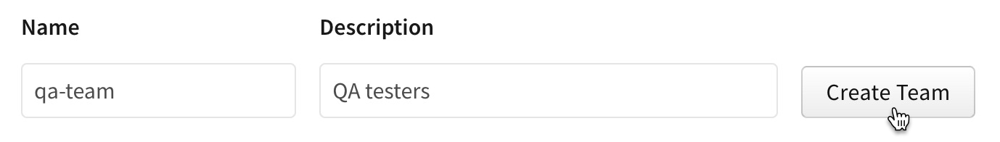

+++
title = "创建团队"
date = 2023-09-22T21:04:35+08:00
weight = 10
type = "docs"
description = ""
isCJKLanguage = true
draft = false
+++

> 原文: [https://docs.npmjs.com/creating-teams](https://docs.npmjs.com/creating-teams)

# Creating teams - 创建团队

As an organization owner or team admin, you can create teams to manage access to sets of packages governed by your organization.

​	作为组织所有者或团队管理员，您可以创建团队来管理由您的组织管理的软件包的访问权限。

**Note:** Team names cannot be changed. To "rename" a team, you must delete the team and recreate it.

**注意：**团队名称无法更改。要“重命名”一个团队，您必须删除该团队并重新创建它。

1. On the npm "Sign In" page, enter your account details and click Sign In.

2. 在npm的“登录”页面上，输入您的账号详细信息，然后点击“登录”。

   

3. In the upper right corner of the page, click your profile picture, then click Account.

4. 在页面的右上角，点击您的个人头像，然后点击“账户”。

   

5. In the left sidebar, click the name of your organization.

6. 在左侧边栏中，点击您组织的名称。

   

7. On the organization settings page, click Teams.

8. 在组织设置页面上，点击“团队”。

   

9. In the "Name" and "Description" fields, type a team name and helpful description. Team names must be lower case and cannot contain spaces or punctuation.

10. 在“名称”和“描述”字段中，输入一个团队名称和有用的描述。团队名称必须为小写字母，不能包含空格或标点符号。

   

11. Click **Create Team**.

12. 点击**创建团队**。

    

**Note:** New teams do not have members or package access by default. Once you create a team, add packages and members from the "Teams" tab.

**注意：**新创建的团队默认没有成员或软件包访问权限。创建团队后，可以从“团队”选项卡中添加软件包和成员。
