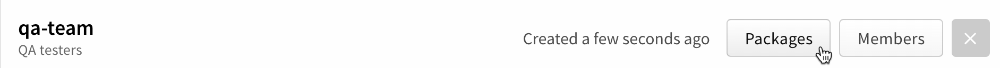
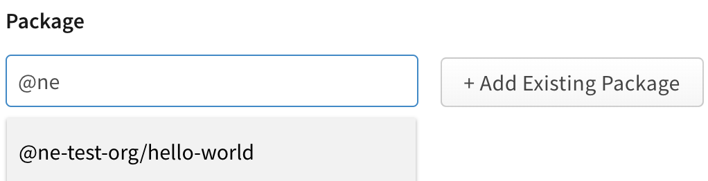
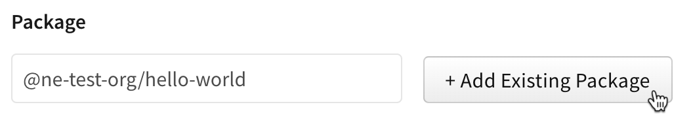
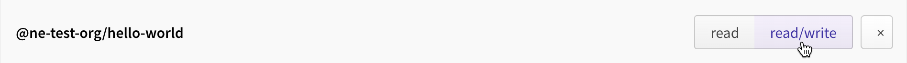
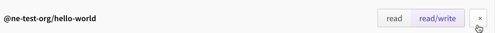
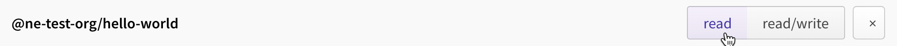

+++
title = "管理团队对组织软件包的访问权限"
date = 2023-09-22T21:05:04+08:00
weight = 40
type = "docs"
description = ""
isCJKLanguage = true
draft = false

+++

> 原文: [https://docs.npmjs.com/managing-team-access-to-organization-packages](https://docs.npmjs.com/managing-team-access-to-organization-packages)

# Managing team access to organization packages - 管理团队对组织软件包的访问权限

As an organization owner or team admin, you can add or remove package access to or from teams in your organization.

​	作为组织所有者或团队管理员，您可以为组织中的团队添加或删除软件包的访问权限。

## 向团队添加软件包访问权限 Adding package access to a team

### 在Web上向团队添加软件包访问权限 Adding package access to a team on the web

1. On the npm "Sign In" page, enter your account details and click Sign In.

2. 在npm的“登录”页面上，输入您的账号详细信息，然后点击“登录”。

   

3. In the upper right corner of the page, click your profile picture, then click Account.

4. 在页面的右上角，点击您的个人头像，然后点击“账户”。

   

5. In the left sidebar, click the name of your organization.

6. 在左侧边栏中，点击您组织的名称。

   

7. On the organization settings page, click Teams.

8. 在组织设置页面上，点击“团队”。

   

9. Beside the team to which you want to add package access, click **Packages**.

10. 在您想要向其添加软件包访问权限的团队旁边，点击**软件包**。

   

11. On the "Add Packages" page, in the "Package" field, type the name of the package and select from the dropdown menu.

12. 在“添加软件包”页面上，在“软件包”字段中，输入软件包的名称并从下拉菜单中选择。

    

13. Click **+ Add Existing Package**.

14. 点击**+ 添加现有软件包**。

    

15. Beside the package name, click **read** or **read/write** to set the team permissions for the package.

16. 在软件包名称旁边，点击**只读**或**读写**来设置团队对软件包的权限。

    

### 使用CLI向团队添加软件包访问权限 Adding package access to a team using the CLI

As an organization owner or team admin, you can use the CLI `access` command to add package access to a team on the command line:

​	作为组织所有者或团队管理员，您可以使用CLI的 `access` 命令在命令行上向团队添加软件包访问权限：

```
npm access grant <read-only|read-write> <org:team> [<package>]
```

For more information, see "[npm-access](https://docs.npmjs.com/cli/access)".

​	有关更多信息，请参阅“[npm-access](https://docs.npmjs.com/cli/access)”。

## 从团队中删除软件包访问权限 Removing package access from a team

### 在Web上从团队中删除软件包访问权限 Removing package access from a team on the web

1. On the npm "Sign In" page, enter your account details and click Sign In.

2. 在npm的“登录”页面上，输入您的账号详细信息，然后点击“登录”。

   

3. In the upper right corner of the page, click your profile picture, then click Account.

4. 在页面的右上角，点击您的个人头像，然后点击“账户”。

   

5. In the left sidebar, click the name of your organization.

6. 在左侧边栏中，点击您组织的名称。

   

7. On the organization settings page, click Teams.

8. 在组织设置页面上，点击“团队”。

   

9. Beside the team from which you want to remove package access, click **Packages**.

10. 在您想要从中删除软件包访问权限的团队旁边，点击**软件包**。

   

11. Beside the name of the package from which you want to remove access, click **x**.

12. 在您想要从中删除访问权限的软件包名称旁边，点击**x**。

    

### 使用CLI从团队中删除软件包访问权限 Removing package access from a team using the CLI

As an organization owner or team admin, you can also use the CLI `access` command to revoke package access from a team on the command line:

​	作为组织所有者或团队管理员，您也可以使用CLI的 `access` 命令在命令行上撤销团队对软件包的访问权限：

```
npm access revoke <org:team> [<package>]
```

For more information, see "[npm-access](https://docs.npmjs.com/cli/access)".

​	有关更多信息，请参阅“[npm-access](https://docs.npmjs.com/cli/access)”。

## 更改团队的软件包访问权限 Changing package access for a team

### 在Web上更改团队的软件包访问权限 Changing package access for a team on the web

1. On the npm "Sign In" page, enter your account details and click Sign In.

2. 在npm的“登录”页面上，输入您的账号详细信息，然后点击“登录”。

   

3. In the upper right corner of the page, click your profile picture, then click Account.

4. 在页面的右上角，点击您的个人头像，然后点击“账户”。

   

5. In the left sidebar, click the name of your organization.

6. 在左侧边栏中，点击您组织的名称。

   

7. On the organization settings page, click Teams.

8. 在组织设置页面上，点击“团队”。

   

9. Beside the team from which you want to remove package access, click **Packages**.

10. 在您想要更改软件包访问权限的团队旁边，点击**软件包**。

   

11. Beside the package name, click **read** or **read/write** to set the team permissions for the package.

12. 在软件包名称旁边，点击**只读**或**读写**以设置团队对软件包的权限。

    

### 使用CLI更改团队的软件包访问权限 Changing package access for a team from the CLI

As an organization owner or team admin, you can change package access for a team from the command line:

​	作为组织所有者或团队管理员，您可以在命令行上更改团队的软件包访问权限：

```
npm access
```

For more information, see the [`npm-access` CLI documentation](https://docs.npmjs.com/cli/access).

​	有关更多信息，请参阅[ `npm-access`  CLI文档](https://docs.npmjs.com/cli/access)。
