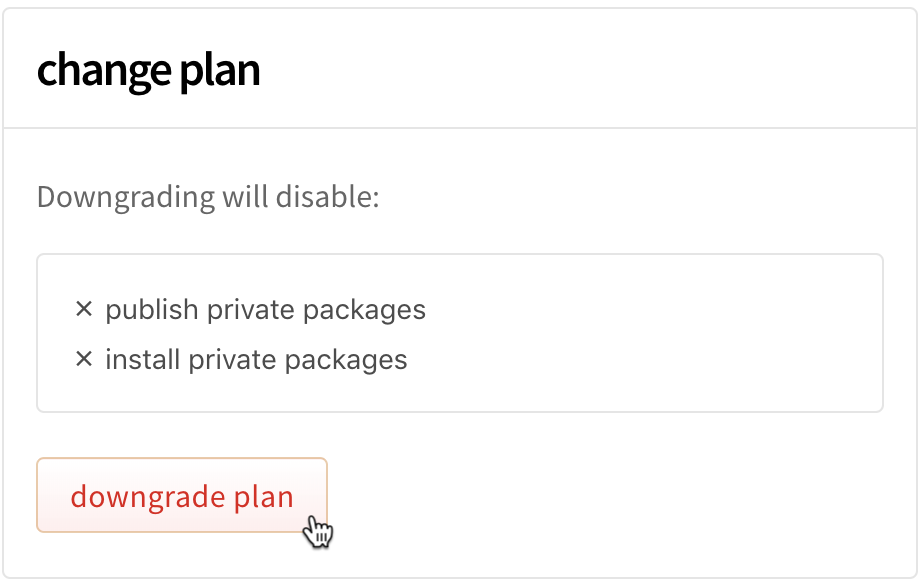
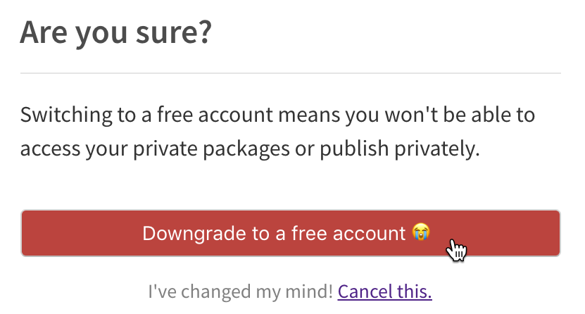

+++
title = "降级到免费组织计划"
date = 2023-09-22T21:03:27+08:00
weight = 30
type = "docs"
description = ""
isCJKLanguage = true
draft = false

+++

> 原文: [https://docs.npmjs.com/downgrading-to-a-free-organization-plan](https://docs.npmjs.com/downgrading-to-a-free-organization-plan)

# Downgrading to a free organization plan - 降级到免费组织计划

**Note:** This article only applies to users of the public npm registry.

**注意：** 本文仅适用于公共npm注册表的用户。

If you are a subscriber to the npm Teams product (you have a paid organization) and you are an owner of the organization, then you can downgrade from npm Teams to a free organization. When you downgrade from a paid to a free organization, you and your organization members will lose the ability to install and publish private packages at the end of your last paid billing cycle. Your private packages will *not* be made publicly visible when you downgrade to a free plan.

​	如果您是npm Teams产品的订户（即您拥有付费组织）并且您是组织的所有者，则可以从npm Teams降级到免费组织。当您从付费组织降级为免费组织时，您和您的组织成员将在最后一个付费计费周期结束时失去安装和发布私有软件包的能力。降级到免费计划时，您的私有软件包将**不会**公开可见。

**Note:** If you would like to pay for fewer seats, you can remove members from your organization by following the steps in "[Removing members from your organization](removing-members-from-your-org)".

**注意：** 如果您想要减少席位数量，您可以按照“[从组织中删除成员](removing-members-from-your-org)”中的步骤将成员从您的组织中移除。

1. On the npm "Sign In" page, enter your account details and click Sign In.

2. 在npm的"登录"页面上，输入您的账户详细信息，然后点击"登录"。

   

3. In the upper right corner of the page, click your profile picture, then click Account.

4. 在页面右上角，点击您的个人头像，然后点击"账户"。

   

5. In the left sidebar, click the name of the organization you want to downgrade.

6. 在左侧边栏中，点击您要降级的组织名称。

   

7. On the organization settings page, click Billing.

8. 在组织设置页面上，点击"计费"。

   

9. Under "change plan", click Downgrade Plan.

10. 在"更改计划"下，点击"降级计划"。

   

11. Under "Are you sure?", click Downgrade to a free account.

12. 在"您确定吗？"下，点击"降级为免费账户"。

    
