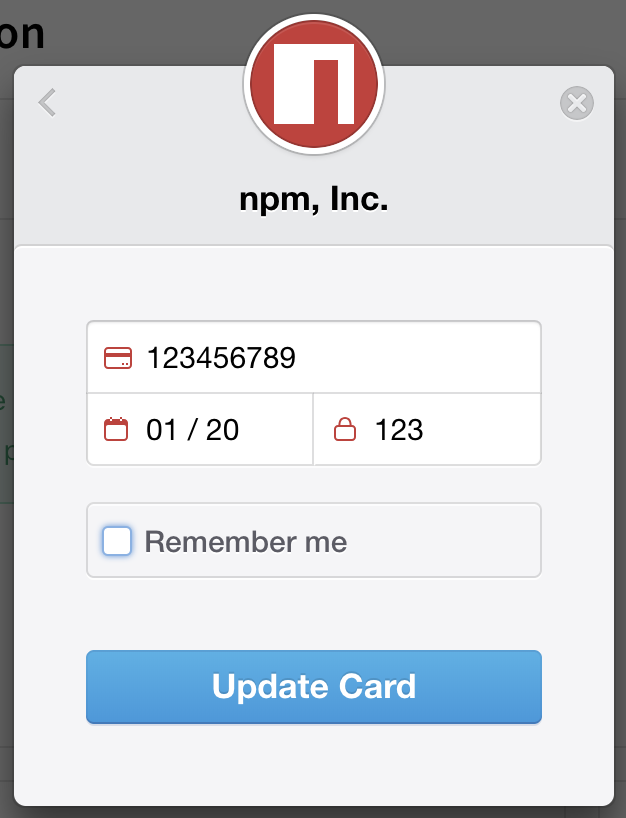
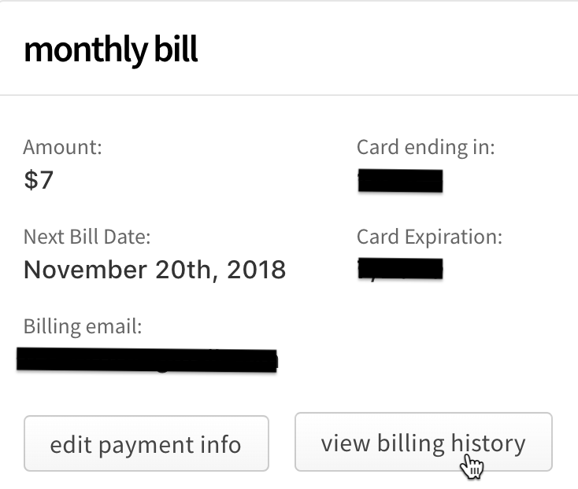
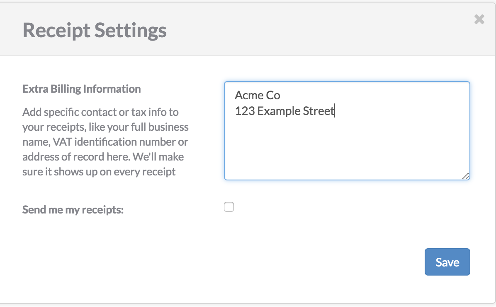

+++
title = "更新组织的计费设置"
date = 2023-09-22T21:03:17+08:00
weight = 20
type = "docs"
description = ""
isCJKLanguage = true
draft = false

+++

> 原文: [https://docs.npmjs.com/updating-organization-billing-settings](https://docs.npmjs.com/updating-organization-billing-settings)

# Updating organization billing settings - 更新组织的计费设置

**Note:** This article only applies to users of the public npm registry.

**注意：**本文仅适用于公共npm注册表的用户。

As an owner of an npm Teams subscription, a paid organization plan, you can update the credit card used to pay for your plan. Updating your credit card will not change your billing cycle date, and the new credit card will be charged on the next billing cycle.

​	作为npm Teams订阅和付费组织计划的所有者，您可以更新用于支付计划的信用卡信息。更新信用卡信息不会更改您的计费周期日期，新的信用卡将在下一个计费周期中收取费用。

**Note:** If the credit card used to pay for your npm Teams subscription or your paid organization plan expires, or we are otherwise are unable to charge your card, you have a grace period of nine days to update the card.

**注意：**如果用于支付npm Teams订阅或付费组织计划的信用卡过期，或者我们无法收取您的卡片的费用，您将有9天的宽限期来更新卡片。

## 更新信用卡信息 Updating credit card information

1. On the npm "Sign In" page, enter your account details and click Sign In.

2. 在npm的“登录”页面上，输入您的账号详细信息，然后点击“登录”。

   

3. In the upper right corner of the page, click your profile picture, then click Account.

4. 在页面的右上角，点击您的个人头像，然后点击“账户”。

   

5. In the left sidebar, click the name of the organization whose credit card information you want to change.

6. 在左侧边栏中，点击您要更改信用卡信息的组织名称。

   

7. On the organization settings page, click Billing.

8. 在组织设置页面上，点击“计费”。

   

9. Under "monthly bill", click Edit Payment Info.

10. 在“monthly bill”下方，点击“编辑付款信息”。

   

11. In the billing information dialog box, enter your billing information:

12. 在计费信息对话框中，输入您的计费信息：

    - Email: the email address used for the billing contact
    - 电子邮件：用于计费联系人的电子邮件地址
    - Name: the name on the credit card used to pay
    - 姓名：用于支付的信用卡上的姓名
    - Street, City, ZIP Code, Country: the billing address associated with the credit card
    - 街道、城市、邮编、国家：与信用卡关联的计费地址

    

13. Click Payment Info.

14. 点击“付款信息”。

    

15. In the credit card information dialog box, enter your credit card information:

16. 在信用卡信息对话框中，输入您的信用卡信息：

    - Card number
    - 卡号
    - MM / YY: the month and year of the card expiration date
    - MM / YY：卡片到期日期的月份和年份
    - CVC: the three-digit code on the credit card
    - CVC：信用卡上的三位数字代码

    

17. To save your credit card information for other payments on npm, select "Remember me".

18. 要在npm上保存您的信用卡信息以进行其他付款，请选择“记住我”。

    

19. Click Update Card.

20. 点击“更新卡片”。

    

## 更新计费收据电子邮件和额外收据信息 Updating billing receipt email and extra receipt information

As an organization owner, you can update the email address used for receipts, and add extra information to the receipt for your paid organization plan, such as your business name, VAT identification number, or address of record. Updated billing information will appear on all receipts immediately.

​	作为组织所有者，您可以更新用于收据的电子邮件地址，并在付费组织计划的收据中添加额外信息，例如您的商业名称、增值税识别号或注册地址。更新的计费信息将立即显示在所有收据上。

**Note:** The billing email is used for receipts only and is not required to match the email address of the person whose card is used to pay for the organization.

**注意：**计费电子邮件仅用于收据，无需与用于支付组织的信用卡的电子邮件地址匹配。

1. On the npm "Sign In" page, enter your account details and click Sign In.

2. 在npm的“登录”页面上，输入您的账号详细信息，然后点击“登录”。

   

3. In the upper right corner of the page, click your profile picture, then click Account.

4. 在页面的右上角，点击您的个人头像，然后点击“账户”。

   

5. In the left sidebar, click the name of the organization whose billing receipt information you want to change.

6. 在左侧边栏中，点击您要更改计费收据信息的组织名称。

   

7. On the organization settings page, click **Billing**.

8. 在组织设置页面上，点击**计费**。

9. On the Billing Information page, under "monthly bill", select View Billing History.

10. 在计费信息页面上，在“monthly bill”下方，选择“查看计费历史”。

   

11. At the bottom of the Billing History dialog box, click "Receipt Settings".

12. 在计费历史对话框的底部，点击“收据设置”。

    

13. To add a business name, VAT number, address of record, or other information to your receipts, in the "Extra Billing Information" text box, type the information.

14. 要在收据中添加商业名称、增值税号、注册地址或其他信息，请在“额外计费信息”文本框中输入信息。

    

15. To update the email address used for receipts, beside "Send my receipts", select the checkbox and type the email address that should receive billing receipts.

16. 要更新用于收据的电子邮件地址，请在“发送我的收据”旁边选中复选框，并输入应接收计费收据的电子邮件地址。

    

17. Click Save.

18. 点击“保存”。

    
