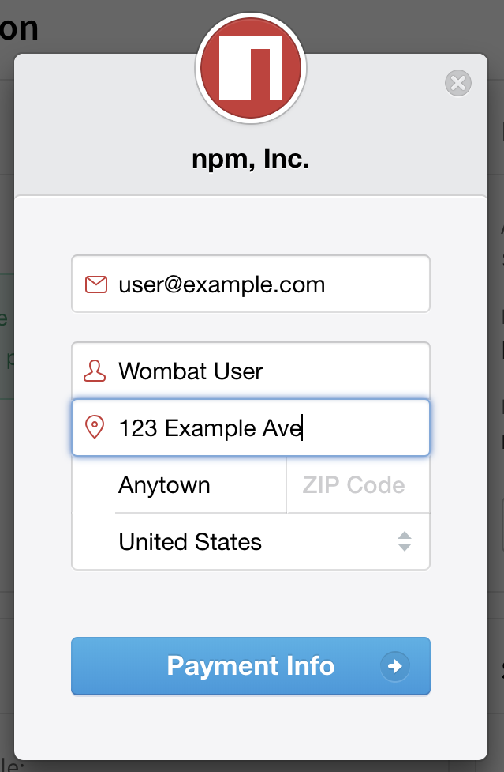
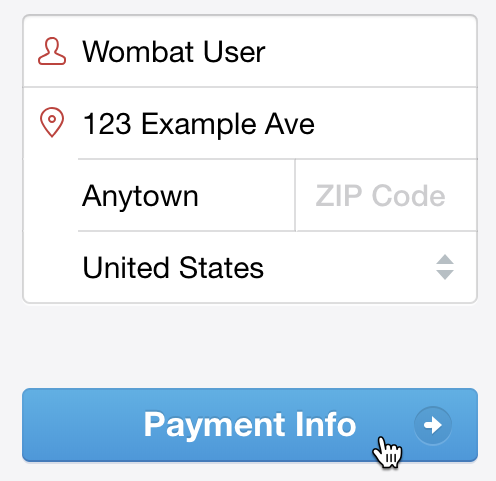
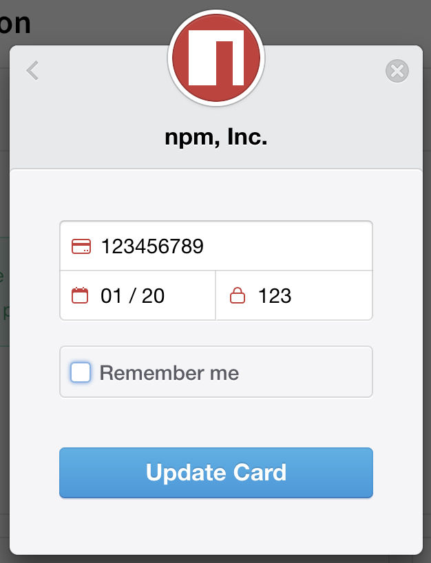

+++
title = "升级到付费组织计划"
date = 2023-09-22T21:02:58+08:00
weight = 1
type = "docs"
description = ""
isCJKLanguage = true
draft = false

+++

> 原文: [https://docs.npmjs.com/upgrading-to-a-paid-organization-plan](https://docs.npmjs.com/upgrading-to-a-paid-organization-plan)

# Upgrading to a paid organization plan - 升级到付费组织计划

**Note:** This article only applies to users of the public npm registry.

**注意：**本文仅适用于公共npm注册表的用户。

As an organization owner, you can upgrade your free organization plan to the npm Teams product. npm Teams is a paid plan to give organization members the ability to install and publish private packages. For more information about npm Teams and our organization pricing plans, see the "npm Teams" section of [our pricing page](https://www.npmjs.com/pricing).

​	作为组织所有者，您可以将免费的组织计划升级为npm Teams产品。npm Teams是一种付费计划，使组织成员能够安装和发布私有软件包。有关npm Teams和我们的组织定价计划的更多信息，请参阅[我们的定价页面](https://www.npmjs.com/pricing)中的“npm Teams”部分。

If you have an organization with a private packages plan, your organization will cost you seven (7) dollars a month per user. **The $7 charge is a flat fee for any member of the organization even if the teams the member belongs do not have access to private packages**

​	如果您的组织拥有私有软件包计划，每个用户每月将花费7美元。**这7美元的费用是组织的所有成员的固定费用，即使成员所属的团队没有访问私有软件包的权限。**

Newly added members to an organization are always billed during the next billing cycle. For more information, see "[Adding members to your organization](adding-members-to-your-org)".

​	新添加的组织成员将始终在下一个计费周期中收费。有关更多信息，请参阅“[向组织添加成员](adding-members-to-your-org)”。

**Note:** Your paid plan and billing cycle will start when you submit your credit card information, and you will be charged for the first month immediately.

**注意：**您的付费计划和计费周期将在您提交信用卡信息时开始，并且您将立即收取第一个月的费用。

1. On the npm "Sign In" page, enter your account details and click Sign In.

2. 在npm的“登录”页面，输入您的账户详细信息，然后点击“登录”。

   

3. In the upper right corner of the page, click your profile picture, then click Account.

4. 在页面的右上角，点击您的个人头像，然后点击“账户”。

   

5. In the left sidebar, click the name of the organization you want to upgrade.

6. 在左侧边栏中，点击要升级的组织名称。

   

7. On the organization settings page, click Billing.

8. 在组织设置页面，点击“计费”。

   

9. Under "change plan", click **Upgrade Plan ($7/User)**.

10. 在“更改计划”下，点击**升级计划（$7/用户）**。

11. Under "Want to upgrade?", click **Enable Private Publishing for $7/mo**.

12. 在“想要升级吗？”下，点击**启用私有发布，每月$7**。

13. In the billing information dialog box, enter your billing information:

14. 在计费信息对话框中，输入您的计费信息：

    - Email: the email address used for the billing contact
    - 电子邮件：用于计费联系的电子邮件地址
    - Name: the name on the credit card used to pay
    - 姓名：用于支付的信用卡上的姓名
    - Street, City, ZIP Code, Country: the billing address associated with the credit card
    - 街道、城市、邮政编码、国家：与信用卡关联的计费地址

    

15. Click Payment Info.

16. 点击“付款信息”。

    

17. In the credit card information dialog box, enter your credit card information:

18. 在信用卡信息对话框中，输入您的信用卡信息：

    - Card number
    - 卡号
    - MM / YY: the month and year of the card expiration date
    - MM / YY：信用卡到期日期的月份和年份
    - CVC: the three-digit code on the credit card
    - CVC：信用卡上的三位数安全码

    

19. To save your credit card information for other payments on npm, select "Remember me".

20. 若要在npm上保存您的信用卡信息以进行其他支付，请选择“记住我”。

    

21. Click **Pay** for the monthly amount. The monthly amount will be the number of members in your organization multiplied by $7.

22. 点击**支付**以支付每月金额。每月金额将是您组织中成员人数乘以7美元。
