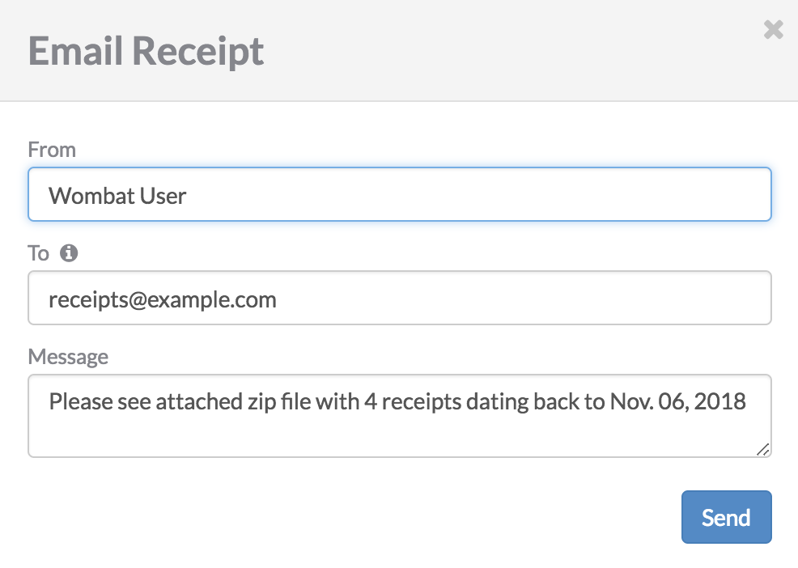

+++
title = "查看、下载和发送组织的收据"
date = 2023-09-22T21:03:07+08:00
weight = 10
type = "docs"
description = ""
isCJKLanguage = true
draft = false

+++

> 原文: [https://docs.npmjs.com/viewing-downloading-and-emailing-receipts-for-your-organization](https://docs.npmjs.com/viewing-downloading-and-emailing-receipts-for-your-organization)

# Viewing, downloading, and emailing receipts for your organization - 查看、下载和发送组织的收据

**Note:** This article only applies to users of the public npm registry.

**注意：**本文仅适用于公共npm注册表的用户。

As an organization owner, you can view, download, and email receipts for the complete billing history of your organization.

​	作为组织所有者，您可以查看、下载和发送您组织的完整计费历史的收据。

## 查看收据 Viewing receipts

1. On the npm "Sign In" page, enter your account details and click Sign In.

2. 在npm的“登录”页面上，输入您的帐户详细信息，然后点击“登录”。

   

3. In the upper right corner of the page, click your profile picture, then click Account.

4. 在页面的右上角，点击您的个人资料图片，然后点击“账户”。

   

5. In the left sidebar, click the name of the organization whose billing receipts you want to view.

6. 在左侧的侧边栏中，点击您要查看计费收据的组织名称。

   

7. On the organization settings page, click Billing.

8. 在组织设置页面上，点击计费。

   

9. On the Billing Information page, under "monthly bill", select View Billing History.

10. 在“Billing Information”页面上，在“monthly bill”下，选择“View Billing History”。

   

11. To view a single receipt, find the row of the receipt you want to view, then, on the right side of the row, click the view icon.

12. 要查看单个收据，请找到您要查看的收据所在行，然后在该行右侧点击查看图标。

    

## 下载收据 Downloading receipts

1. On the npm "Sign In" page, enter your account details and click Sign In.

2. 在npm的“登录”页面上，输入您的帐户详细信息，然后点击“登录”。

   

3. In the upper right corner of the page, click your profile picture, then click Account.

4. 在页面的右上角，点击您的个人资料图片，然后点击“账户”。

   

5. In the left sidebar, click the name of the organization whose billing receipts you want to download.

6. 在左侧的侧边栏中，点击您要下载计费收据的组织名称。

   

7. On the organization settings page, click Billing.

8. 在组织设置页面上，点击计费。

   

9. On the Billing Information page, under "monthly bill", select View Billing History.

10. 在“Billing Information”页面上，在“monthly bill”下，选择“View Billing History”。

   

11. To download a single receipt, find the row of the receipt you want to download, then click the PDF icon on the right side of the row.

12. 要下载单个收据，请找到您要下载的收据所在行，然后点击该行右侧的PDF图标。

    

13. To download multiple receipts, first select the receipts that you wish to download by selecting the box next to the date. To select all receipts, select the checkbox next to the "Date" header. Then click Download Checked.

14. 要下载多个收据，请先通过选择日期旁边的框选中要下载的收据。要选择所有收据，请选择“日期”标题旁边的复选框。然后点击“Download Checked”。

    

## 发送收据 Emailing receipts

1. On the npm "Sign In" page, enter your account details and click Sign In.

2. 在npm的“登录”页面上，输入您的帐户详细信息，然后点击“登录”。

   

3. In the upper right corner of the page, click your profile picture, then click Account.

4. 在页面的右上角，点击您的个人资料图片，然后点击“账户”。

   

5. In the left sidebar, click the name of the organization whose billing receipts you want to email.

6. 在左侧的侧边栏中，点击您要发送计费收据的组织名称。

   

7. On the organization settings page, click Billing.

8. 在组织设置页面上，点击计费。

   

9. On the Billing Information page, under "monthly bill", select View Billing History.

10. 在“Billing Information”页面上，在“monthly bill”下，选择“View Billing History”。

   

11. To email a single receipt, find the row of the receipt you want to download, then, on the right side of the row, click the email icon.

12. 要发送单个收据，请找到您要下载的收据所在行，然后在该行右侧点击电子邮件图标。

    

13. To email multiple receipts, first select the receipts that you wish to download by selecting the box next to the date. To select all receipts, select the checkbox next to the "Date" header. Then click Email Checked.

14. 要发送多个收据，请先通过选择日期旁边的框选中要下载的收据。要选择所有收据，请选择“日期”标题旁边的复选框。然后点击“Email Checked”。

    

15. In the Email Receipt dialog box, fill in the "From", "To", and "Message" fields.

16. 在“Email Receipt”对话框中，填写“From”、“To”和“Message”字段。

    

17. Click **Send**.

18. 点击**Send**。
