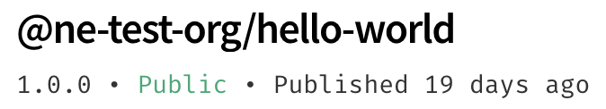

+++
title = "创建和发布作用域公共包"
date = 2023-09-22T20:55:50+08:00
weight = 40
type = "docs"
description = ""
isCJKLanguage = true
draft = false

+++

> 原文: [https://docs.npmjs.com/creating-and-publishing-scoped-public-packages](https://docs.npmjs.com/creating-and-publishing-scoped-public-packages)

# Creating and publishing scoped public packages - 创建和发布作用域公共包

To share your code publicly in a user or organization namespace, you can publish public user-scoped or organization-scoped packages to the npm registry.

​	要在用户或组织命名空间中公开共享代码，您可以将公共用户作用域或组织作用域的软件包发布到npm注册表。

For more information on scopes, see "[About scopes](https://docs.npmjs.com/about-scopes)".

​	有关作用域的更多信息，请参阅“[关于作用域](https://docs.npmjs.com/about-scopes)”。

**Note:** Before you can publish user-scoped npm packages, you must [sign up](https://www.npmjs.com/signup) for an npm user account.

**注意：**在发布用户作用域的npm软件包之前，您必须[注册](https://www.npmjs.com/signup)一个npm用户账户。

Additionally, to publish organization-scoped packages, you must [create an npm user account](https://www.npmjs.com/signup), then [create an npm organization](https://www.npmjs.com/signup?next=/org/create).

​	此外，要发布组织作用域的软件包，您必须首先[创建一个npm用户账户](https://www.npmjs.com/signup)，然后[创建一个npm组织](https://www.npmjs.com/signup?next=/org/create)。

## 创建作用域公共包 Creating a scoped public package

1. If you are using npmrc to [manage accounts on multiple registries](configuring-your-registry-settings-as-an-npm-enterprise-user), on the command line, switch to the appropriate profile:

2. 如果您正在使用npmrc来[管理多个注册表上的账户](configuring-your-registry-settings-as-an-npm-enterprise-user)，请在命令行上切换到适当的配置文件：

   ```
   npmrc <profile-name>
   ```

3. On the command line, create a directory for your package:

4. 在命令行上，为您的软件包创建一个目录：

   ```
   mkdir my-test-package
   ```

5. Navigate to the root directory of your package:

6. 导航到您的软件包的根目录：

   ```
   cd my-test-package
   ```

7. If you are using git to manage your package code, in the package root directory, run the following commands, replacing `git-remote-url` with the git remote URL for your package:

8. 如果您使用git来管理软件包代码，请在软件包根目录中运行以下命令，将 `git-remote-url` 替换为您的软件包的git远程URL：

   ```
   git init
   git remote add origin git://git-remote-url
   ```

9. In the package root directory, run the `npm init` command and pass the scope to the `scope` flag:

10. 在软件包根目录中，运行 `npm init` 命令，并将作用域传递给 `scope` 标志：

   - For an organization-scoped package, replace `my-org` with the name of your organization:

   - 对于组织作用域的软件包，请将 `my-org` 替换为您的组织名称：

     ```
     npm init --scope=@my-org
     ```
     
   - For a user-scoped package, replace `my-username` with your username:

   - 对于用户作用域的软件包，请将 `my-username` 替换为您的用户名：

     ```
     npm init --scope=@my-username
     ```

11. Respond to the prompts to generate a [`package.json`](https://docs.npmjs.com/about-package-json-and-package-lock-json-files) file. For help naming your package, see "[Package name guidelines](package-name-guidelines)".

12. 响应提示以生成[ `package.json` ](https://docs.npmjs.com/about-package-json-and-package-lock-json-files)文件。有关命名软件包的帮助，请参阅“[软件包名称准则](package-name-guidelines)”。

13. Create a [README file](about-package-readme-files) that explains what your package code is and how to use it.

14. 创建一个[README文件](about-package-readme-files)，解释您的软件包代码是什么以及如何使用它。

15. In your preferred text editor, write the code for your package.

16. 在您喜欢的文本编辑器中，编写您的软件包的代码。

## 检查软件包内容是否包含敏感或不必要的信息 Reviewing package contents for sensitive or unnecessary information

Publishing sensitive information to the registry can harm your users, compromise your development infrastructure, be expensive to fix, and put you at risk of legal action. **We strongly recommend removing sensitive information, such as private keys, passwords, [personally identifiable information](https://en.wikipedia.org/wiki/Personally_identifiable_information) (PII), and credit card data before publishing your package to the registry.**

​	将敏感信息发布到注册表可能会损害您的用户，危害您的开发基础设施，修复起来也很昂贵，并使您面临法律诉讼的风险。**我们强烈建议在将软件包发布到注册表之前，删除敏感信息，例如私钥、密码、[个人身份信息](https://en.wikipedia.org/wiki/Personally_identifiable_information)（PII）和信用卡数据。**

For less sensitive information, such as testing data, use a `.npmignore` or `.gitignore` file to prevent publishing to the registry. For more information, see [this article](https://docs.npmjs.com/misc/developers#keeping-files-out-of-your-package).

​	对于较不敏感的信息，例如测试数据，请使用 `.npmignore` 或 `.gitignore` 文件防止发布到注册表。有关更多信息，请参阅[本文](https://docs.npmjs.com/misc/developers#keeping-files-out-of-your-package)。

## 测试您的软件包 Testing your package

To reduce the chances of publishing bugs, we recommend testing your package before publishing it to the npm registry. To test your package, run `npm install` with the full path to your package directory:

​	为了减少发布错误的机会，我们建议在将软件包发布到npm注册表之前对其进行测试。要测试您的软件包，请使用软件包目录的完整路径运行 `npm install` 命令：

```
npm install my-package
```

## 发布作用域公共包 Publishing scoped public packages

By default, scoped packages are published with private visibility. To publish a scoped package with public visibility, use `npm publish --access public`.

​	默认情况下，作用域软件包以私有可见性进行发布。要以公共可见性发布作用域软件包，请使用 `npm publish --access public` 命令。

1. On the command line, navigate to the root directory of your package.

2. 在命令行上，导航到您的软件包的根目录。

   ```
   cd /path/to/package
   ```

3. To publish your scoped public package to the npm registry, run:

4. 要将作用域公共软件包发布到npm注册表，请运行：

   ```
   npm publish --access public
   ```

   **Note:** If you use GitHub Actions to publish your packages, you can generate provenance information for each package you publish. For more information, see "[Generating provenance statements](https://docs.npmjs.com/generating-provenance-statements)."

   **注意：**如果您使用GitHub Actions来发布软件包，您可以为您发布的每个软件包生成来源信息。有关更多信息，请参阅“[生成来源声明](https://docs.npmjs.com/generating-provenance-statements)”。

5. To see your public package page, visit https://npmjs.com/package/\*package-name\*, replacing *package-name* with the name of your package. Public packages will say `public` below the package name on the npm website.

6. 要查看您的公共软件包页面，请访问https://npmjs.com/package/\*package-name\*，将*package-name*替换为您的软件包的名称。在npm网站上，公共软件包下方将显示 `public` 。

   

For more information on the `publish` command, see the [CLI documentation](https://docs.npmjs.com/cli/publish).

​	有关 `publish` 命令的更多信息，请参阅[CLI文档](https://docs.npmjs.com/cli/publish)。
