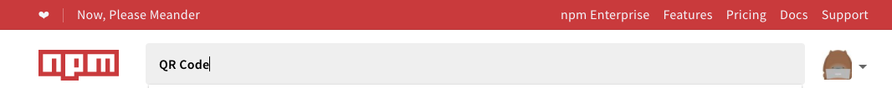
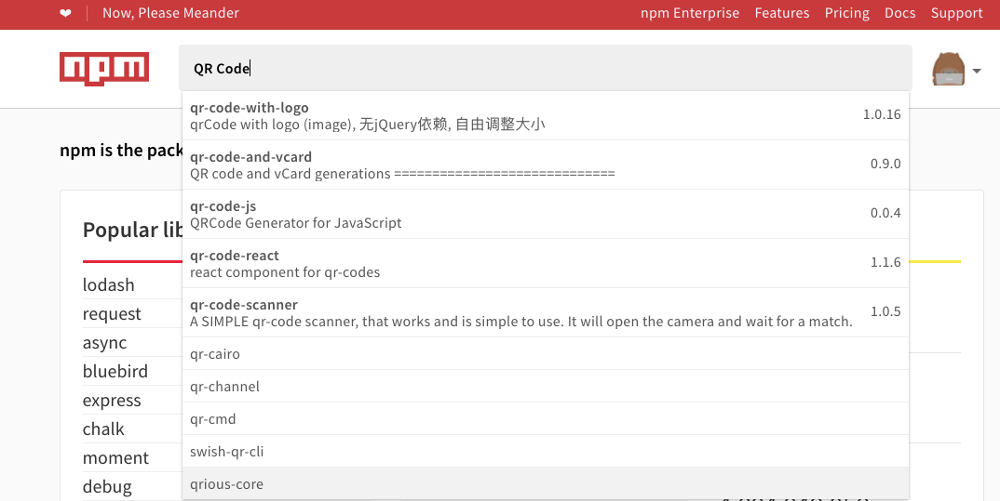
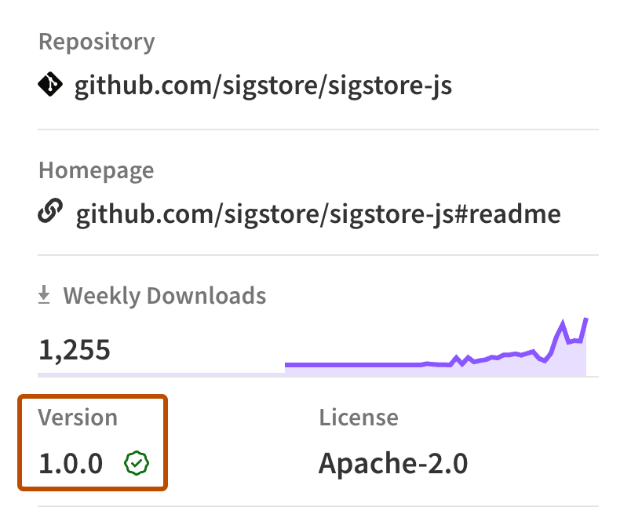
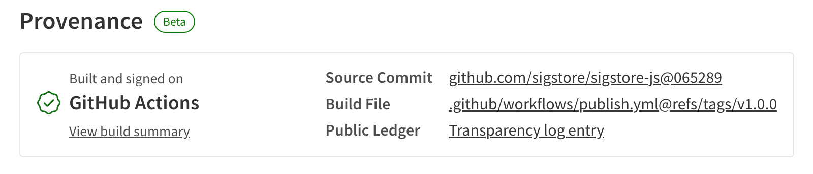
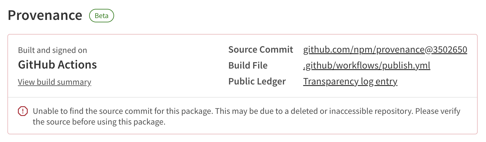

+++
title = "搜索和选择要下载的包"
date = 2023-09-22T20:57:56+08:00
weight = 1
type = "docs"
description = ""
isCJKLanguage = true
draft = false

+++

> 原文: [https://docs.npmjs.com/searching-for-and-choosing-packages-to-download](https://docs.npmjs.com/searching-for-and-choosing-packages-to-download)

# Searching for and choosing packages to download - 搜索和选择要下载的包

You can use the npm search bar to find packages to use in your projects. npm search uses npms and the npms analyzer; for more information on both, see https://npms.io/about.

​	您可以使用 npm 搜索栏来查找要在项目中使用的包。npm 搜索使用 npms 和 npms 分析器；有关两者的更多信息，请参见 https://npms.io/about。

## 搜索包 Searching for a package

1. In the search bar, type a search term and press **Enter**. As you type, possible choices will appear.

2. 在搜索栏中输入搜索词并按 **Enter** 键。当您输入时，可能会出现可能的选择。

   

   

3. To list packages ranked according to [package search rank criteria](#package-search-rank-criteria), in the left sidebar, under "Sort packages", click the criterion. For example, to sort packages by popularity, click "Popularity".

4. 要按照[包搜索排名标准](#包搜索排名标准)列出排名，可以在左侧边栏的“Sort packages”下，点击相应的标准。例如，要按照流行度排序包，点击“Popularity”。

5. In the package search results list, click the name of the package.

6. 在包搜索结果列表中，点击包的名称。

## 包搜索排名标准 Package search rank criteria

Often, there are dozens or even hundreds of packages with similar names and/or similar purposes. To help you decide the best ones to explore, each package has been ranked according to four criteria using the npms analyzer:

​	通常，有几十甚至几百个具有相似名称和/或相似用途的包。为了帮助您决定要探索的最佳包，每个包都根据四个标准使用 npms 分析器进行了排名：

### 流行度 Popularity

Popularity indicates how many times the package has been downloaded. This is a strong indicator of packages that others have found to be useful.

​	流行度表示包被下载的次数。这是一个其他人发现有用的包的强有力指标。

### 质量 Quality

Quality includes considerations such as the presence of a README file, stability, tests, up-to-date dependencies, custom website, and code complexity.

​	维护性根据开发人员对包的关注程度对其进行排名。更经常维护的包更有可能与当前或即将发布的 npm CLI 版本良好配合使用。

### 维护 Maintenance

Maintenance ranks packages according to the attention they are given by developers. More frequently maintained packages are more likely to work well with the current or upcoming versions of the npm CLI, for example.

​	维护根据开发者的关注度对软件包进行排名。维护频率较高的软件包更有可能与当前或即将发布的npm CLI版本良好配合使用。

### 最优 Optimal

Optimal combines the other three criteria (popularity, quality, maintenance) into one score in a meaningful way.

​	最优将其他三个标准（流行度、质量、维护）综合成一个有意义的分数。

## 软件包来源 Package provenance

When packages have been published with provenance, you can:

​	当软件包通过来源发布时，您可以：

- Verify where and how a package was published.
- 验证软件包的发布位置和方式。
- Validate that an authorized user published a package.
- 验证授权用户是否发布了软件包。

You can use this information to audit packages and determine whether or not you want to consume them. For more information about npm provenance, see "[About npm provenance](https://docs.npmjs.com/generating-provenance-statements#about-npm-provenance)."

​	您可以使用这些信息来审核软件包，并确定是否要使用它们。有关npm来源的更多信息，请参阅“[关于npm来源](https://docs.npmjs.com/generating-provenance-statements#about-npm-provenance)”。

To view provenance information for a package in the npm registry:

​	要查看npm注册表中软件包的来源信息：

1. In the npm registry, navigate to a package.

2. 在npm注册表中导航到一个软件包。

3. On the package's page, in the **Version** field to the right of the README, look for a green check mark. If there is a green check mark, this means the package was published with provenance.

4. 在软件包页面上，在README右侧的**版本**字段中查找一个绿色的勾号。如果有一个绿色的勾号，这意味着该软件包是通过来源发布的。

   

5. Click on the check mark, then click **View more details**.

6. 点击勾号，然后点击**查看更多细节**。

7. View the following information for the package:

8. 查看软件包的以下信息：

   - **Build Environment**: The environment used to build the package.
   - **构建环境**：用于构建软件包的环境。
   - **Build Summary**: A link to the workflow run that built the package.
   - **构建摘要**：构建软件包的工作流运行的链接。
   - **Source Commit**: A link to the commit the package was built from.
   - **源提交**：构建软件包的提交链接。
   - **Build File**: A link to the workflow file used to build the package.
   - **构建文件**：用于构建软件包的工作流文件链接。
   - **Public Ledger**: A link to a transparency log entry attesting an authorized user published the package.
   - **公共账本**：证明授权用户发布该软件包的透明日志条目链接。

   

**Note:** Whenever you access a package's provenance information on npmjs.com, the linked source commit and repository are checked by npm. If the linked source commit or repository cannot be found, an error message will appear at the top of the page and alongside the provenance information. This is to inform you that the provenance for this package can no longer be established, which may occur when a repository is deleted or made private.

**注意：**每当您在npmjs.com上访问软件包的来源信息时，npm都会检查链接的源提交和存储库。如果找不到链接的源提交或存储库，页面顶部和来源信息旁边将显示错误消息。这是为了通知您无法建立该软件包的来源，这可能发生在存储库被删除或设为私有时。



### 验证来源证明 Verifying provenance attestations

When you download a package from the registry, you can verify the provenance of a package with the following CLI command:

​	当您从注册表下载软件包时，可以使用以下CLI命令验证软件包的来源证明：

```
npm audit signatures
```

This command checks the registry signatures and provenance attestations. If a package has missing or invalid signatures or attestations, it returns an error. This could indicate that a package has been tampered with.

​	该命令会检查注册表的签名和来源证明。如果软件包的签名或证明缺失或无效，它将返回一个错误。这可能表明软件包已被篡改。

**Note:** In order to run the audit command to verify package provenance, you must:

**注意：**为了运行审核命令以验证软件包的来源，您必须：

- Install npm CLI version `v9.5.0` or later: `npm install -g npm@latest`
- 安装npm CLI版本 `v9.5.0` 或更高版本： `npm install -g npm@latest` 
- Install dependencies with `npm install` or `npm ci`
- 使用 `npm install` 或 `npm ci` 安装依赖项。
