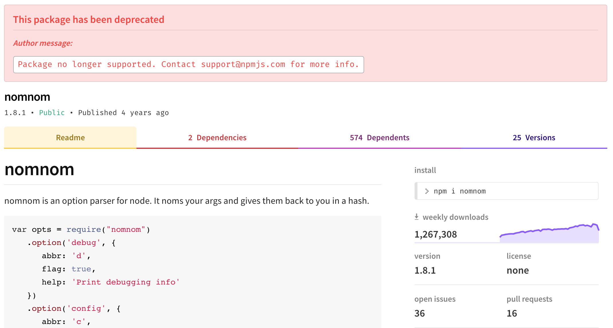

+++
title = "使用已弃用的软件包"
date = 2023-09-22T20:58:52+08:00
weight = 60
type = "docs"
description = ""
isCJKLanguage = true
draft = false

+++

> 原文: [https://docs.npmjs.com/using-deprecated-packages](https://docs.npmjs.com/using-deprecated-packages)

# Using deprecated packages - 使用已弃用的软件包

If you install a package, and it prints a deprecation message, we recommend following the instructions, if possible.

​	如果您安装了一个软件包，并且它打印出一个弃用消息，我们建议按照说明进行操作，如果可能的话。

That might mean updating to a new version, or updating your package dependencies.

​	这可能意味着更新到一个新版本，或者更新您的软件包依赖项。

A deprecation message doesn't always mean the package or version is unusable; it may mean the package is unmaintained and will no longer be updated by the publisher.

​	弃用消息并不总是意味着软件包或版本不可用；它可能意味着软件包不再维护，并且发布者将不再对其进行更新。
