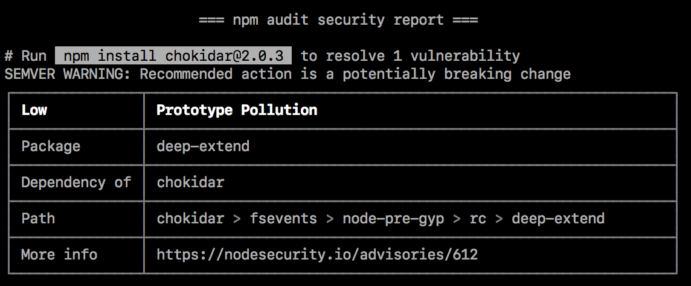

+++
title = "Auditing package dependencies for security vulnerabilities"
date = 2023-09-22T20:59:24+08:00
weight = 10
type = "docs"
description = ""
isCJKLanguage = true
draft = false
+++

> 原文: [https://docs.npmjs.com/auditing-package-dependencies-for-security-vulnerabilities](https://docs.npmjs.com/auditing-package-dependencies-for-security-vulnerabilities)

# Auditing package dependencies for security vulnerabilities - 审查包依赖项以查找安全漏洞

## 关于安全审计 About security audits

A security audit is an assessment of package dependencies for security vulnerabilities. Security audits help you protect your package's users by enabling you to find and fix known vulnerabilities in dependencies that could cause data loss, service outages, unauthorized access to sensitive information, or other issues.

​	安全审计是对包依赖项进行安全漏洞评估。安全审计可以帮助您通过查找和修复依赖项中已知的安全漏洞来保护您的包的用户，这些漏洞可能导致数据丢失、服务中断、未经授权访问敏感信息或其他问题。

## 使用  `npm audit`  运行安全审计 Running a security audit with `npm audit`

**Note:** The `npm audit` command is available in npm@6. To upgrade, run `npm install npm@latest -g`.

**注意：**  `npm audit`  命令在 npm@6 中可用。要升级，请运行  `npm install npm@latest -g` 。

The [`npm audit` command](https://docs.npmjs.com/cli/audit) submits a description of the dependencies configured in your package to your default registry and asks for a report of known vulnerabilities. `npm audit` checks direct dependencies, devDependencies, bundledDependencies, and optionalDependencies, but does not check peerDependencies.

​	[ `npm audit`  命令](https://docs.npmjs.com/cli/audit)将您包中配置的依赖项的描述提交给默认注册表，并要求提供已知漏洞的报告。 `npm audit`  检查直接依赖项、devDependencies、bundledDependencies 和 optionalDependencies，但不检查 peerDependencies。

`npm audit` automatically runs when you install a package with `npm install`. You can also run `npm audit` manually on your [locally installed packages](downloading-and-installing-packages-locally) to conduct a security audit of the package and produce a report of dependency vulnerabilities and, if available, suggested patches.

 	`npm audit`  在使用  `npm install`  安装包时会自动运行。您也可以在[本地安装的包](downloading-and-installing-packages-locally)上手动运行  `npm audit` ，以进行安全审计并生成依赖项漏洞报告和（如果有的话）建议的修补程序。

1. On the command line, navigate to your package directory by typing `cd path/to/your-package-name` and pressing **Enter**.
2. 在命令行中，通过输入  `cd path/to/your-package-name`  并按 **Enter** 键导航到您的包目录。
3. Ensure your package contains `package.json` and `package-lock.json` files.
4. 确保您的包包含  `package.json`  和  `package-lock.json`  文件。
5. Type `npm audit` and press **Enter**.
6. 输入  `npm audit`  并按 **Enter** 键。
7. Review the audit report and run recommended commands or investigate further if needed.
8. 查看审计报告，如果需要，运行建议的命令或进一步调查。

### 解决  `EAUDITNOPJSON`  和  `EAUDITNOLOCK`  错误 Resolving `EAUDITNOPJSON` and `EAUDITNOLOCK` errors

`npm audit` requires packages to have `package.json` and `package-lock.json` files.

 	`npm audit`  需要包含  `package.json`  和  `package-lock.json`  文件的包。

- If you get an `EAUDITNOPJSON` error, create a `package.json` file by following the steps in "[Creating a package.json file](creating-a-package-json-file)".
- 如果出现  `EAUDITNOPJSON`  错误，请按照“[创建 package.json 文件](creating-a-package-json-file)”中的步骤创建  `package.json`  文件。
- If you get an `EAUDITNOLOCK` error, make sure your package has a `package.json` file, then create the package lock file by running `npm i --package-lock-only`.
- 如果出现  `EAUDITNOLOCK`  错误，请确保您的包有一个  `package.json`  文件，然后运行  `npm i --package-lock-only`  命令创建 package lock 文件。

## 查看并处理安全审计报告 Reviewing and acting on the security audit report

Running `npm audit` will produce a report of security vulnerabilities with the affected package name, vulnerability severity and description, path, and other information, and, if available, commands to apply patches to resolve vulnerabilities. For more information on the fields in the audit report, see "[About audit reports](about-audit-reports)"

​	运行  `npm audit`  将生成一个安全漏洞报告，其中包含受影响的包名称、漏洞严重程度和描述、路径和其他信息，以及（如果有的话）应用修补程序以解决漏洞的命令。有关审计报告中字段的更多信息，请参阅“[关于审计报告](about-audit-reports)”。

### 发现安全漏洞并提供建议的更新 Security vulnerabilities found with suggested updates

If security vulnerabilities are found and updates are available, you can either:

​	如果发现安全漏洞并提供更新，您可以选择：

- Run the `npm audit fix` subcommand to automatically install compatible updates to vulnerable dependencies.
- 运行  `npm audit fix`  子命令，自动安装与受漏洞影响的依赖项兼容的更新。
- Run the recommended commands individually to install updates to vulnerable dependencies. (Some updates may be semver-breaking changes; for more information, see "[SEMVER warnings](#semver-warnings)".)
- 逐个运行建议的命令，以安装与受漏洞影响的依赖项的更新。 （某些更新可能会导致破坏性的变更；有关更多信息，请参阅“[SEMVER 警告](#semver-warnings)”）。



#### SEMVER 警告 SEMVER warnings

If the recommended action is a potential breaking change (semantic version major change), it will be followed by a `SEMVER WARNING` that says "SEMVER WARNING: Recommended action is a potentially breaking change". If the package with the vulnerability has changed its API, you may need to make additional changes to your package's code.

​	如果推荐的操作是潜在的破坏性更改（语义版本主要更改），它后面会有一个  `SEMVER WARNING` ，内容为“SEMVER WARNING: 推荐的操作是潜在的破坏性更改”。如果具有漏洞的包已更改其 API，则您可能需要对包的代码进行其他更改。

### 发现需要手动审查的安全漏洞 Security vulnerabilities found requiring manual review

If security vulnerabilities are found, but no patches are available, the audit report will provide information about the vulnerability so you can investigate further.

​	如果发现安全漏洞，但没有可用的修补程序，审计报告将提供有关漏洞的信息，以便您进一步调查。


To address the vulnerability, you can

​	要解决漏洞，您可以选择

- [Check for mitigating factors](#check-for-mitigating-factors)
- 要解决漏洞，您可以选择
- [Update dependent packages if a fix exists](#update-dependent-packages-if-a-fix-exists)
- 如果存在修复，请更新依赖包
- [Fix the vulnerability](#fix-the-vulnerability)
- 修复漏洞
- [Open an issue in the package or dependent package issue tracker](#open-an-issue-in-the-package-or-dependent-package-issue-tracker)
- 在包或依赖包问题跟踪器中提交问题

#### 要解决漏洞，您可以选择 Check for mitigating factors

Review the security advisory in the "More info" field for mitigating factors that may allow you to continue using the package with the vulnerability in limited cases. For example, the vulnerability may only exist when the code is used on specific operating systems, or when a specific function is called.

​	查看“更多信息”字段中的安全通告，了解可能允许您在有限情况下继续使用具有漏洞的包的缓解因素。例如，漏洞只存在于特定操作系统上使用代码或调用特定函数时。

#### 如果存在修复，请更新依赖包 Update dependent packages if a fix exists

If a fix exists but packages that depend on the package with the vulnerability have not been updated to include the fixed version, you may want to open a pull or merge request on the dependent package repository to use the fixed version.

​	如果存在修复程序，但依赖于具有漏洞的包的包尚未更新以包含修复版本，您可能需要在依赖包存储库上打开一个拉取请求或合并请求，以使用修复版本。

1. To find the package that must be updated, check the "Path" field for the location of the package with the vulnerability, then check for the package that depends on it. For example, if the path to the vulnerability is `@package-name > dependent-package > package-with-vulnerability`, you will need to update `dependent-package`.
2. 要找到必须更新的包，请检查“路径”字段以查找具有漏洞的包的位置，然后检查依赖于它的包。例如，如果漏洞的路径是  `@package-name > dependent-package > package-with-vulnerability` ，则需要更新  `dependent-package` 。
3. On the [npm public registry](https://npmjs.com), find the dependent package and navigate to its repository. For more information on finding packages, see "[Searching for and choosing packages to download](searching-for-and-choosing-packages-to-download)".
4. 在 [npm 公共注册表](https://npmjs.com) 上找到依赖包，并转到其存储库。有关查找包的更多信息，请参阅“[搜索和选择要下载的包](searching-for-and-choosing-packages-to-download)”。
5. In the dependent package repository, open a pull or merge request to update the version of the vulnerable package to a version with a fix.
6. 在依赖包存储库中，打开一个拉取请求或合并请求，将受漏洞影响的包的版本更新为修复版本。
7. Once the pull or merge request is merged and the package has been updated in the [npm public registry](https://npmjs.com), update your copy of the package with `npm update`.
8. 一旦合并拉取请求并在 [npm 公共注册表](https://npmjs.com) 中更新了包，使用  `npm update`  更新依赖于具有修复程序的包的副本。

#### 修复漏洞 Fix the vulnerability

If a fix does not exist, you may want to suggest changes that address the vulnerability to the package maintainer in a pull or merge request on the package repository.

​	如果没有修复程序，您可能需要在包存储库上为包维护者提出建议的更改，以解决漏洞，可以在拉取请求或合并请求中提出。

1. Check the "Path" field for the location of the vulnerability.
2. 检查“路径”字段以查找漏洞的位置。
3. On the [npm public registry](https://npmjs.com), find the package with the vulnerability. For more information on finding packages, see "[Searching for and choosing packages to download](searching-for-and-choosing-packages-to-download)".
4. 在 [npm 公共注册表](https://npmjs.com) 上找到具有漏洞的包。有关查找包的更多信息，请参阅“[搜索和选择要下载的包](searching-for-and-choosing-packages-to-download)”。
5. In the package repository, open a pull or merge request to make the fix on the package repository.
6. 在包存储库中，打开一个拉取请求或合并请求，对包存储库进行修复。
7. Once the fix is merged and the package has been updated in the npm public registry, update your copy of the package that depends on the package with the fix.
8. 一旦合并修复并在 npm 公共注册表中更新了包，更新依赖于具有修复程序的包的副本。

#### 在包或依赖包问题跟踪器中提交问题 Open an issue in the package or dependent package issue tracker

If you do not want to fix the vulnerability or update the dependent package yourself, open an issue in the package or dependent package issue tracker.

​	如果您不想自己修复漏洞或更新依赖包，请在包或依赖包问题跟踪器中提交问题。

1. On the [npm public registry](https://npmjs.com), find the package with the vulnerability or the dependent package that needs an update. For more information on finding packages, see "[Searching for and choosing packages to download](searching-for-and-choosing-packages-to-download)".
2. 在 [npm 公共注册表](https://npmjs.com) 上找到具有漏洞的包或需要更新的依赖包。有关查找包的更多信息，请参阅“[搜索和选择要下载的包](searching-for-and-choosing-packages-to-download)”。
3. In the package or dependent package issue tracker, open an issue and include information from the audit report, including the vulnerability report from the "More info" field.
4. 在包或依赖包问题跟踪器中，打开一个问题，并包含来自审计报告的信息，包括“更多信息”字段中的漏洞报告。

### 未发现安全漏洞 No security vulnerabilities found

If no security vulnerabilities are found, this means that packages with known vulnerabilities were not found in your package dependency tree. Since the advisory database can be updated at any time, we recommend regularly running `npm audit` manually, or adding `npm audit` to your continuous integration process.

​	如果未发现安全漏洞，这意味着在您的包依赖树中未找到已知漏洞的包。由于安全通告数据库可以随时更新，我们建议定期手动运行  `npm audit` ，或将  `npm audit`  添加到您的持续集成流程中。


## 在包安装时关闭  `npm audit`  Turning off `npm audit` on package installation

### 安装单个包 Installing a single package

To turn off `npm audit` when installing a single package, use the `--no-audit` flag:

​	要在安装单个包时关闭  `npm audit` ，请使用  `--no-audit`  标志：

```
npm install example-package-name --no-audit
```

For more information, see the [`npm-install` command](https://docs.npmjs.com/cli/install).

​	有关更多信息，请参阅 [ `npm-install`  命令](https://docs.npmjs.com/cli/install)。

### 安装所有包 Installing all packages

To turn off `npm audit` when installing all packages, set the `audit` setting to `false` in your user and global npmrc config files:

​	要在安装所有包时关闭  `npm audit` ，请在用户和全局 npmrc 配置文件中将  `audit`  设置为  `false` ：

```
npm set audit false
```

For more information, see the [`npm-config` management command](https://docs.npmjs.com/cli/config) and the [`npm-config` audit setting](https://docs.npmjs.com/cli/config#audit).

​	有关更多信息，请参阅 [ `npm-config`  管理命令](https://docs.npmjs.com/cli/config) 和 [ `npm-config`  audit 设置](https://docs.npmjs.com/cli/config#audit)。
