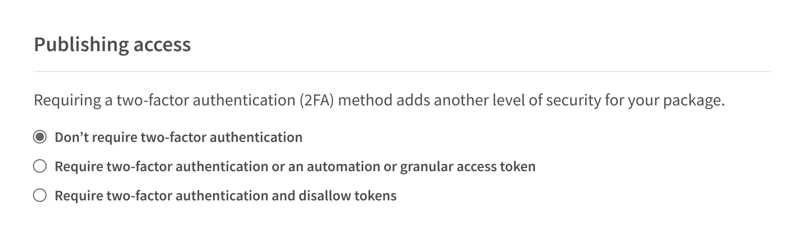

+++
title = "要求对软件包发布和设置修改进行双因素身份验证"
date = 2023-09-22T21:00:18+08:00
weight = 70
type = "docs"
description = ""
isCJKLanguage = true
draft = false

+++

> 原文: [https://docs.npmjs.com/requiring-2fa-for-package-publishing-and-settings-modification](https://docs.npmjs.com/requiring-2fa-for-package-publishing-and-settings-modification)

# Requiring 2FA for package publishing and settings modification - 要求对软件包发布和设置修改进行双因素身份验证

To protect your packages, as a package publisher, you can require everyone who has write access to a package to have two-factor authentication (2FA) enabled. This will require that users provide 2FA credentials in addition to their login token when they publish the package. For more information, see "[Configuring two-factor authentication](configuring-two-factor-authentication)".

​	为了保护您的软件包，作为软件包发布者，您可以要求所有具有写访问权限的用户启用双因素身份验证（2FA）。这将要求用户在发布软件包时除了登录令牌外，还提供2FA凭据。有关更多信息，请参阅“[配置双因素身份验证](configuring-two-factor-authentication)”。

You may also choose to allow publishing with either two-factor authentication *or* with [automation tokens](creating-and-viewing-access-tokens#creating-granular-access-tokens-on-the-website). This lets you configure automation tokens in a CI/CD workflow, but requires two-factor authentication from interactive publishes.

​	您还可以选择允许使用双因素身份验证或[自动化令牌](creating-and-viewing-access-tokens#creating-granular-access-tokens-on-the-website)进行发布。这样可以在CI/CD工作流程中配置自动化令牌，但要求交互式发布时使用双因素身份验证。

## 配置双因素身份验证 Configuring two-factor authentication

1. On the npm "Sign In" page, enter your account details and click Sign In.

2. 在npm“登录”页面上，输入您的帐户详细信息，然后点击“登录”。

   

3. Navigate to the package on which you want to require a second factor to publish or modify settings.

4. 导航到您想要要求第二因素以发布或修改设置的软件包。

5. Click **Settings**.

6. 点击“**Settings**”。

   

7. Under "Publishing access", select the requirements to publish a package.

8. 在“Publishing access”下，选择发布软件包的要求。

   1. **Dont require two-factor authentication** 

   2. **不要求双因素身份验证**
      With this option, a maintainer can publish a package or change the package settings whether they have two-factor authentication enabled or not. This is the least secure setting.

      使用此选项，维护者可以发布软件包或更改软件包设置，无论他们是否已启用双因素身份验证。这是最不安全的设置。

   3. **Require two-factor authentication or automation tokens or granular access token**

   4. **要求双因素身份验证或自动化令牌或粒度访问令牌**

      With this option, maintainers must have two-factor authentication enabled for their account. If they publish a package interactively, using the `npm publish` command, they will be required to enter 2FA credentials when they perform the publish. However, maintainers may also create an [automation token](creating-and-viewing-access-tokens#creating-granular-access-tokens-on-the-website) or a [granular access token](creating-and-viewing-access-tokens#creating-granular-access-tokens-on-the-website) and use that to publish. A second factor is *not* required when using a token, making it useful for continuous integration and continuous deployment workflows.

   5. **Require two-factor authentication and disallow tokens**

   6. **要求双因素身份验证并禁止使用令牌**

      With this option, a maintainer must have two-factor authentication enabled for their account, and they must publish interactively. Maintainers will be required to enter 2FA credentials when they perform the publish. Automation tokens and granular access tokens cannot be used to publish packages.

      使用此选项，维护者必须在其帐户上启用双因素身份验证，并且必须进行交互式发布。维护者在执行发布时将被要求输入2FA凭据。自动化令牌和粒度访问令牌不能用于发布软件包。

   

9. Click **Update Package Settings**.

10. 点击“**Update Package Settings**”。
