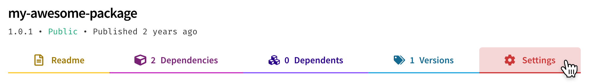

+++
title = "Deprecating and undeprecating packages or package versions"
date = 2023-09-22T20:57:28+08:00
weight = 30
type = "docs"
description = ""
isCJKLanguage = true
draft = false
+++

> 原文: [https://docs.npmjs.com/deprecating-and-undeprecating-packages-or-package-versions](https://docs.npmjs.com/deprecating-and-undeprecating-packages-or-package-versions)

# Deprecating and undeprecating packages or package versions - 废弃和取消废弃包或包版本

If you no longer wish to maintain a package, or if you would like to encourage users to update to a new or different version, you can [deprecate](https://docs.npmjs.com/cli/deprecate) it. Deprecating a package or version will print a message to the terminal when a user installs it.

​	如果您不再希望维护一个包，或者如果您希望鼓励用户更新到一个新的或不同的版本，您可以[废弃](https://docs.npmjs.com/cli/deprecate)它。废弃一个包或版本将在用户安装时在终端打印一条消息。

A deprecation warning or message can say anything. You may wish to include a message encouraging users to update to a specific version, or an alternate, supported package.

​	废弃警告或消息可以是任何内容。您可以包含一条消息，鼓励用户更新到特定版本或一个替代的受支持的包。

**Note:** We strongly recommend deprecating packages or package versions instead of [unpublishing](https://docs.npmjs.com/unpublishing-packages-from-the-registry) them, because unpublishing removes a package from the registry entirely, meaning anyone who relied on it will no longer be able to use it, with no warning.

**注意：**我们强烈建议废弃包或包版本，而不是[取消发布](https://docs.npmjs.com/unpublishing-packages-from-the-registry)，因为取消发布会完全从注册表中删除一个包，这意味着依赖它的任何人将无法再使用它，也没有警告。

## 废弃整个包 Deprecating an entire package

Deprecating an entire package will remove it from search results on the npm website and a deprecation message will also be displayed on the package page.

​	废弃整个包将在 npm 网站的搜索结果中删除它，并且在包页面上也会显示一个废弃消息。


Deprecating a package is an alternative to deleting a package if your package does not meet the [unpublishing requirements](https://docs.npmjs.com/policies/unpublish).

​	如果您的包不符合[取消发布要求](https://docs.npmjs.com/policies/unpublish)，废弃一个包是删除一个包的替代方法。

### 使用网站 Using the website

1. On the npm "Sign In" page, enter your account details and click Sign In.

2. 在 npm 的“[登录](https://www.npmjs.com/login)”页面，输入您的帐户详细信息，然后单击“登录”。

   

3. Navigate to the package page for the package you want to deprecate, replacing `<your-package-name>` with the name of your package: `https://www.npmjs.com/package/<your-package-name>`.

4. 导航到您要废弃的包的包页面，将  `<your-package-name>`  替换为您的包的名称： `https://www.npmjs.com/package/<your-package-name>` 。

5. Click **Settings**.

6. 单击 **Settings**。

   

7. Under "deprecate package", click **Deprecate package**.

8. 在“废弃包”下，单击 **Deprecate package**。

   

9. If you are sure that you want to continue, enter your package name and click **Deprecate package**.

10. 如果您确定要继续，请输入您的包名称，然后单击 **Deprecate package**。

   

### 使用命令行 Using the command line

To deprecate an entire package, run the following command, replacing `<package-name>` with the name of your package, and `"<message>"` with your deprecation message:

​	要废弃整个包，请运行以下命令，将  `<package-name>`  替换为您的包的名称， `"<message>"`  替换为您的废弃消息：

```
npm deprecate <package-name> "<message>"
```

If you have enabled [two-factor authentication](about-two-factor-authentication), add a one-time password to the command, `--otp=123456` (where *123456* is the code from your authenticator app).

​	如果您已启用[双因素身份验证](about-two-factor-authentication)，请在命令中添加一次性密码， `--otp=123456` （其中 *123456* 是您的身份验证器应用中的代码）。

## 废弃包的单个版本 Deprecating a single version of a package

When you deprecate a version of a package, a red message will be displayed on that version's package page, similar to deprecating an entire package.

​	当您废弃一个包的版本时，该版本的包页面上将显示一条红色消息，类似于废弃整个包。


### 使用命令行 Using the command line

To deprecate a package version, run the following command, replacing `<package-name>` with the name of your package, `<version>` with your version number, and `"<message>"` with your deprecation message:

​	要废弃一个包的版本，请运行以下命令，将  `<package-name>`  替换为您的包的名称， `<version>`  替换为您的版本号， `"<message>"`  替换为您的废弃消息：

```
npm deprecate <package-name>@<version> "<message>"
```

The CLI will also accept version ranges for `<version>`.

​	CLI 也接受  `<version>`  的版本范围。

If you have two-factor auth, add a one-time password to the command, `--otp=123456` (where *123456* is the code from your authenticator).

​	如果您启用了双因素身份验证，请在命令中添加一次性密码， `--otp=123456` （其中 *123456* 是您的身份验证器中的代码）。

## 取消废弃包或版本 Undeprecating a package or version

To undeprecate a package, replace `"<message>"` with `""` (an empty string) in one of the above commands.

​	要取消废弃一个包，请在上述命令中将  `"<message>"`  替换为  `""` （空字符串）。

For example, to undeprecate a package version, run the following command, replacing `<package-name>` with the name of your package, and `<version>` with your version number:

​	例如，要取消废弃一个包的版本，请运行以下命令，将  `<package-name>`  替换为您的包的名称， `<version>`  替换为您的版本号：

```
npm deprecate <package-name>@<version> ""
```

If you have two-factor auth, add a one-time password to the command, `--otp=123456` (where *123456* is the code from your authenticator).

​	如果您启用了双因素身份验证，请在命令中添加一次性密码， `--otp=123456` （其中 *123456* 是您的身份验证器中的代码）。

## 将废弃的包转移到 npm - Transferring a deprecated package to npm

If you are no longer maintaining a package, but other users depend on it, and you'd like to remove it from your user profile, you can transfer it to the [`@npm`](https://www.npmjs.com/~npm) user account, which is owned by the npm registry.

​	如果您不再维护一个包，但其他用户依赖于它，并且您希望将其从您的用户配置文件中删除，您可以将其转移到 npm 注册表所拥有的 [ `@npm` ](https://www.npmjs.com/~npm) 用户帐户。

**Note:** Once you transfer a package to the npm account, you will no longer be able to update it.

**注意：**一旦您将一个包转移到 npm 帐户，您将无法再更新它。

To transfer a package to the npm user account, run the following two commands in order, replacing `<user>` with your npm user name, and `<package-name>` with the package you want to transfer:

​	要将包转移到 npm 用户帐户，请按顺序运行以下两个命令，将  `<user>`  替换为您的 npm 用户名，将  `<package-name>`  替换为要转移的包：

```
npm owner add npm <package-name>
npm owner rm <user> <package-name>
```

If you have two-factor auth, add a one-time password to the command, `--otp=123456` (where *123456* is the code from your authenticator).

​	如果您启用了双因素身份验证，请在命令中添加一次性密码， `--otp=123456` （其中 *123456* 是您的身份验证器中的代码）。
