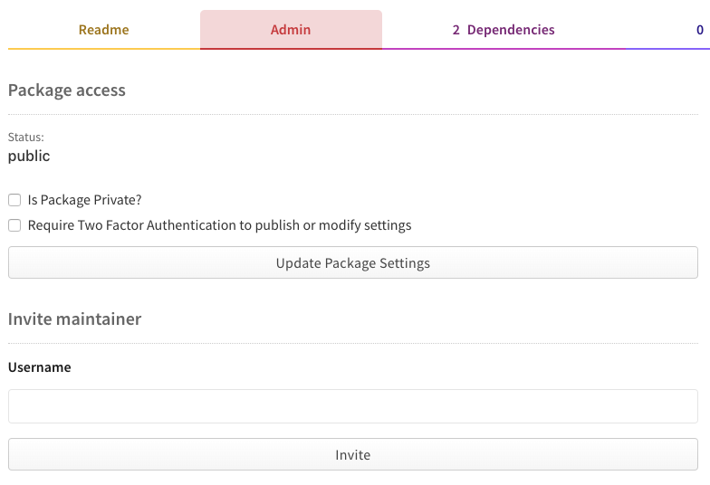
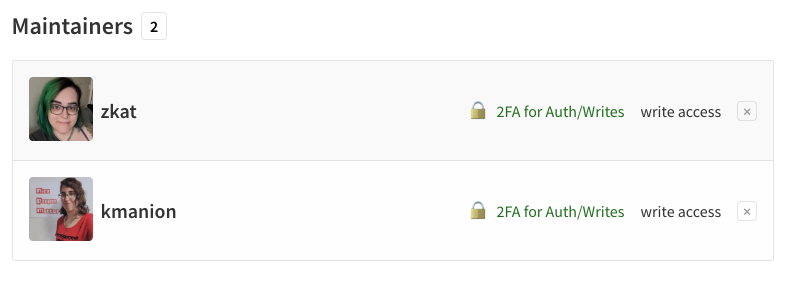

+++
title = "将包从一个用户账户转移到另一个用户账户"
date = 2023-09-22T20:57:38+08:00
weight = 40
type = "docs"
description = ""
isCJKLanguage = true
draft = false

+++

> 原文: [https://docs.npmjs.com/transferring-a-package-from-a-user-account-to-another-user-account](https://docs.npmjs.com/transferring-a-package-from-a-user-account-to-another-user-account)

# Transferring a package from a user account to another user account - 将包从一个用户账户转移到另一个用户账户

As a package owner or maintainer, you can transfer ownership of a package you no longer wish to maintain to another trusted npm user using either the npm website or the command line.

​	作为包的所有者或维护者，您可以将不再希望维护的包转移给另一个受信任的 npm 用户，可以使用 npm 网站或命令行进行转移。

For more information on how npm support handles package name disputes between users, you can refer to npm's [package name dispute policy](https://docs.npmjs.com/policies/disputes).

​	有关 npm 支持处理用户之间的包名称争议的信息，您可以参考 npm 的[包名称争议政策](https://docs.npmjs.com/policies/disputes)。

**Note:** You cannot transfer a scoped package to another user account or organization, because a package's scope *is* the user account or organization name. You will need to create a new package in the new scope.

**注意：**您无法将作用域包转移到另一个用户账户或组织，因为包的作用域 *就是* 用户账户或组织名称。您需要在新的作用域中创建一个新的包。

## 在网站上将包从一个用户账户转移到另一个用户账户 Transferring a package from a user account to another user account on the website

To transfer a package you own or maintain to another user, follow these steps:

​	要将您拥有或维护的包转移到另一个用户，请按照以下步骤操作：

1. Navigate to the package page for the package you want to transfer, replacing `<your-package-name>` with the name of your package: `https://www.npmjs.com/package/<your-package-name>`.

2. 导航到要转移的包的包页面，将  `<your-package-name>`  替换为您的包名称： `https://www.npmjs.com/package/<your-package-name>` 。

3. On the package Admin tab, under "Maintainers", enter the npm username of the new maintainer.

4. 在包的管理选项卡下，找到“Maintainers”下的输入框，输入新维护者的 npm 用户名。

   

5. Click "Invite."

6. 单击“Invite”。

7. To remove yourself as a maintainer, under the maintainers list, click the "x" next to your username.

8. 要将自己从维护者中删除，在维护者列表下，单击您的用户名旁边的“x”。

   

## 在命令行上将包从一个用户账户转移到另一个用户账户 Transferring a package from a user account to another user account on the command line

To transfer a package to another npm user using the CLI, run the [`npm owner add`](cli/owner) command replacing `<their-username>` with the other user's npm username. An email invitation is sent to the other user. After the user has accepted the invitation, run the `npm owner rm` command replacing `<your-username>` with your npm username:

​	要使用 CLI 将包转移到另一个 npm 用户，运行 [ `npm owner add` ](cli/owner) 命令，将  `<their-username>`  替换为另一个用户的 npm 用户名。系统将向另一个用户发送电子邮件邀请。在用户接受邀请后，运行  `npm owner rm`  命令，将  `<your-username>`  替换为您的 npm 用户名：

```
npm owner add <their-username> <package-name>

# new maintainer accepts invitation

npm owner rm <your-username> <package-name>
```

If you have two-factor authentication enabled for writes, add a one-time password to the command, `--otp=123456` (where *123456* is the code from your authenticator application).

​	如果您已为写入操作启用了两步验证，请在命令中添加一次性密码， `--otp=123456` （其中 *123456* 是身份验证应用程序中的代码）。

```
npm owner add <their-username> <package-name> --otp=123456

# new maintainer accepts invitation

npm owner rm <your-username> <package-name> --otp=123456
```
