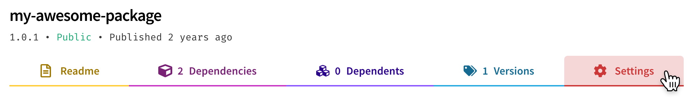
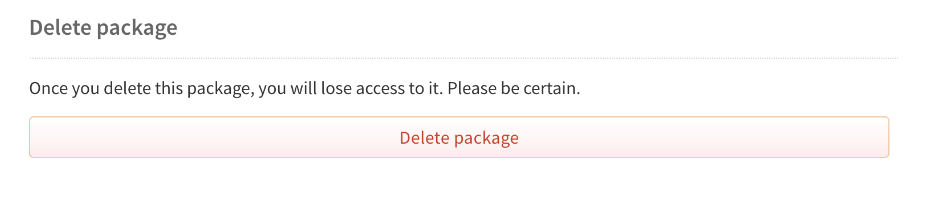
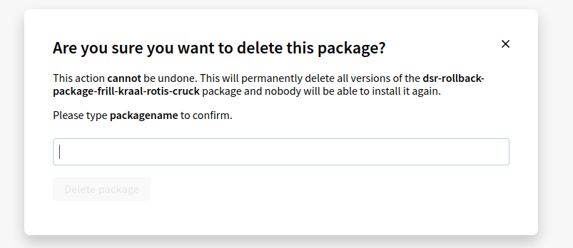

+++
title = "从注册表中取消发布包"
date = 2023-09-22T20:57:48+08:00
weight = 50
type = "docs"
description = ""
isCJKLanguage = true
draft = false

+++

> 原文: [https://docs.npmjs.com/unpublishing-packages-from-the-registry](https://docs.npmjs.com/unpublishing-packages-from-the-registry)

# Unpublishing packages from the registry - 从注册表中取消发布包

As a package owner or collaborator, if your package has no dependents, you can permanently remove it from the npm registry by using the CLI. You can [unpublish](https://docs.npmjs.com/cli/commands/npm-unpublish) within 72 hours of the initial publish; beyond 72 hours, you can still unpublish your package if [it meets certain criteria](https://www.npmjs.com/policies/unpublish).

​	作为包的所有者或协作者，如果您的包没有任何依赖项，您可以使用 CLI 从 npm 注册表中永久删除它。您可以在初始发布后的 72 小时内[取消发布](https://docs.npmjs.com/cli/commands/npm-unpublish)；超过 72 小时后，如果[满足某些条件](https://www.npmjs.com/policies/unpublish)，仍然可以取消发布您的包。

These criteria are set to avoid damaging the JavaScript package ecosystem. If you cannot unpublish your package, you can [deprecate it instead](https://docs.npmjs.com/deprecating-and-undeprecating-packages-or-package-versions).

​	这些条件是为了避免对 JavaScript 包生态系统造成损害。如果您无法取消发布您的包，您可以[将其标记为废弃](https://docs.npmjs.com/deprecating-and-undeprecating-packages-or-package-versions)。

**Note:** Removing all the collaborators or teams from the package will not unpublish it.

**注意：**删除所有协作者或团队不会取消发布包。

## 取消发布一个包 Unpublishing a package

If you want to completely remove all versions of a package from the registry, you can unpublish it completely. This will delete it from the registry and it will be unable to be installed.

​	如果您想要完全从注册表中删除一个包的所有版本，您可以完全取消发布它。这将从注册表中删除它，无法再安装它。

To unpublish a package, you must meet the requirements of the [package unpublishing rules](https://docs.npmjs.com/policies/unpublish).

​	要取消发布一个包，您必须满足[包取消发布规则](https://docs.npmjs.com/policies/unpublish)的要求。

### 使用网站 Using the website

1. On the npm "Sign In" page, enter your account details and click Sign In.

2. 在 npm 的“登录”页面上，输入您的帐户详细信息，然后单击“登录”。

   

3. Navigate to the package page for the package you want to unpublish, replacing `<your-package-name>` with the name of your package: `https://www.npmjs.com/package/<your-package-name>`.

4. 导航到要取消发布的包的包页面，将  `<your-package-name>`  替换为您的包名称： `https://www.npmjs.com/package/<your-package-name>` 。

5. Click **Settings**.

6. 单击 **Settings**。

   

7. Under "delete package", click **Delete package**.

8. 在“delete package”下，单击 **Delete package**。

   

   **Note:** If you cannot delete the package because it does not meet the [unpublishing requirements](https://docs.npmjs.com/policies/unpublish), then the delete package option will not be available. Instead, you will be prompted to [deprecate the package](https://docs.npmjs.com/deprecating-and-undeprecating-packages-or-package-versions#deprecating-a-package-from-the-website).

   **注意：**如果您无法删除包，因为它不符合[取消发布要求](https://docs.npmjs.com/policies/unpublish)，那么删除包选项将不可用。相反，您将被提示[将包标记为废弃](https://docs.npmjs.com/deprecating-and-undeprecating-packages-or-package-versions#deprecating-a-package-from-the-website)。

9. If you are sure that you want to continue, enter your package name and click **Delete package**.

10. 如果您确定要继续，请输入您的包名称，然后单击 **Delete package**。

   

### 使用命令行 Using the command line

To unpublish an entire package, run the following command, replacing `<package-name>` with the name of your package:

​	要取消发布整个包，请运行以下命令，将  `<package-name>`  替换为您的包名称：

```
npm unpublish <package-name> -f
```

If you have [two-factor authentication](about-two-factor-authentication) enabled for writes, you will need to add a one-time password to the `unpublish` command, `--otp=123456` (where *123456* is the code from your authenticator app).

​	如果您已为写入操作启用了[两步验证](about-two-factor-authentication)，则需要在  `unpublish`  命令中添加一次性密码， `--otp=123456` （其中 *123456* 是您的身份验证应用程序中的代码）。

If you need help unpublishing your package, please [contact npm Support](https://www.npmjs.com/support). If you are an Enterprise customer, please [contact Enterprise Support](mailto:enterprise@npmjs.com).

​	如果您需要帮助撤销发布软件包，请[联系npm支持](https://www.npmjs.com/support)。如果您是企业客户，请[联系企业支持](mailto:enterprise@npmjs.com)。

**Note:** If you unpublish an entire package, you may not publish any new versions of that package until 24 hours have passed.

**注意：**如果您撤销发布整个软件包，您将无法在24小时内发布该软件包的任何新版本。

## 撤销发布软件包的单个版本 Unpublishing a single version of a package

If you want to remove a single version of a package, you can unpublish one version without affecting the others. This will delete only that version from the registry and it will be unable to be installed. This option is only available via the npm CLI.

​	如果您想删除软件包的单个版本，您可以撤销发布一个版本而不影响其他版本。这将仅从注册表中删除该版本，并且无法安装该版本。此选项仅可通过npm CLI使用。

### 使用命令行 Using the command line

To unpublish a single version of a package, run the following command, replacing `<package-name>` with the name of your package, and `<version>` with your version number:

​	要撤销发布软件包的单个版本，请运行以下命令，将 `<package-name>` 替换为您的软件包名称，将 `<version>` 替换为您的版本号：

```
npm unpublish <package-name>@<version>
```

## 何时撤销发布 When to unpublish

Unpublishing a package permanently removes the package from the registry so it is no longer available for other users to install. Once a package is unpublished, republishing under the same name is blocked for 24 hours. If you've unpublished a package by mistake, we'd recommend publishing again under a different name, or for unpublished versions, bumping the version number and publishing again.

​	撤销发布软件包将永久从注册表中删除该软件包，因此其他用户无法再安装该软件包。一旦软件包被撤销发布，将在24小时内阻止使用相同名称重新发布。如果您错误地撤销了软件包的发布，我们建议您使用不同的名称重新发布，或者对于撤销发布的版本，增加版本号并重新发布。

You might want to unpublish a package because you:

​	您可能希望撤销发布软件包，因为：

- Published something accidentally.
- 不小心发布了某些内容。
- Wanted to test npm.
- 希望测试npm。
- Published content you [didn't intend to be public](https://blog.npmjs.org/post/101934969510/oh-no-i-accidentally-published-private-data-to).
- 发布了您[不希望公开的内容](https://blog.npmjs.org/post/101934969510/oh-no-i-accidentally-published-private-data-to)。
- Want to rename a package. (The only way to rename a package is to re-publish it under a new name)
- 想要重命名一个软件包。（重命名软件包的唯一方法是使用新名称重新发布它）

**Note:** `package-name@version` is unique, and cannot be reused by unpublishing and re-publishing it. We recommend publishing a minor version update instead.

**注意：** `package-name@version` 是唯一的，不可以通过撤销发布和重新发布来重用。我们建议发布一个次要版本更新。

## 何时标记为弃用 When to deprecate

If you are no longer interested in maintaining a package, but want it to remain available for users to install, or if your package has dependents, we'd recommend [deprecating](cli/deprecate) it. To learn about how to deprecate a package, see "[Deprecating and undeprecating packages or package versions](deprecating-and-undeprecating-packages-or-package-versions)".

​	如果您不再有兴趣维护一个软件包，但希望它仍然可供用户安装，或者如果您的软件包有依赖项，我们建议您将其[标记为弃用](cli/deprecate)。有关如何将软件包标记为弃用的详细信息，请参阅“[标记软件包或软件包版本为弃用状态](deprecating-and-undeprecating-packages-or-package-versions)”文档。
